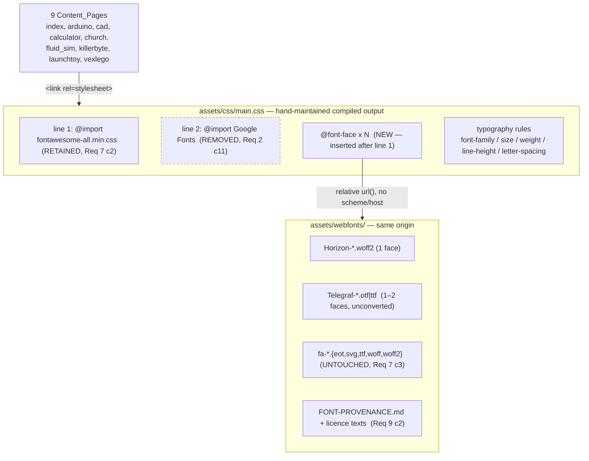

# Design Document

## Overview

This design implements the outcomes of `requirements.md` against a static, build-tool-free HTML5 UP site. **Change Set 1 is implemented and merged to `main`** (commits `d49d8c5`, merged as `a3d8a92`); its two outcomes were:

1. **Footer email legibility** — the `mailto:` link moves from `#717981` (4.05:1, measured) to a darker value, via a *targeted* selector rather than a palette edit. Change Set 1 shipped `#4a5158` (7.38:1); **Change Set 2 supersedes it with `#3a4148` (9.49:1)** — see §5.1.
2. **Typeface replacement** — Horizon (WOFF2, one solid face) for `h1`–`h6`; PP Telegraf (vendor-supplied OTF, unconverted) for body text and all small interface text. Google Fonts is removed; both faces are self-hosted.

**Change Set 2** is a follow-up amendment against the merged code, specified in Requirements 10–14 plus amendments to Requirements 1, 5, 8 and 9. Its seven changes and the sections that carry them:

| # | Change | Requirement | Design section |
|---|---|---|---|
| 1 | Footer email link `#4a5158` → `#3a4148` (7.38:1 → 9.49:1) | Req 1 c7/c12/c13, Req 8 c7 | §5.1, and §3.6 / §4.2 revised |
| 2 | Project card titles centred in their header band | Req 10 | §5.2 |
| 3 | Nav links, Read More / View Model buttons and skills pills move to Ultrabold (800) | Req 11, Req 5 c2 | §5.3 |
| 4 | Skills pill box geometry corrected for the heavier label text | Req 12 | §5.4 |
| 5 | Footer "Fonts & icons" line becomes a Back to top control; HTML5 UP credit **retained** and reworded | Req 13, Req 8 c5 | §5.5 |
| 6 | `#copyright` contrast raised — **reverses conflict C3** | Req 14, Req 1 c11 | §5.6, and conflict C3 re-marked |
| 7 | Stored-licence-text obligation no longer applies to Horizon | Req 9 c2, c9–c11 | §5.7, and §4.4 revised |

Change Set 2 adds **no font file**, changes **no `@font-face` rule**, and changes **no palette value** beyond the single `alt.fg-link` token that Change Set 1 already introduced. Every other Change Set 2 effect is a per-rule declaration change.

**Change Set 3** is a third amendment against the Change Set 2 tree (branch `spec/typography-refresh-change-set-2`, PR #2, plus the follow-up that removed the global `scroll-behavior` declaration). It is specified in Requirements 15–17 plus amendments to Requirements 4 c4, 7 c5/c11–c13, 9 c3 and 11 c15, and to the **Chrome_Text** and **Bold_Chrome_Text** glossary entries. Its three changes:

| # | Change | Requirement | Design section |
|---|---|---|---|
| 1 | The Copyright_Divider sits at the exact horizontal centre of the row, for **any** label pair | Req 15 | **§6.1**, and §5.5 revised |
| 2 | Nav_Panel_Toggle and Nav_Panel_Link move to Ultrabold (800) | Req 16, Req 11 c15 | **§6.2**, and §3.5 / §5.3 revised |
| 3 | `README.md` returns to a short form; the stylesheet documentation moves to `docs/stylesheet-sync.md`, linked in one line | Req 17, Req 7 c6–c9 (c5/c11–c13 before the Change Set 4 renumbering), Req 9 c3, Req 4 c4 | **§6.3**, and §7.5 |

Change Set 3 adds no font file, changes no `@font-face` rule, changes no palette value, and changes **no markup inside any of the nine Content_Pages** — which makes it the first change set since Change Set 1 to leave all nine pages byte-identical. Changes 1 and 2 are stylesheet-only. Change 3 touches `README.md`, the new `docs/stylesheet-sync.md`, and the prune step of `.github/workflows/static.yml`.

**Change Set 4** removes the second stylesheet artifact. `assets/sass/` — 31 files — is **deleted**, and `assets/css/main.css` together with `assets/css/noscript.css` are now the only stylesheets in the repository; `main.css` is a source file, not an output. The requirements consequences are in `requirements.md` (Requirement 7 rewritten and renumbered, Assumptions item 16); the design consequences are collected in **§7**, and they reach back into this document in five places:

| # | Change | Requirement | Design section |
|---|---|---|---|
| 1 | `assets/sass/**` deleted | Req 7 rewritten | **§7.1**; Architecture, §3.1, §4.1, §4.2, the Sync Procedure section (**removed**) and Property 2 (**removed**) |
| 2 | The fully-overridden `body.home #main .button.skills, body.home #main .actions .button` rule deleted | Req 12 (no criterion changes) | **§7.2**, and §5.4 revised |
| 3 | `assets/js/waterParticles.js` pointer tracking fixed | Req 8 c6 | **§7.3** |
| 4 | Two dangling background layers and a broken `@import` removed from both stylesheets | Req 7 c2 | **§7.4** |
| 5 | `docs/stylesheet-sync.md` rewritten as a five-item maintenance note | Req 7 c6–c9, Req 17 c8–c9 | **§7.5**, and §6.3 revised |

Change Set 4 adds no font file, changes no `@font-face` rule, changes no colour value, and edits no Content_Page. **It is the first change set that deletes an artifact rather than editing one**, which is why its verification story is subtractive: three checks are retargeted at `main.css`, one property and one check are deleted outright, and nothing new is asserted.

### What research established

All numbers below were measured against the repository during design, not assumed. Six findings materially shaped the design:

| # | Finding | Consequence |
|---|---|---|
| F1 | `#4a5158` measures **7.38:1** on `#f5f5f5`; `#3a4148` measures **9.49:1** | Change Set 1 shipped 7.38:1. **Change Set 2 supersedes it with `#3a4148` at 9.49:1** (Req 1 c12). Both clear the 7.0:1 threshold of Req 1 c1, which is unchanged. |
| F2 | `#717981` occurs **15×** in `assets/css/main.css` — it is the shared `alt` palette `fg`/`fg-bold` driving footer headings, social icons, table `th`, and pagination | The colour change **cannot** be a palette edit; Req 1 c10/c11 force a targeted selector. See D3. |
| F3 | The footer link underline is `rgba(113,121,129,0.5)` → composites to `#b3b7bb` = **1.85:1** | Fails Req 1 c7 (≥3:1). The underline must become solid. See D4. |
| F4 | `#intro h1` is **5rem**, not 4rem, with a `3.25rem` override at `<=small` | Req 3 c6 caps intro `h1` at ≤4rem, so this is a reduction of two declarations, not one. See §3.3. |
| F5 | `#intro` horizontal padding is `4rem`/side (compiled: `padding: 8rem 4rem 6rem 4rem`); root font-size at 768px resolves to **11pt = 14.67px** | Gives a hard 650.7px content budget at 768px, which is the binding constraint on intro `h1`. See §3.3. |
| F6 | "Hallgrímskirkja" (15 chars, no break opportunity) **already overflows** at 320px in Source Sans Pro at 3.25rem (357.5px needed vs 266.7px available) | Req 3 c11 is unsatisfiable by size reduction alone. `overflow-wrap` is mandatory, not optional. See D6. |

F2, F3 and F6 are pre-existing defects that this refresh must fix in order to satisfy its own acceptance criteria. F6 in particular means the requirement cannot be met by tuning font sizes, which is how it would otherwise be read.

Requirement conflicts uncovered during measurement are collected in **Requirement Conflicts Requiring a Decision**. All six are **settled**, but one has since been re-decided: C2, C4, C5, C6 and C1 stand exactly as recorded there, while **C3 (`#copyright` contrast) is reversed by Change Set 2** — the owner has ruled that the copyright bar must be legible now that it hosts an interactive control, so C3 is resolved *by fixing it* rather than by leaving it unchanged (Req 14; §5.6). C2 (footer `h3` at 4.05:1) is untouched and remains the sole accepted contrast exception.

---

## Architecture

There is no application architecture. The only architecture is the *resolution chain* by which a page acquires a glyph, and the only structural decision is where each link in that chain lives.



Two properties of this chain drive the rest of the design:

- **`main.css` is the only stylesheet node, and it is a source rather than an output.** There is no `package.json`, no compiler, and — since Change Set 4 — no second artifact: the `assets/sass/` tree that this diagram used to show as a dotted, hand-mirrored edge into `main.css` has been deleted (§7.1). An edit is made in `main.css` once and there is nowhere to mirror it. The **Compiled Stylesheet Sync Procedure** section that defined that mirroring, and **Correctness Property 2** that detected its failure, are both removed with the edge; what replaces them is not a weaker check but no check, because the failure mode they guarded cannot occur. `noscript.css` is a second *file* but not a second source: it styles the `<noscript>` path only and shares no declaration with `main.css`.
- **`@font-face` must be inserted after the Font Awesome `@import`.** CSS requires all `@import` rules to precede other rules; placing `@font-face` above line 1 would invalidate the Font Awesome import and break every icon (Req 7 c2, formerly c6). This is the one item in the old sync procedure that survives it — it is a fact about `main.css` itself, not about keeping two files equal, which is exactly the distinction §7.5 uses to decide what the maintenance note keeps.

### Deployment topology and rollback

`.github/workflows/static.yml` triggers on push to `main` and uploads `path: '.'` — **the entire repository, with no build step and no staging environment**. Two consequences:

- Any file added to the repo is published, including `.kiro/` (already published today) and any new tooling. the **Testing Strategy** adds a prune step so verification tooling does not become part of the site.
- There is no pre-production environment, so "verify before it goes live" must mean *verify before push*. the **Pre-push verification gate** in the Testing Strategy defines that gate.

---

## Components and Interfaces

### 3.0 Change Set 1 as shipped — reconciliation

Sections 3.1 through 4.5 were written *before* the fonts were in hand, so several of their values are stated as estimates or as open branches. Change Set 1's intake gate (Check G) resolved all of them, and the resolutions are recorded in `assets/webfonts/FONT-PROVENANCE.md`. **Change Set 2 targets the shipped values below, not the pre-intake estimates**, and where the two differ the shipped value governs:

| Item | Pre-intake estimate in §3.1–§4.3 | **As shipped on `main`** |
|---|---|---|
| Body_Font CSS family name | `Telegraf` | **`PP Telegraf`** (the faces' internal family name) |
| `weight-heading` | `$HORIZON_WEIGHT`, expected `400` | **`700`** — Horizon's single face is a Bold at `usWeightClass` 700 |
| `weight-bold` | `700` under Branch A | **`800`** — the free download has no 700 face; `PPTelegraf-Ultrabold.otf` is 800 |
| Bold branch (§3.4) | A or B, undecided | **Branch A.** A true bold ships, so no alternative emphasis treatment and no README limitation note |
| Italic faces | possibly absent | **None shipped.** Zero `<em>`/`<i>` in site content; synthesized oblique stays inside `PP Telegraf` |
| Intro `h1` | `3.5rem` estimated | **`3.75rem`** browser-confirmed (7.72% margin at 768px) |
| `unicode-range` | `U+2000-206F` blanket | narrowed to the punctuation codepoints verified present in all three faces |
| Font bundle | ≤600 KB budget | **103,324 bytes (≈101 KB)**, 17% of budget |

Change Set 2 depends on three of these directly: `weight-bold: 800` is the value Req 11 c2 resolves through (§5.3), `PP Telegraf` is the family that stays unchanged under Req 11 c5, and the 101 KB bundle is why Req 11 adds no payload at all (§5.3).

### 3.1 The typeface values, as `assets/css/main.css` declares them

**Rewritten in Change Set 4.** This section used to document the `$font` map in `assets/sass/libs/_vars.scss` as "the single interface through which every typeface decision is expressed (Req 7 c4)". **That interface no longer exists**: the map is deleted with its file, and Req 7 c4 is deleted with it (§7.1). The *values* below are unchanged and still ship — what changes is that they are declared literally, at every site that needs them, in `main.css`.

| Decision | Value as declared in `main.css` | Where it is declared |
|---|---|---|
| Body / interface family | `"PP Telegraf", "Helvetica Neue", "Segoe UI", Roboto, sans-serif` | the `body` rule and each Chrome_Text rule |
| Heading family | `"Horizon", "Arial Black", Verdana, "Trebuchet MS", sans-serif` | the `h1`–`h6` rule, the Card_Heading rule, and `#header .logo` — 11 sites in total |
| Fixed-width family | `"Courier New", monospace` — UNCHANGED (Req 4 c8) | the `code` / `pre` rules |
| Body weight | `400` — `PPTelegraf-Regular.otf` | the `body` rule and the four Chrome_Text groups Req 11 c15 pins at 400 |
| Bold weight | `800` — `PPTelegraf-Ultrabold.otf`; no 700 face ships | `strong`/`b`, and each of the five Bold_Chrome_Text rules |
| Heading weight | `700` — Horizon's single solid face, measured | the `h1`–`h6` rule and the Card_Heading rule |
| Heading letter-spacing | `0.05em` | each heading and Chrome_Text rule; Req 11 c8 makes it a **floor** |

**The cost of losing the map is real and is stated rather than glossed over.** A family change is now an edit at 11 sites instead of one, and nothing structural stops the eleventh being missed. Two things stand in for the map: Property 3 (typography invariant across pages, per role) and Property 4 (every element resolves to the token model) both quantify over rendered elements rather than over declarations, so a missed site fails as a *computed* difference on the page that carries it — which is a better signal than the map ever gave, since the map could be edited correctly while `main.css` shipped something else. See §7.1 for the residual-risk entry and R12.

**Change Set 2 changed none of these values.** Requirement 11 changed which *rules* declare the bold weight; the value was already correct.

**Fallback stack for `family-heading` — widest-first, as Req 6 c1 requires.** Horizon is an extra-wide face, so its advance widths exceed every installed fallback. Ordering the stack widest-first minimises the layout shift when the webfont swaps in (Req 6 c8):

| Position | Family | Default-installed on | Why this position |
|---|---|---|---|
| 1 | `Arial Black` | Windows, macOS | Closest available match on *both* axes that matter — heavy weight and wide advances. Best single approximation of Horizon's metrics. |
| 2 | `Verdana` | Windows, macOS | Widest advances among ubiquitous text sans faces; wider than Arial/Helvetica by a clear margin. |
| 3 | `Trebuchet MS` | Windows, macOS | Moderately wide humanist sans; last resort before the generic. |
| 4 | `sans-serif` | generic | Terminator required by Req 6 c3; satisfies Req 6 c11. |

Android/iOS ship none of positions 1–3 and will land on `sans-serif` (Roboto / SF). This is acceptable: Req 6 c1 requires each *named* family to be installed on **at least one** of the four platforms, which positions 1–3 satisfy, and the generic terminator guarantees a rendering everywhere.

**Fallback stack for `family` — Req 6 c2** requires two or more named families, each default-installed somewhere, then the generic: `Helvetica Neue` (macOS/iOS), `Segoe UI` (Windows), `Roboto` (Android), `sans-serif`. Between them these cover all four named platforms with a neo-grotesque of similar proportion to Telegraf, keeping swap reflow small (Req 6 c9).

**The heading weight is resolved at implementation, not guessed.** Horizon ships exactly one solid face (decision 4), and Req 3 c4 requires the declared heading weight to *equal that face's weight* and requires the `@font-face` `font-weight` to match it, so that no browser-synthesized bold is ever applied. The value is read from the font's `OS/2.usWeightClass` once the file is in hand:

```bash
python3 -c "from fontTools.ttLib import TTFont; f=TTFont('assets/webfonts/Horizon.woff2'); \
print('usWeightClass =', f['OS/2'].usWeightClass, '| subfamily =', f['name'].getDebugName(2))"
```

Expected `400`. Whatever it reports is written *identically* into the heading rules and into the `@font-face` block. Because browsers default `h1`–`h6` to `bold`, an explicit `font-weight` is mandatory at every heading level — which the `h1`–`h6` rule provides, **except** at the card `h2`, which hardcoded `font-weight: 700` and had to be converted (§3.5).

**The `0.05em` heading letter-spacing was introduced as a shared value rather than per-rule.** In the deleted SASS tree it was a map key that fixed a latent bug — `components/_pagination.scss:31` read a `letter-spacing-heading` key that did not exist, which would have errored the first time anyone ran a compiler on the tree. **Change Set 4 retires that note along with the file**: nothing reads a missing key any more, because nothing reads keys. The value survives as `0.05em` declared at each heading and Chrome_Text rule in `main.css`, which is what Req 5 c8 and Req 11 c8 measure.

### 3.2 `@font-face` blocks — `assets/css/main.css`

Inserted immediately after the Font Awesome `@import` on line 1, before the reset. Filenames are placeholders confirmed against the actual downloads.

```css
/* Horizon — Alberto Fontense, free personal-use tier. WOFF2 (Req 2 c2). */
@font-face {
    font-family: 'Horizon';
    src: url('../webfonts/Horizon.woff2') format('woff2');
    font-weight: 400;          /* MUST equal $HORIZON_WEIGHT — Req 3 c4 */
    font-style: normal;
    font-display: swap;        /* Req 2 c8, Req 6 c6 */
    unicode-range: U+0000-00FF, U+0100-017F, U+2000-206F, U+2212;
}

/* Telegraf — Pangram Pangram Foundry, free personal-use tier.
   Vendor-supplied OTF, shipped unconverted (Req 2 c3, Req 9 c6).
   format() hint MUST match the actual file: opentype for .otf, truetype for .ttf. */
@font-face {
    font-family: 'Telegraf';
    src: url('../webfonts/Telegraf-Regular.otf') format('opentype');
    font-weight: 400;
    font-style: normal;
    font-display: swap;
    unicode-range: U+0000-00FF, U+0100-017F, U+2000-206F, U+2212;
}

/* Branch A only — omit entirely under Branch B (§3.4). */
@font-face {
    font-family: 'Telegraf';
    src: url('../webfonts/Telegraf-Bold.otf') format('opentype');
    font-weight: 700;
    font-style: normal;
    font-display: swap;
    unicode-range: U+0000-00FF, U+0100-017F, U+2000-206F, U+2212;
}
```

Interface contract per Req 2 c6 — one rule per file; `font-family` identical to the first family of the corresponding stack; `font-weight` equal to the referenced file's weight; `format()` matching the real format. Paths are relative to `main.css` (`../webfonts/…`), carrying no scheme and no host (Req 2 c7, c14).

> **As shipped (§3.0):** the CSS family name is **`PP Telegraf`**, not `Telegraf`; the files are `PPTelegraf-Regular.otf` (400) and `PPTelegraf-Ultrabold.otf` (**800**, not 700); Horizon's `font-weight` is **700**; and the `unicode-range` is the narrowed enumeration recorded in `FONT-PROVENANCE.md`. **Change Set 2 changes none of these rules** — Req 11 c4 requires it not to, and §5.3 reuses the already-declared 800 face rather than adding one.

**On `unicode-range` (Req 2 c9).** The criterion is scoped to rules referencing a *subset* font file. Req 9 c6 forbids subsetting, so **no rule here references a subset file and the criterion is vacuously satisfied**. The declaration is included anyway, for two reasons: it documents the coverage each face is relied upon for, and it is a correctness guard — an over-narrow range silently diverts characters to the fallback. The range must therefore be verified against real page content, not copied from a template. Measured content across all nine pages contains exactly three non-ASCII characters:

| Codepoint | Char | Where | In declared range? |
|---|---|---|---|
| U+00ED | í | `Hallgrímskirkja` — `h1` (church.html), `h2` (index.html) — **Heading_Text** | Yes (Latin-1) |
| U+00D7 | × | body text | Yes (Latin-1) |
| U+00B7 | · | body text | Yes (Latin-1) |

U+00ED lands in Heading_Text, so Horizon must actually carry it. Horizon's stated coverage is Basic Latin, Latin-1 and Latin Extended, so the declared range sits inside its coverage as Req 3 c15 requires — **to be confirmed by glyph audit** (**Testing Strategy, Check G**), because a missing glyph here silently substitutes a fallback family mid-word (Req 3 c16, Req 4 c14).

### 3.3 Heading type scale

Levels `h2`–`h6` are fixed by Req 3 c5 and were already correct in the `h1`–`h6` rule; they are re-declared unchanged. The base `h1` stays at `4rem`, satisfying the strictly-decreasing rule (4 → 1.75 → 1.25 → 1 → 0.9 → 0.8, every gap ≥ 0.1rem).

The *overrides* are where the work is. Req 3 c6 requires the intro `h1` to be "the largest value at or below 4rem" that keeps "Jeffery Ross" on one line at 768/1024/1440 — so the value must be **derived**, not chosen.

**Derivation method.** With `text-transform: uppercase` the string laid out is `JEFFERY ROSS` (12 characters). Required width is `chars × avg_advance_em × font_px`; available width is `viewport − 2 × padding`. Measured geometry:

| Viewport | Matching root step | Root px | `#intro` pad/side | Available |
|---|---|---|---|---|
| 320px | `<=xxsmall` 10pt | 13.33px | 2rem = 26.7px | **266.7px** |
| 768px | `<=large` 11pt | 14.67px | 4rem = 58.7px | **650.7px** |
| 1024px | `<=large` 11pt | 14.67px | 4rem = 58.7px | 906.7px |
| 1440px | `<=xlarge` 12pt | 16.00px | 4rem = 64.0px | 1312.0px |

Maximum intro `h1` that keeps `JEFFERY ROSS` on one line, as a function of Horizon's mean uppercase advance:

| Viewport | 0.80em | 0.90em | 1.00em | 1.10em |
|---|---|---|---|---|
| **768px** | 4.62rem | **4.11rem** | **3.70rem** | **3.36rem** |
| 1024px | 6.44rem | 5.72rem | 5.15rem | 4.68rem |
| 1440px | 8.54rem | 7.59rem | 6.83rem | 6.21rem |

**768px is the binding constraint** at every plausible advance width — 1024px and 1440px have slack to spare. Combined with the 4rem ceiling:

- **Intro `h1` (default): `3.5rem`** — down from 5rem. Survives a mean advance up to ~1.06em, which brackets the plausible range for an extra-wide geometric sans. Chosen over 4rem because 4rem only survives to ~0.92em and Horizon may well exceed that.
- **Intro `h1` (`<=small`): `2.75rem`** — down from 3.25rem. At 320px the widest unbreakable token is `JEFFERY` (7 chars); 2.75rem needs 256.7px of the 266.7px available at 1.00em advance. 3.25rem needs 303px and overflows. Req 3 c13 permits two lines here, which 2.75rem delivers.
- **Project-page `h1` (`body.project-page … header.major > h1`): `2.5rem`** — down from 3.25rem. These strings are far longer than the intro's (up to 38 chars: "KillerByte Full-Body Spinner BattleBot"); they wrap across multiple lines by design, so the constraint is the widest *word*, not the string.

**Verification, and the fallback if it does not fit.** The estimates above must be confirmed against Horizon's real metrics once the file is in hand. Exact per-string measurement, no browser needed:

```bash
python3 - <<'PY'
from fontTools.ttLib import TTFont
f = TTFont('assets/webfonts/Horizon.woff2')
upm = f['head'].unitsPerEm; cmap = f.getBestCmap(); hmtx = f['hmtx']
def width_em(s):
    return sum(hmtx[cmap[ord(c)]][0] for c in s if ord(c) in cmap) / upm
for s in ('JEFFERY ROSS', 'JEFFERY', 'HALLGRÍMSKIRKJA'):
    w = width_em(s)
    print(f'{s!r:20s} {w:6.3f}em  mean/char {w/len(s):.3f}em')
PY
```
Then, with `LS` the chosen letter-spacing in em and `AVAIL` the value from the geometry table: `max_rem = AVAIL / ((width_em + LS × len) × root_px)`. Take the **minimum** across 768/1024/1440, cap at 4rem, and round *down* to the nearest 0.25rem for margin.

If even a heavily reduced size will not hold `JEFFERY ROSS` on one line at 768px — i.e. the derived cap falls below ~2.5rem, where the intro would stop reading as a display heading — the escalation order is:

1. Apply the `-0.02em` end of the Req 3 c7 letter-spacing range (buys ~2% width).
2. Reduce the `<=medium` intro padding from `4rem` to `2rem`/side, adding ~117px of budget at 768px (~18%). This is a layout change outside the stated scope and needs owner sign-off.
3. Escalate to the owner: Req 3 c12 (one line at 768px) and Req 3 c6 (recognisable display size) are then in genuine conflict, and one must give.

Mid-word breaking is deliberately **not** on this list for the intro: it would split a person's name across lines.

**Heading letter-spacing: `-0.01em`** (Req 3 c7 range −0.02em…0.02em). Horizon's extra-wide letterforms already carry generous side bearings; the inherited `0.075em` would read as badly over-tracked. A slight negative value tightens word shapes without collision. This replaces `0.075em` at the `h1`–`h6` rule.

**Heading line-height** (Req 3 c8): intro `h1` `1.1` (range 1.05–1.20; replaces the current `1`, which is out of range); `h1`–`h6` base `1.3` (range 1.20–1.50; replaces `1.5`, tightened because a heavy extra-wide face at 1.5 leaves visually loose leading).

`text-transform: uppercase` and `fg-bold` colour resolution are preserved (Req 3 c9). Existing root-size steps are untouched, so rem values scale as Req 3 c10 requires.

### 3.4 Body text

| Property | Current | Target | Requirement |
|---|---|---|---|
| `font-family` | Merriweather stack | Telegraf stack | Req 4 c1, c2 |
| `line-height` | `2.375` | **`1.7`** | Req 4 c5 |
| `font-size` | `1rem` | `1rem` (unchanged) | Req 4 c6 |
| `text-align` | `justify` | `justify` (unchanged) | Req 4 c10 |

**`line-height: 1.7`** sits mid-range in the required 1.6–1.9. The existing 2.375 was tuned for Merriweather, a serif with a small x-height; Telegraf's larger x-height makes the same leading look disconnected. 1.7 keeps justified paragraphs cohesive while staying comfortable at 1rem.

Root steps (16pt/12pt/11pt/10pt) are preserved (Req 4 c6). The smallest resulting body size is 10pt = 13.33px at ≤360px, clearing the 13px floor of Req 4 c13 — with only 0.33px of margin, so the root steps must not be lowered.

**Italics (Req 4 c11).** If the licensed download has no true italic, `em`/`i` must stay in the Telegraf family with a synthesized oblique and must *not* fall back to another family. Browsers do this by default, but only if nothing disables synthesis — so `font-synthesis: none` must **not** be applied globally. Under Branch B it is applied to `strong`/`b` only, never to `em`/`i`.

**Bold — two branches, written while Assumption 6 was open.** The free Telegraf tier ships "selected styles", so a 700 face was not confirmed at design time. Both branches were fully specified so implementation could proceed either way; the branch was selected by inspecting the download (**Testing Strategy, Check G**).

> **RESOLVED at intake — Branch A, at weight 800.** The free download supplied a true bold, so Branch B was not implemented and no README limitation note was required. The face is `PPTelegraf-Ultrabold.otf` at `usWeightClass` **800**, not 700; there is no 700 face, so `weight-bold: 800` is declared against the file that actually ships (Req 4 c3). Branch B below is retained as history — it is not live code. This is the token that Requirement 11 now reuses for Bold_Chrome_Text (§5.3), which is why that change ships no new font file.

*Branch A — a bold face exists.* Body weight `400`, bold weight `700`; both faces ship; `strong`/`b` declare the bold weight as they already do. Nothing further.

*Branch B — no bold face (Req 4 c4).* The bold weight is declared **equal to** the body weight (400), only the regular face ships, and `strong`/`b` receive an alternative emphasis that does not rely on synthesized bold:

```css
strong, b {
    font-weight: 400;              /* == body weight; no weight delta */
    font-synthesis: none;          /* suppress the synthetic bold browsers would apply */
    letter-spacing: 0.02em;        /* subtle tracking cue */
    background-color: rgba(24, 191, 239, 0.12);   /* accent-derived tint */
    padding: 0 0.15em;
}
```
The tint reuses the existing accent `#18bfef` at low alpha, so emphasis stays legible without a second colour token, and the near-transparent wash leaves text contrast essentially unchanged — a claim that Property 1 verifies rather than assumes. Branch B also requires the limitation to be recorded in `README.md` (Req 4 c4) and reduces the bundle to a single Telegraf file, easing the §4.3 budget.

### 3.5 Chrome_Text migration — Heading font → body font

Chrome_Text inherited the heading family at sizes down to **0.55rem** (`body.home #main .button.skills`). Horizon's tight, closed apertures collapse long before that size, so all seven sites move to the body family (Req 5 c1). Every one is a heading-stack → body-stack swap plus a weight change from the heading weight to the body weight (Req 5 c2 — Chrome_Text must sit on a weight that actually ships).

| Rule in `assets/css/main.css` | Selector | Size |
|---|---|---|
| the base `.button` rule | buttons — skills + Read More | 0.8rem (0.7 small, 0.55 card) |
| the `label` rules | `label` | inherits |
| the pagination rule | `.pagination a` | 0.8rem |
| the table-header rule | `table th` | 0.8rem |
| the `#navPanelToggle` rule | Nav_Panel_Toggle | 0.9rem (0.8 at `<=small`) |
| the `#navPanel .links li a` rule | Nav_Panel_Link | 0.9rem |
| the `#copyright` rule | Copyright_Block | 0.8rem |
| the `#nav ul.links` rule | top nav links (conflict C6) | 0.8rem |

*(The two nav-panel sites were one row in the Change Set 1 draft. They are split here because Change Set 3 treats them as two named elements — see the Nav_Panel_Toggle and Nav_Panel_Link glossary entries — and because the toggle carries a second, `<=small` size that the combined row hid. The `<=0.9rem` size bound of the Chrome_Text glossary entry was also amended in Change Set 3 from a strict to a non-strict inequality: both of these declarations are *exactly* 0.9rem, so the original wording excluded by accident the two elements the same entry already listed. **Change Set 4 replaced this table's `assets/sass/**` paths and line numbers with the selectors that carry each rule**, which is also how the unit assertions locate them — a line-indexed check goes stale on the next comment edit, and the SASS column now names files that do not exist.)*

**Change Set 2 splits this table in two, and Change Set 3 moves two more rows across.** Requirement 11 moved three groups — the nav links, every `.button` label, and the skills pill labels — from the body weight to the bold weight, making them **Bold_Chrome_Text** (§5.3). Requirement 16 moves the **Nav_Panel_Toggle and the Nav_Panel_Link** across as well (§6.2). The family stays the body stack for all five, so the Req 5 c1 routing above is unchanged; only the weight differs. Form labels, pagination links, table headers and `#copyright` are what remain at 400 — that four-group list is the amended text of Req 11 c15, and it is the authority for the 400 half of Property 4's partition.

**Chrome_Text letter-spacing: `0.05em`**, down from `0.075em` (Req 5 c8 range 0.025–0.075em; both comply). Reduced deliberately: the longest skills label is exactly **20 characters** ("Waterjet fabrication"), precisely at the Req 5 c4 single-line boundary, and it must fit inside a card pill at 0.55rem. Dropping tracking by 0.025em buys ~0.5 characters of width at zero visual cost. Declared at the same value across all seven sites so they stay consistent (Req 8 c3).

**The card `h2` (Req 3 c3).** The Card_Heading rule hardcoded three values that all had to change, not just the family:

```css
/* before                                     after */
font-family: Merriweather, Georgia, serif;  /* → the Horizon stack */
font-weight: 700;                           /* → 700, now Horizon's measured face weight */
letter-spacing: 0;                          /* → 0.05em */
```
The `font-weight` is as important as the family: a 700 aimed at a bold Merriweather, left in place with a single-weight Horizon, would trigger exactly the synthesized bold Req 3 c4 forbids — the number is unchanged and its meaning is not. `font-size: 1.1rem` and `text-transform: none` are deliberate card-design choices and are retained — see conflict C5. Before Change Set 1 this was the one rule that named a typeface outside the shared stacks and the `@font-face` blocks; since Change Set 4 the distinction between "a literal here" and "a map lookup" no longer exists, so what the criterion asks for is simply that the Card_Heading declare the same heading stack as every other heading rule (Req 3 c3).

**Skills pills cannot wrap as currently built (Req 5 c7).** `body.home #main .button.skills` sets `white-space: nowrap`, a fixed `height: 1.7rem` and `line-height: 1.55rem`, and its container sets `flex-wrap: nowrap`. Req 5 c7 requires a label that exceeds the available width to *wrap inside the card* with every character visible — impossible under `nowrap`, and a wrapped label inside a fixed 1.7rem pill would be clipped even if it did wrap. The pill therefore becomes vertically elastic:

```css
body.home #main .skills-box { flex-wrap: wrap; }
body.home #main .button.skills {
    white-space: normal;        /* was nowrap  — permits the Req 5 c7 wrap */
    height: auto;               /* was 1.7rem  — fixed height would clip line 2 */
    min-height: 1.7rem;         /* preserves the current pill silhouette */
    line-height: 1.4;           /* was 1.55rem — must be a ratio once multi-line */
    padding: 0.15rem 0.4rem;    /* restores vertical centring without a fixed height */
}
```
Background, border, radius and uppercase treatment are untouched (Req 5 c5). White-on-`rgba(18,38,58,0.92)` measures 12.18:1 worst-case (over white) and 15.40:1 on the card, comfortably clearing Req 5 c6.

> **Superseded in part by Change Set 2 (§5.4).** The `min-height: 1.7rem` / `padding: 0.15rem 0.4rem` pairing above is the geometry the owner now reports as mismatching its text, and measurement confirms two distinct faults in it: the trailing comment "restores vertical centring without a fixed height" is **wrong** — `min-height` exceeds the natural content height by ~8px, and in block layout all of that slack falls *below* the text rather than splitting — and the 0.4rem horizontal padding leaves the widest label at a 0.89 label-to-pill width ratio, over the 0.88 ceiling Req 12 c5 sets. The wrap behaviour established here (`white-space: normal`, `height: auto`, `flex-wrap: wrap` on the container) is **retained unchanged** by Req 12 c8; only `padding`, `min-height` and the centring mechanism change. See §5.4.

### 3.6 Footer email link

Selector: **`#footer a[href^="mailto:"]`**. Chosen over a class or a structural path because the nine pages carry two different footer nesting depths (index/arduino/cad/calculator/church/fluid_sim nest one level deeper than killerbyte/launchtoy/vexlego); an attribute selector matches all nine identically with no markup edits, satisfying Req 1 c3 and c9 while leaving every page's DOM untouched (Req 8 c5).

```css
#footer a[href^="mailto:"] {
    color: #3a4148;                    /* 9.49:1 measured — Req 1 c1, c2, c12 */
    border-bottom-color: #3a4148;      /* solid, 9.49:1 — Req 1 c7; was 1.85:1 */
}
#footer a[href^="mailto:"]:hover {
    color: #18bfef !important;         /* accent mandated by Req 1 c4 */
    border-bottom-color: #3a4148;      /* stays 9.49:1 — Req 1 c7 in hover state */
}
#footer a[href^="mailto:"]:focus-visible {
    outline: 2px solid #212931;        /* 13.51:1, ≥2px, spans the box — Req 1 c6 */
    outline-offset: 2px;
}
```

**Colour history.** Change Set 1 shipped `#4a5158` at **7.38:1**. **Change Set 2 supersedes it with `#3a4148` at 9.49:1** (Req 1 c12) — the darker of the two candidates originally considered. Both clear the 7.0:1 threshold of Req 1 c1, which the amendment leaves unchanged; the change buys margin, it does not chase a new threshold. Three declarations in `main.css` carry the value — default text, default underline, hover underline — and all three change together (§5.1). *(Change Set 2 made this edit as one token value in `assets/sass/libs/_vars.scss` plus three resolved mirrors; Change Set 4 leaves only the three declarations, which is the same edit with the indirection removed.)* Req 1 c13 additionally requires **zero** remaining occurrences of `#4a5158` as a link or underline colour, comments included.

Four things this encodes:

- **Underline (Req 1 c7).** The inherited `rgba(113,121,129,0.5)` composites to `#b3b7bb` = 1.85:1 and fails. Even `rgba(74,81,88,0.5)` reaches only 2.33:1. Only a solid colour clears 3:1, so the underline is declared solid at the link colour.
- **Hover underline.** The generic `#footer a:hover` sets `border-bottom-color: transparent`. Req 1 c7 requires ≥3:1 in the hover state, and a transparent underline is at best an ambiguous pass; the rule above keeps it solid and measurable — now at 9.49:1.
- **Focus (Req 1 c6).** `outline` is used rather than a border so the indicator spans the full text box and cannot alter layout. `:focus-visible` keeps the ring off mouse clicks; because `outline` and `color` are independent properties, the ring survives simultaneous hover as c6 demands.
- **Transitions (Req 1 c4, c5).** The inherited `a` transition is `0.2s` on `color` and `border-color`, inside the 200 ms bound. No new transition is needed.

Existing `0.8rem` sizing (`#footer form label, #footer h3, #footer p`) satisfies Req 1 c8 unchanged. No other footer colour is touched (Req 1 c10, c11).

---

## Data Models

The only persistent structures are the typeface values in `main.css`, the font bundle, and the provenance record. **Before Change Set 4 the first of those was a pair of SASS maps**; §4.1 and §4.2 below are rewritten as inventories of declared values, because that is all that is left of them.

### 4.1 Typeface values — declared in `assets/css/main.css`

| Value | Type | Before | After | Constraint |
|---|---|---|---|---|
| body family | font stack | `Merriweather, Georgia, serif` | `"PP Telegraf", "Helvetica Neue", "Segoe UI", Roboto, sans-serif` | Req 4 c1; Req 6 c2, c3 |
| heading family | font stack | `"Source Sans Pro", Helvetica, sans-serif` | `"Horizon", "Arial Black", Verdana, "Trebuchet MS", sans-serif` | Req 3 c1; Req 6 c1, c3 |
| fixed family | font stack | `"Courier New", monospace` | unchanged | Req 4 c8 |
| body weight | 100–900 | `300` | `400` | Req 4 c3 |
| bold weight | 100–900 | `600` | **`800`** (Branch A; measured, §3.0) | Req 4 c3, c4 |
| heading weight | 100–900 | `900` | **`700`** (Horizon, measured) | Req 3 c4 |
| heading letter-spacing | em length | `0.075em` | `0.05em` | Req 5 c8; Req 11 c8 |

Change Set 2 touches none of these rows. The bold weight and the heading letter-spacing acquire additional consumers under Requirement 11 (§5.3) but keep their values — and Req 11 c8 forbids *lowering* the letter-spacing, which pins `0.05em` as a floor from here on.

The body weight moves 300 → 400 and the heading weight 900 → Horizon's single weight because Req 2 c5/c16 and Req 3 c4 require every declared weight to correspond to a face that actually ships. A declared 300 with only a 400 face on disk would invite synthesis.

**Change Set 4 changes no value in this table.** What it changes is the number of places each value is written: a stack that was one map entry read by 11 rules is now 11 literals. §3.1 records that cost and what checks it instead.

### 4.2 Colour values — one change since Change Set 1

Every existing colour value is preserved (Req 8 c7). One is changed:

| Role | Change Set 1 | **Change Set 2** | Purpose |
|---|---|---|---|
| footer email link, default text and underline | `#4a5158` (7.38:1) | **`#3a4148` (9.49:1)** | Req 1 c12, c13 |

See conflict C1 under **Requirement Conflicts Requiring a Decision** for why Change Set 1 introduced a link-specific value rather than editing the shared `#717981` that 15 declarations resolve to.

**This remains the only changed colour value**, which matters because Req 8 c7 is written as a single-exception rule. The Copyright_Block recolouring of §5.6 does not widen the exception: it raises the alpha of the white the `#copyright` rule already declared, and the opaque `#ffffff` in the surrounding rules is untouched (Req 14 c4). Property 8 checks it that way, comparing every colour literal in `main.css` against its baseline with only the footer link value allowlisted. *(Before Change Set 4 this section described an additive `alt.fg-link` key in a `$palette` map and Property 8 compared map entries; the check is the same one read against declarations instead of tokens, which is strictly closer to what ships.)*

### 4.3 Webfont bundle manifest

Budget: **≤600 KB** for the two families combined, **≤400 KB** per Telegraf file (Req 2 c12, c13). The existing Font Awesome files (~2.9 MB across 15 files) are excluded from both bounds by name (Req 2 c12) and must remain byte-identical (Req 7 c3).

| File | Family | Weight | Format | `format()` | Typical | Bound |
|---|---|---|---|---|---|---|
| `Horizon.woff2` | Horizon | `$HORIZON_WEIGHT` | WOFF2 | `woff2` | 20–60 KB | — |
| `Telegraf-Regular.otf` | Telegraf | 400 | OTF (unconverted) | `opentype` | 60–200 KB | ≤400 KB |
| `Telegraf-Bold.otf` *(Branch A only)* | Telegraf | 700 | OTF (unconverted) | `opentype` | 60–200 KB | ≤400 KB |

Face count is the minimum Requirement 4 needs and no more (Req 2 c16) — one Horizon face (Req 2 c4), one Telegraf face per declared weight (Req 2 c5). If the download supplies `.ttf` rather than `.otf`, both the extension and the `format()` hint change to `truetype` together; a mismatched hint is a Req 2 c6 failure.

> **As shipped (§3.0):** three files, all OTF/WOFF2 as planned but named and weighted differently — `Horizon.woff2` (17,084 B, weight 700), `PPTelegraf-Regular.otf` (41,576 B, 400) and `PPTelegraf-Ultrabold.otf` (44,664 B, **800**). Total **103,324 B ≈ 101 KB, 17% of the 600 KB budget**; the seven unshipped Telegraf styles were deleted under Req 2 c16. **Change Set 2 adds nothing to this manifest**, which is the whole reason Requirement 11 has no payload cost (§5.3).

### 4.4 Provenance record — `assets/webfonts/FONT-PROVENANCE.md`

Requirement 9 c2 and c8 require source URL, download date, licence tier and format to be stored *in the repository*, alongside the licence texts, and updated whenever a file is added or replaced. One record per file:

| Field | Example |
|---|---|
| `file` | `Telegraf-Regular.otf` |
| `family` / `designer` | Telegraf / Pangram Pangram Foundry |
| `source_url` | `https://pangrampangram.com/products/telegraf/` (official channel only — Req 9 c1) |
| `download_date` | `2025-01-15` |
| `licence_tier` | Free personal / non-commercial |
| `licence_text_file` | `Telegraf-LICENSE.txt` |
| `format` / `converted` | OTF / **no** (Req 9 c6) |
| `sha256` | `…` — proves the shipped file is byte-identical to the download |
| `stored_bytes` | `142336` |
| `content_encoding` | `identity` (measured — Req 2 c17) |
| `transfer_bytes` | `142336` (measured — Req 2 c17, c18) |

`sha256` is not decorative: Req 9 c6 requires byte-for-byte fidelity to the vendor file, and a recorded hash is the only way a later reviewer can confirm nobody quietly re-saved or subsetted a face.

Neither Horizon nor Telegraf can be fetched by automation — both require a manual download from the designer's own channel behind an account or checkout flow (Req 9 c1 forbids aggregator mirrors, explicitly including the `fontdownloader.net` link that informed the requirements). Font acquisition is therefore a **manual prerequisite** that gates implementation; **Check G** in the Testing Strategy is the intake gate.

**Stored licence text — Body_Font only, as amended by Change Set 2 (Req 9 c2, c9–c11).** The design originally required a stored licence text for both families. Body_Font's obligation is met by the shipped `assets/webfonts/EULA-PangramPangram-FreeForPersonalUse-MAY2021.pdf`. For Heading_Font no such text could be located from the designer's channels, and Req 9 c2 no longer asks for one; criterion 9 substitutes a **recorded-fields** obligation instead. See §5.7 for the exact `FONT-PROVENANCE.md` edit. Two consequences for the data model:

- The `licence_text_file` field becomes **optional per family**, not per file. For the `Horizon.woff2` record it carries the literal `none — accepted, see note` rather than a filename, which is a recorded position and not a missing value (Req 9 c11).
- The four fields that *are* mandatory for Heading_Font — `licence_tier` (`free for personal use`), `designer`, `source_url`, `download_date` — are already present and non-empty in the shipped record, so §5.7 is a note edit, not a data edit.

The substantive licence terms are untouched: Req 9 c10 states plainly that the free-personal-use grant binds the Site whether or not a copy is stored, so Non_Commercial_Use (Req 9 c4, c5) applies to Horizon exactly as before. Property 11's field check is adjusted accordingly — it must not fail an absent licence text for Heading_Font, and it must not accept an *invented* one either.

### 4.5 Transfer-size measurement procedure (Req 2 c17, c18)

Req 2 c17 requires the *measured* `Content-Encoding` and over-the-wire byte count for each Telegraf file from the deployed origin — because the OTF/TTF delivery path was chosen on a size trade-off that should be verified rather than assumed. Run **after** the first deploy that includes the fonts, and record both values in §4.4:

```bash
BASE=https://jefferyxr.github.io/personal-website/assets/webfonts
for f in Telegraf-Regular.otf Telegraf-Bold.otf Horizon.woff2; do
  [ -f "assets/webfonts/$f" ] || continue
  curl -sI --compressed "$BASE/$f" | grep -iE '^(HTTP/|content-encoding|content-length|content-type)'
  curl -s -o /dev/null --compressed \
       -w "$f  http=%{http_code}  transfer_bytes=%{size_download}  encoding=%{content_type}\n" \
       "$BASE/$f"
  echo "  stored_bytes=$(wc -c < "assets/webfonts/$f")"
done
```

`--compressed` advertises gzip/br so the response reflects what a real browser receives. GitHub Pages compresses some MIME types and not others, and `font/otf` is commonly **not** compressed — so `Content-Encoding: identity` with `transfer_bytes == stored_bytes` is the expected result, and `gzip` with a smaller count is a bonus.

**Either outcome changes nothing in the CSS.** The `@font-face` rules, `format()` hints and paths are identical regardless. What the measurement does affect is the budget: if `identity` is confirmed, the §4.3 stored-size bounds *are* the transfer cost, and the ≤400 KB per-file bound is the real defence against a slow first paint. Req 2 c18 (measured ≤ stored) holds in both cases, since compression can only reduce the count — but it is recorded as measured fact, not inferred. The same run doubles as the Req 2 c10 same-origin check (`http=200` for every file).

---

## Change Set 2 — Design

Seven follow-up changes against the merged Change Set 1 code. All seven are **declaration-level or markup-level**; none adds a font file, alters an `@font-face` rule, or edits a palette value beyond the single `alt.fg-link` token that already exists.

The total source delta is small and worth stating up front, because it bounds the review surface:

| Change | `main.css` rules | HTML pages | *(SASS declarations, as Change Set 2 shipped it)* |
|---|---|---|---|
| §5.1 email colour | 3 declarations | 0 | *1 token in `_vars.scss`* |
| §5.2 centred titles | 1 (`left` → `center`) | 0 | *1* |
| §5.3 bold weight | 2 | 0 | *2* |
| §5.4 pill geometry | 2 rules retuned | 0 | *2* |
| §5.5 Back to top | 2 added (cursor, focus) | **9** | *2* |
| §5.6 copyright contrast | 1 | 0 | *1 alpha in `_footer.scss`* |
| §5.7 Horizon licence note | 0 | 0 (one Markdown file) | *0* |

*(The last column is kept because it is the shape the review of Change Set 2 actually took. Every file it names has since been deleted — §7.1 — so it is history, not a place to make an edit.)*

### 5.1 Footer email link — `#4a5158` → `#3a4148`

**Three declarations in `assets/css/main.css` carry this value** — the default text colour, the default underline colour and the hover underline colour, all on the `#footer a[href^="mailto:"]` selectors of §3.6 — and all three change together:

```css
color: #3a4148;                 /* was #4a5158.  9.49:1 on #f5f5f5, was 7.38:1 */
border-bottom-color: #3a4148;   /* same value, default and hover */
```

*(Change Set 2 made this edit as one token value in `assets/sass/libs/_vars.scss` plus those three resolved mirrors. Change Set 4 deleted the token's file, so the three declarations are the whole edit — the same three literals, with nothing above them.)*

| State | Colour | Ratio on `#f5f5f5` | Requirement |
|---|---|---|---|
| default text | `#3a4148` | **9.49:1** | Req 1 c1 (≥7.0:1), c12 |
| default underline | `#3a4148`, fully opaque | **9.49:1** | Req 1 c7 (≥3.0:1) |
| hover text | `#18bfef` | 1.98:1 — mandated by Req 1 c4, see conflict C4 | Req 1 c4 |
| hover underline | `#3a4148` | **9.49:1** | Req 1 c7 in hover state |
| focus outline | `#212931` | 13.51:1 | Req 1 c6 (≥3.0:1) |

Three points that keep this from being a blind find-and-replace:

- **The threshold did not move.** Req 1 c1 still says ≥7.0:1, and `#4a5158` already cleared it. This change buys margin against a stricter future target and satisfies the owner's stated preference for the darker candidate; it does not fix a failure. Recording that matters, because a reader who assumes 7.38:1 was failing will misread the amendment's intent.
- **Req 1 c13 is a zero-occurrence rule, not just a replacement rule.** After this change, `#4a5158` must appear **nowhere** in `main.css` as a link or underline colour, comments included. Two places mentioned it as *prose*: the conflict C2 note in this document names it as the ready remedy for the footer `h3`, and the footer rules carried explanatory comments. The C2 remedy reference is updated in the conflicts section below; any comment naming the old value is updated with the declaration, so the stylesheet does not document a value it no longer sets. **Since Change Set 4 there is one artifact to scan rather than two**, which narrows the rule's reach without weakening it — the two-artifact version could pass on `main.css` and fail in a SASS comment nobody shipped.
- **Relative luminance, not just ratio.** Req 1 c2 requires a lower relative luminance than `#717981`. `#3a4148` is darker than `#4a5158`, which was already darker than `#717981`, so c2 holds transitively — but Property 1 checks it directly rather than by inference.

### 5.2 Centred project card titles (Req 10)

**Decision: set `text-align: center` on the Card_Header_Band, editing the existing `text-align: left` on that rule. Do not add a declaration to the `h2`.**

```css
/* body.home #main > .posts > article header */
text-align: center;   /* was left — Req 10 c1 */
```

Why the band and not the `h2`:

- **It is an edit, not an addition.** The band already declares `text-align: left`; changing one token leaves the declaration count identical in both artifacts. Adding `text-align: center` to the `h2` instead would leave the source saying *"this band is left-aligned, and its only child is centred"* — an internal contradiction that invites a future editor to "tidy" one of the two and silently undo the change.
- **The band's only content is the Card_Heading.** The glossary pins this, and the markup confirms it: the `header` contains the `h2` and nothing else. So band-level centring has no collateral reach today, and if a card header ever gains a second child, centring extends to it automatically — which is the stated intent, cards reading as a symmetrical grid.
- **It keeps the `h2` rule untouched.** Req 10 c4 pins the Card_Heading's `font-size: 1.1rem`, `text-transform: none`, `line-height` and `color`, and Req 10 c5 pins `h2 > a { color: inherit }`. Not editing that rule at all is the cheapest way to guarantee those four are preserved.

**Multi-line titles need no extra work, and this is the load-bearing detail.** `text-align` applies per line box, not per block, so every line box inside the band is centred independently within the band's content box. That covers both cases Requirement 10 distinguishes:

- **Forced breaks (Req 10 c3).** "KillerByte / Full-body Spinner Battlebot" carries an explicit `<br />` inside its `h2 > a`. An anchor is inline and establishes no new block container, so the `<br />` breaks the `h2`'s line box and each resulting line centres on its own. No flex or grid centring is needed, and none should be used — `justify-content: center` on the band would centre the `h2` *box* as a single unit and leave its internal lines left-ragged, which fails c2 and c3 while appearing to pass c1.
- **Automatic wrapping (Req 10 c2, c6).** Titles that wrap at 320px behave identically, and `overflow-wrap: break-word` from Change Set 1 still governs any unbreakable token.

**Explicitly not touched (Req 10 c7).** The homepage card block declares `text-align: left` in exactly three places — verified by grep: the Card_Header_Band, and the two `body.home #main > .posts > article p` card *description* rules (both `font-size: 0.85rem`, one of them inside a narrow-viewport media block). Only the band changes; left-aligning prose is a deliberate readability choice. Property 8 carries all three against their baseline so that a careless global replace fails a check rather than shipping. **Change Set 4 replaced the three `_main.scss` line numbers here with selectors**, which is what the assertions match on anyway.

Req 10 c9 (band `background-color: #12263a`, `padding: 0.85rem 1rem`, box dimensions preserved) holds trivially: `text-align` affects inline content position within the line box and changes no box dimension, so no card height and no grid alignment moves.

### 5.3 Ultrabold for nav, buttons and pills (Req 11)

**Three element groups move from weight 400 to 800, through exactly two declarations in `assets/css/main.css`.**

```css
/* #nav ul.links — the "Projects" / "CAD Gallery" links */
font-weight: 800;   /* was 400 */

/* the base .button rule */
font-weight: 800;   /* was 400 */
```

**Two declarations cover all three groups, which is exactly what Req 11 c3 asks for.** The base `.button` rule reaches Read More (`.button`), View Model (`.button.primary`, `.button.primary.small.fit`) *and* the skills pills (`.button.skills`) because `body.home #main .button.skills` declares no `font-weight` of its own and inherits from `.button`. Req 11 c3 requires a single rule covering all three so that no variant is left behind, and this is that rule. Site inventory confirms the reach: 24 `button skills`, 7 `button`, 6 `button primary`, 5 `button primary small fit`.

Three things this does *not* change, all pinned by Req 11:

- **Family (c5).** Both rules keep the `PP Telegraf` stack. Only the weight moves.
- **Letter-spacing (c8).** Both keep `letter-spacing: 0.05em`. Req 11 c8 forbids going *below* the pre-amendment value, so 0.05em is now a floor rather than a free parameter — which removes the tracking-reduction lever that §3.5 used to buy width. Any width shortfall must be absorbed by the box (§5.4), not by tighter tracking.
- **Appearance (c13).** `text-transform`, `background-color`, `border`, `border-radius`, default/hover colours and transition timing are all untouched. Contrast is therefore unchanged and Req 11 c14 inherits Change Set 1's measurements (white on `rgba(18,38,58,0.92)` = 12.18:1 worst case).

**No new font file, and the bundle budget is untouched — stated explicitly because it is easy to assume otherwise.** `PPTelegraf-Ultrabold.otf` (44,664 bytes, `usWeightClass` 800) already ships and is already declared at `font-weight: 800` under the `PP Telegraf` CSS family, because Change Set 1 needed it for `<strong>`. Requirement 11 adds a second consumer of a face that is already downloaded on every page load. The bundle stays at **103,324 bytes (≈101 KB), 17% of the 600 KB budget**, and Req 11 c4 (add no file, remove no file, change no `@font-face` rule) is satisfied by doing nothing. Req 11 c6 likewise: 800 is a shipped `usWeightClass`, so no weight is synthesized or interpolated.

**Two incidental reaches of the `.button` rule, both benign.** The compiled `.button` rule at `main.css:2120` is a grouped selector that also covers `input[type="submit"|"reset"|"button"]` and bare `button` elements. A content audit finds **zero forms and zero such inputs** across all nine pages, so those selectors match nothing today. The one non-anchor match is the intro down-arrow, `class="button icon solid solo fa-arrow-down scrolly"` — an icon-only control with no text node, whose glyph is painted by a Font Awesome `:before` rule that sets its own `font-family` and `font-weight`, so the change has no visible effect on it. Neither reach touches anything Req 11 c15 pins at 400, because none of those resolves through `.button`. *(As amended in Change Set 3, that pinned list is form labels, pagination links, table headers and the Copyright_Block. The nav-panel links left it under Requirement 16 — §6.2 — which is a change of weight for those anchors, not a change to the reach of this `.button` rule.)*

#### The real risk: Ultrabold is wider than Regular

This is the substantive risk in Change Set 2, and it is measured rather than assumed. Advance widths were read directly from the two shipped binaries with `fontTools` — summed `hmtx` advances over `unitsPerEm`, plus the declared `0.05em` tracking per character — so these are properties of the files on disk, not estimates:

| Label (as rendered, uppercase) | 400 | 800 | Increase |
|---|---|---|---|
| `PROJECTS` | 5.378em | 5.659em | **+5.22%** |
| `CAD GALLERY` | 7.103em | 7.586em | **+6.80%** |
| `READ MORE` | 6.130em | 6.550em | **+6.85%** |
| `VIEW MODEL` | 6.848em | 7.328em | **+7.01%** |
| `CSS` (narrowest pill) | 2.157em | 2.235em | +3.62% |
| `AUTODESK INVENTOR` | 11.390em | 12.166em | +6.81% |
| `WATERJET FABRICATION` (widest pill) | 13.200em | 14.096em | **+6.79%** |

The increase is **+3.6% to +8.5%, clustering near +6.8%** — materially less than the 60–100% jump Horizon caused for headings (risk R1), but real and non-uniform.

**Rendered label widths at the four required viewports (Req 11 c16).** Computed from the measured em widths above and the declared root steps (12pt = 16.00px at ≤xlarge, 11pt = 14.67px at ≤large, 10pt = 13.33px at ≤xxsmall), so 1024px and 768px share a row:

| Label | Size | 320px | 768/1024px | 1440px |
|---|---|---|---|---|
| `PROJECTS` | 0.8rem | 57.4 → **60.4** | 63.1 → **66.4** | 68.8 → **72.4** |
| `CAD GALLERY` | 0.8rem | 75.8 → **80.9** | 83.3 → **89.0** | 90.9 → **97.1** |
| `READ MORE` | 0.7rem | 57.2 → **61.1** | 62.9 → **67.2** | 68.7 → **73.4** |
| `VIEW MODEL` | 0.7rem | 63.9 → **68.4** | 70.3 → **75.2** | 76.7 → **82.1** |
| `WATERJET FABRICATION` | 0.55rem | 96.8 → **103.4** | 106.5 → **113.7** | 116.1 → **124.0** |

*(px, 400 → 800. The 0.7rem row is the `.actions .button` override; the 0.55rem row is the homepage pill.)*

**How each group is verified, rather than assumed:**

- **Nav bar (Req 11 c10) — low risk, and the numbers say why.** The two labels together grow from 159.7px to 169.5px at 1440px, an absolute increase of **9.8px** inside a 1312px content box. Even at 320px the pair totals 141.3px. The nav is a flex row with `flex-grow`/`flex-shrink` on `ul.links`, so it has slack in every direction. Verified by Property 3's bounding-box arm at all four viewports rather than by inspection, because the nav also carries a logo and a right-hand icon group that the arithmetic above does not model.
- **Buttons (Req 11 c11) — low risk, structurally.** `.button` is `inline-block` with `width: auto` and `padding: 0 2rem` (0 1rem under the `.actions` override), so the box grows with its label; the label cannot overflow a box that sizes to it. `white-space: nowrap` is retained as c11 requires. The `.fit` variant on `cad.html` is `width: 100%`, which has even more room. The exposure is not clipping but *reflow* — a wider button changing how the actions row wraps — which Property 5's containment arm covers.
- **Pills (Req 12) — the binding case, and it does fail today.** At 0.55rem the widest label reaches 124.0px at 1440px, and against the shipped `padding: 0 0.4rem` that puts the label-to-pill width ratio at **0.893**, over the 0.88 ceiling of Req 12 c5. This is a genuine measured breach introduced by the weight change, and §5.4 is its remedy.

**The interaction with Requirement 12 is direct, so the two are one change.** Requirement 11 widens the labels; Requirement 12 resizes the boxes that hold them. Landing 11 without 12 ships a measurable Req 12 c5 failure, so they belong in the same commit and the same verification run. Req 11 c12 also constrains the remedy in advance: a label that will not fit must be given a **larger box**, never a smaller font (the Req 5 c3 floor), never a return to weight 400, and never `text-overflow` truncation.

### 5.4 Skills pill box geometry (Req 12)

Requirement 12 deliberately pins **no pixel values**, and its criterion 13 makes measuring and recording them a design-phase obligation. This section discharges that: it states the measurement procedure, records what the current geometry measures, and derives values that satisfy the bounds.

#### What the shipped geometry measures — two distinct faults

**Homepage geometry** (`body.home #main .button.skills`: `font-size: 0.55rem`, `min-height: 1.7rem`, `padding: 0.15rem 0.4rem`, `line-height: 1.4`, 1px border):

| Bound | Req | Shipped value | Verdict |
|---|---|---|---|
| width ratio ≤ 0.88 | 12 c5 | **0.891–0.893** (`WATERJET FABRICATION`) | **FAIL** |
| width ratio ≥ 0.40 | 12 c5 | 0.549 (`C++`) | pass |
| height ratio 0.40–0.85 | 12 c5 | 0.453 | pass |
| vertical symmetry ≤ 1px | 12 c2 | **≈8.1px at 1440px** | **FAIL** |
| horizontal padding / vertical gap ∈ 1.5–3.5 | 12 c4 | 2.67 | pass |

The symmetry failure is the one the owner is describing as boxes mismatching their text, and its cause is worth naming precisely. Natural content height at 1440px is `line box 12.32px + 2×3.2px padding… ` — in fact `12.32 + 2×2.4 + 2 = 19.12px` — while `min-height: 1.7rem` forces **27.2px**. In normal block layout the line box sits at the top of the box and *all* 8.08px of surplus accumulates below it: top gap 2.4px, bottom gap 10.5px. The §3.5 comment claiming this arrangement "restores vertical centring" is simply incorrect, and no amount of padding tuning fixes it while a `min-height` larger than the content dominates.

**Wider-context geometry** (the grouped `body.home #main .button.skills, body.home #main .actions .button` rule: `font-size: 0.7rem`, `height: 2.25rem`, `line-height: 2.25rem`, `padding: 0 1rem`) is worse, and fails in a way that is invisible until the ratios are written down — *and, as §7.2 records, invisible in a second sense too: this rule had **zero rendered instances**, which is why Change Set 4 deleted it outright rather than keeping the retune below:*

| Bound | Req | Shipped value | Verdict |
|---|---|---|---|
| height ratio ≤ 0.85 | 12 c5 | **1.000** | **FAIL** |
| horizontal padding / vertical gap ∈ 1.5–3.5 | 12 c4 | **undefined** (gap = 0) | **FAIL** |
| width ratio 0.40–0.88 | 12 c5 | 0.424–0.831 | pass |

`line-height: 2.25rem` is a **length**, not a ratio, and it is set equal to `height`. So the rendered line box exactly fills the box: the height ratio is 1.000 against a 0.85 ceiling, and Req 12 c4's "half the difference between the declared `height` and the rendered line box height" evaluates to **zero**, making any non-zero horizontal padding an infinite multiple of it. This is the classic fixed-height/matched-line-height centring trick, and it is unsatisfiable under Requirement 12 as written — not because the requirement is unreasonable, but because that trick leaves no vertical padding to be in ratio *with*.

#### Measurement procedure (Req 11 c16, Req 12 c13)

Two layers, because they answer different questions and have different costs.

**Layer 1 — font metrics, from the binaries.** Already run; it produced the tables in §5.3 and the ratios above. Deterministic, no browser, no fonts to load:

```bash
python3 - <<'PY'
from fontTools.ttLib import TTFont
F = {w: TTFont(f'assets/webfonts/PPTelegraf-{n}.otf')
     for w, n in (('400','Regular'), ('800','Ultrabold'))}
def width_em(w, s, ls=0.05):
    f = F[w]; upm = f['head'].unitsPerEm; cmap = f.getBestCmap(); hmtx = f['hmtx']
    return sum(hmtx[cmap[ord(c)]][0] for c in s) / upm + ls * len(s)
for s in ('PROJECTS','CAD GALLERY','READ MORE','VIEW MODEL','CSS','WATERJET FABRICATION'):
    a, b = width_em('400', s), width_em('800', s)
    print(f'{s:24s} {a:7.3f}em -> {b:7.3f}em  {(b/a-1)*100:+.2f}%')
PY
```

This layer establishes the *label* box. It cannot establish the *pill* box, because that depends on layout: the card's content width, the `skills-box` flex gap, and how many pills share a row.

**Layer 2 — rendered boxes, in a real browser.** Playwright, headless Chromium, with the real fonts confirmed loaded via `document.fonts.check('0.55rem "PP Telegraf"')` before any measurement — a measurement taken during the fallback window is a measurement of Helvetica, not Telegraf. For each of the **9 pages × 4 viewports** {320, 768, 1024, 1440} and every `a.button.skills`:

1. Read the pill's `getBoundingClientRect()` and its resolved `padding`, `border-width` and `min-height`.
2. Read the **label** box from a `Range` over the anchor's text node via `getClientRects()` — not from the anchor's own rect, which is the pill. This distinction is the whole point: `getClientRects()` on a Range returns one rect per rendered line, which gives per-line widths for the wrap case and the true glyph extent for the ratio bounds.
3. Derive the four left/right/top/bottom gaps, the width and height ratios of Req 12 c5 and c6, and the padding-to-gap ratio of c4.
4. Record the narrowest and widest label of each geometry, as c13 requires, and assert pill-to-pill non-overlap and card containment (c12).

Layer 2 is the authority. Where Layer 1 and Layer 2 disagree, Layer 2 wins — subpixel rounding, hinting and the flex gap are all outside the arithmetic.

#### Chosen values

> **These are derived, not yet browser-measured.** The label widths are measured from the shipped binaries and the pill boxes are computed from the declared CSS and root steps. The ratios below therefore have the status of *predictions with a measured input*, and Req 12 c13 is discharged only once Layer 2 records the rendered numbers. Implementation runs Layer 2 first and adjusts padding, `min-height` or `line-height` if any bound is missed, exactly as Req 12 c11 directs.

**Homepage geometry:**

```css
body.home #main .button.skills {
    font-size: 0.55rem;         /* UNCHANGED — Req 12 c11 forbids reducing it */
    line-height: 1.4;           /* UNCHANGED — a ratio, so it survives wrapping */
    padding: 0.2rem 0.55rem;    /* was 0.15rem 0.4rem */
    min-height: 1.35rem;        /* was 1.7rem */
    display: inline-flex;       /* was inline-block (inherited from .button) */
    align-items: center;        /* splits any residual vertical slack evenly */
    justify-content: center;
    white-space: normal;        /* UNCHANGED — Req 12 c8 */
    height: auto;               /* UNCHANGED — Req 12 c8, c11 */
}
```

**Wider-context geometry** — *this rule was deleted by Change Set 4; see §7.2. It is kept here because the reasoning below is why the deletion is safe:*

```css
body.home #main .button.skills,
body.home #main .actions .button {
    font-size: 0.7rem;          /* UNCHANGED */
    height: 2.25rem;            /* UNCHANGED — no box-size change */
    line-height: 1.4;           /* was 2.25rem — a LENGTH equal to height; now a ratio */
    padding: 0 1rem;            /* UNCHANGED */
}
```

Predicted ratios, identical at all four viewports because every input except the 1px border scales with the root step:

| Geometry | Label | width ratio (0.40–0.88) | height ratio (0.40–0.85) | pad/gap (1.5–3.5) |
|---|---|---|---|---|
| homepage | `WATERJET FABRICATION` | 0.861–0.864 | 0.570 | 2.75 |
| homepage | `AUTODESK INVENTOR` | 0.843–0.845 | 0.570 | 2.75 |
| homepage | `CSS` | 0.496–0.501 | 0.570 | 2.75 |
| homepage | `C++` (narrowest) | 0.481–0.486 | 0.570 | 2.75 |
| wider | `WATERJET FABRICATION` | 0.831 | 0.436 | 1.57 |
| wider | `C++` (narrowest) | 0.424 | 0.436 | 1.57 |

Reasoning behind each number:

- **Horizontal padding 0.4rem → 0.55rem (homepage).** The 0.88 ceiling requires the pill border-box to be at least `label / 0.88` wide. At the widest label that means padding ≥ **0.466rem** at 1440px, ≥0.460rem at 768/1024px, ≥0.454rem at 320px. `0.5rem` would clear it at 0.873 — passing, but with 0.007 of headroom against a bound, which browser rounding could erase. `0.55rem` lands at 0.864 and keeps the narrowest label at 0.481, comfortably inside both ends.
- **Vertical padding 0.15rem → 0.2rem (homepage).** Forced by Req 12 c4, not by appearance. With horizontal padding at 0.55rem, the 3.5× ceiling requires vertical padding ≥ 0.157rem, so 0.15rem is *out of bounds by itself*. `0.2rem` gives a ratio of 2.75, mid-range.
- **`min-height` 1.7rem → 1.35rem (homepage).** Req 12 c7 sets a floor: `min-height` ≥ one line box + vertical padding + borders. That sum is **1.295rem** at 1440px, 1.306rem at 768/1024px and **1.320rem** at 320px — the 320px case being largest because the 2px border is absolute and so a bigger fraction of a smaller root. `1.35rem` clears the worst case with 0.03rem to spare. The old `1.7rem` exceeded the content by ~8px, which is exactly what produced the c2 asymmetry.
- **`display: inline-flex` with `align-items: center`.** This is the belt to `min-height`'s braces. Even at 1.35rem a residual ~0.88px of slack exists at 1440px; block layout would drop all of it below the text, flex centring splits it to ~0.44px per side, inside the 1px tolerance of Req 12 c2 with margin. It also makes c2 hold *structurally* rather than by arithmetic coincidence, so a future font or root-step change cannot silently reintroduce the fault. Multi-line wrapping is unaffected — the text becomes a single anonymous flex item that still wraps internally under `white-space: normal` — so Req 12 c8 and Req 5 c7 are preserved.
- **Wider-context: change `line-height` only.** `2.25rem` → `1.4` converts a length into a ratio, which simultaneously fixes both faults: the height ratio drops from 1.000 to **0.436** (inside 0.40–0.85), and the vertical gap becomes `(36 − 15.68)/2 = 10.16px` at 1440px, putting the 1rem horizontal padding at **1.57×** it (inside 1.5–3.5). `height: 2.25rem` and `padding: 0 1rem` are deliberately left alone so the Read More and View Model boxes do not change size — Req 11 c13 and Req 8 c5 both favour minimal box churn, and this reaches the bounds without any.
- **Two-line case (Req 12 c6).** Homepage: two line boxes total 1.54rem against a border-box of 2.09rem → **0.737**, inside the 0.90 ceiling. No label in current content wraps at these sizes, so this path is exercised by generated over-long labels in Property 15, as Property 5 already does for Req 5 c7.

**Documented fallback if Layer 2 misses a bound.** The two thinnest margins are the wider-context height ratio (0.436 against a 0.40 floor) and its narrowest width ratio (0.424 against the same floor). If either measures below 0.40, apply `height: 2.1rem` with `padding: 0 0.9rem`, which computes to **0.467** height ratio and **0.450–0.846** width ratios — more margin at both ends, at the cost of a slightly shorter Read More / View Model box. This is a recorded fallback with computed consequences, not an open question, and Req 12 c11 sanctions exactly this class of adjustment.

Req 12 c9 holds throughout: `border-radius: 999px`, `background-color`, border colour and width, and label colour are untouched in both geometries. The correction changes fit, not appearance.

### 5.5 Back to top control and the retained design credit (Req 13)

#### Markup — identical on all nine pages

Current content, inside `div#copyright` on every page:

```html
<ul><li>Fonts &amp; icons: <a href="https://html5up.net">HTML5 UP</a></li></ul>
```

Replacement:

```html
<ul><li><a href="#top">Back to top</a></li><li>Design: <a href="https://html5up.net">HTML5 UP</a></li></ul>
```

Two `<li>` elements, matching the two-element structure Req 13 c12 requires. This slots into the existing `#copyright ul li` styling with no CSS work: those items are `inline-block` with `border-left: solid 2px` and `:first-child { border-left: 0 }`, so the second item automatically gets the template's divider rule — and at `<=xsmall` they stack, which the existing breakpoint already handles.

> **Superseded in part by Change Set 3 (§6.1).** "No CSS work" was true and is the reason the divider is now measurably off centre: reusing the template's two-`inline-block` arrangement inside a `text-align: center` block centres the *combined run* of the two items, so the join between them — and therefore the divider drawn on the second item's left border — lands wherever the unequal label widths put it. At 1440px that is **20.1px left of centre**. The markup above is **unchanged** by Change Set 3 (Req 15 c12 forbids touching it); §6.1 replaces the `#copyright ul` layout mechanism instead. Everything else in this section — the `#top` decision, the no-JavaScript reasoning, the removed smooth-scroll block, the accessibility table, and the retained design credit — stands exactly as written.

**Page-by-page application (Req 13 c13, c14).** Six pages write `#copyright` across multiple source lines and three — `killerbyte.html`, `launchtoy.html`, `vexlego.html` — write the whole div on one line; the replacement respects each page's existing line layout while emitting **identical inner markup structure and identical text**. `vexlego.html` currently differs from the other eight by writing the ampersand as `&amp;` where they use a bare `&`. The new wording contains **no ampersand at all**, which retires that divergence: after this change all nine pages carry a byte-identical `<ul>…</ul>`, and Req 13 c14's escaping rule is satisfied vacuously rather than by nine careful edits. Property 16 asserts the byte-identity so a future single-page edit cannot drift.

#### `#top` versus `#wrapper`

Req 13 c4 permits either. **Decision: `href="#top"`.**

- **It is guaranteed by specification, not by markup.** The HTML standard defines the indicated part of a document for the fragment `top` (ASCII case-insensitive) as the **top of the document** when no element has that ID — so the link cannot be broken by a markup change. `href="#wrapper"` depends on an element continuing to exist; `#wrapper` is present on all nine pages today, but that is a fact about current markup rather than a guarantee.
- **It targets the document origin rather than an element's box.** `#wrapper` scrolls to the wrapper's box position, which is the document top today only because nothing precedes it and it has no top offset. Both facts are incidental.
- **Neither option requires markup outside the Copyright_Block**, so Req 8 c5's pin on element set, count, order and nesting elsewhere is respected by both. That rules out inventing an `id="top"` anchor at the top of `<body>`.
- **`#wrapper` is recorded as the sanctioned fallback**, since c4 names it and the element genuinely is present on all nine pages. If a target browser is found not to honour the `top` special case, switching is a one-token change per page with no other consequence.

Req 13 c6 is satisfied by construction: the `href` is a real same-document fragment, not `href="#"` and not a `javascript:` URL.

#### No JavaScript, and no jQuery

Req 13 c5 requires the control to work with scripting disabled, or `jquery.scrolly.min.js` failing to load, or any other script failing. A native `<a href="#top">` satisfies this because fragment navigation is a **browser** behaviour, not a scripted one.

**`class="scrolly"` is deliberately not used**, even though the site already loads `jquery.scrolly.min.js` and the intro down-arrow (`href="#main"`) uses it. Scrolly binds a click handler that calls `preventDefault()` and animates via jQuery. That would *technically* still degrade correctly — with no JS the handler never binds and the native jump happens — but it would make the control's *intended* behaviour depend on jQuery, three script files and a plugin, for nothing but easing. Requirement 13's whole thrust is a control that does not depend on scripting.

#### Easing: the CSS smooth-scroll block was tried, and is removed

**Decision: no easing. The control performs an instant fragment jump, and that is what ships.**

Change Set 2 first shipped `html { scroll-behavior: smooth }` with a `@media (prefers-reduced-motion: reduce)` arm restoring `auto`, on the reasoning that the easing could come from CSS rather than from jQuery. **Both declarations are removed.** This section already named that outcome as the sanctioned fallback — the block is *optional* to Requirement 13, whose c2 asks only that the top of the document be brought into the viewport — and **the fallback has been taken**: the instant jump satisfies c2, c3 and c5 in full. With no CSS smooth scroll there is no unrequested motion left to suppress, so the reduced-motion arm went with it rather than staying behind as a guard over nothing.

**The justification that put the block here was wrong, and it shipped a regression.** It read: *`scrolly` calls `preventDefault()`, so no native scroll competes with jQuery's animation in the first place.* `preventDefault()` suppresses the native **fragment navigation**. It does nothing about `scroll-behavior` being applied to jQuery's own **programmatic** `scrollTop` writes — which is the mechanism that actually decides this:

`assets/js/jquery.scrolly.min.js` animates with `parent.stop().animate({scrollTop: t}, 1000, 'swing')`, where `parent` is `$("body,html")`. jQuery writes `scrollTop` once per frame, and with `scroll-behavior: smooth` in force on the scrolling element **each of those ~60 writes starts its own smooth scroll**. So nothing visibly moves until the 1000 ms animation's final write sticks.

Measured at 1440 px in headless Chromium, sampling `window.scrollY` every 16 ms after activating each control:

| Control | first movement | half-way | on target | final y |
|---|---|---|---|---|
| intro down-arrow, with `scroll-behavior: smooth` | **1056 ms** (1042 ms on a second run) | 1172 ms | 1331 ms | 900 ✓ |
| intro down-arrow, with `scroll-behavior: auto` | **32–50 ms** | ≈520 ms | 834 ms | 900 ✓ |
| footer Back to top, with smooth | 50 ms | — | reached 0 at 882 ms | 0 ✓ |
| footer Back to top, after removal | **18–23 ms** | — | reached 0 at 18–23 ms | 0 ✓ |

Two things the numbers settle. **The footer control was never the broken one** — it is native fragment navigation, so smooth easing applied to it exactly as intended, reaching 0 at 882 ms. The casualty was the **intro down-arrow**, an element this change set was not otherwise touching, reached only because `scroll-behavior` has to sit on the scrolling element and is therefore global. And **every row lands on its target**, which is precisely why final-position verification passed the defect through; see Check J in the Testing Strategy.

**The `preventDefault()` reasoning is deleted rather than reworded**, deliberately: a future reader who reconstructs it will re-add the declaration. The `DO NOT REINTRODUCE` comment that survives in the `html` rule of `assets/css/main.css` therefore states the real mechanism and carries the measured figures instead of merely recording that the block was dropped. *(Change Set 2 placed the same comment in `assets/sass/base/_page.scss` as well; Change Set 4 deleted that file, so the `main.css` comment is now the only one — which is also the only one a maintainer would ever read, since it sits in the file they edit.)* Two guards back it up — a static assertion of **zero** `scroll-behavior` and **zero** `prefers-reduced-motion` declarations in the shipped stylesheets (scanned with comments stripped, since the surviving comment names the property on purpose), and Check J, which measures what the declaration actually broke.

**Nothing else about the control changes.** It is still `<a href="#top">`, still carries no `class="scrolly"`, still works with scripting disabled (Req 13 c5), and is still keyboard reachable with the focus ring described below. Only the easing is gone.

#### Accessibility

| Criterion | Mechanism |
|---|---|
| c7 accessible name | Visible text `Back to top`, which is the anchor's accessible name. No `aria-label` needed, and none added — a redundant label risks diverging from the visible text. |
| c8 keyboard reachable | A native `<a>` with an `href` is in the tab order by default. No `tabindex` is declared on it or any ancestor, so no positive value can exist. |
| c3 keyboard activation | Enter on a focused anchor performs the same navigation as a click. No `keydown` handler required. |
| c9 focus indicator | See below. |
| c17 pointer cursor | `#copyright` sets `cursor: default` on its static text; both links need an override. |

```css
#copyright a { cursor: pointer; }                    /* Req 13 c17 */

#copyright a:focus-visible {
    outline: 2px solid currentColor;                 /* Req 13 c9 — 2px, spans the text box */
    outline-offset: 2px;
}
```

`currentColor` resolves to the Copyright_Block text colour, which §5.6 sets to a composite of **`#b0b3b6`** = **7.33:1** against `#1e252d` — well past the 3.0:1 of Req 13 c9. Binding the ring to `currentColor` rather than a literal means it tracks the block colour automatically, so §5.6 and this rule cannot drift apart. `outline` rather than a border, for the same reason as §3.6: it spans the full text box and alters no layout. `:focus-visible` keeps the ring off pointer clicks.

Req 13 c15 (Copyright_Block typography preserved — `PP Telegraf`, 0.8rem, uppercase, declared letter-spacing, 1.5 line-height, centred alignment) holds because none of the rules above touches those properties; only `color`, `cursor` and the focus outline change.

#### The HTML5 UP credit is retained, and reworded

**The Design_Credit stays.** The owner asked whether it could be dropped, given that the fonts are no longer HTML5 UP's and the site now looks and behaves very differently from the published Massively demo. The recorded answer is **no**, on three independent grounds:

1. **The credit is the consideration, not a courtesy.** [html5up.net/license](https://html5up.net/license) places the templates under **Creative Commons Attribution 3.0** and states that personal use, commercial use and modification are all permitted — with credit for the design given in exchange. HTML5 UP separately sells attribution-free usage through Pixelarity. That an attribution-free tier is a *paid product* settles the character of the free tier's credit: it is the price, not etiquette.
2. **CC BY 3.0 attaches attribution to adaptations, not only to verbatim copies.** So the extent of divergence does not discharge the condition. A heavily modified derivative is still a derivative, and the licence's attribution term travels with it. "It looks nothing like the demo" is an argument about *how much* was changed, and the licence does not condition attribution on that quantity.
3. **The Site remains substantially template-derived, as a matter of fact.** Verified against the repository: both shipped stylesheets carry the Massively header, as do all nine Content_Pages and `assets/js/main.js`; six template JavaScript files still ship (`main.js`, `util.js`, `breakpoints.min.js`, `browser.min.js`, `jquery.scrollex.min.js`, `jquery.scrolly.min.js`); and the `#wrapper`, `is-preload`, `split contact`, `icons` and `actions` structures appear on all nine pages. This design document's own §5.4 fallback and §5.5 markup both build directly on template CSS (`#copyright ul li`, `.button`), which is the clearest possible demonstration that the template is still load-bearing. **Change Set 4 restated this list**: it previously counted 24 files under `assets/sass/` carrying the Massively header, and those files are now deleted. Deleting derived files does not make the remaining ones original, and the derivation is still visible in the two artifacts a visitor actually loads.

**The one supported route to removing the credit is a Pixelarity licence**, which is what HTML5 UP sells for exactly this purpose. That would be a new owner decision outside this spec, and it is a purchase rather than a code change.

**What does change is the wording.** "Fonts & icons: HTML5 UP" is now simply inaccurate: Heading_Font is Horizon (Alberto Fontense) and Body_Font is PP Telegraf (Pangram Pangram Foundry), both credited under Req 9 c3 in `README.md`. Only the Font Awesome icons still come through the template. The credit is therefore reworded to what it actually is — a **design** credit — satisfying Req 13 c10 (visible, names HTML5 UP, links to `https://html5up.net`) and c11 (worded as a template/site design credit, not a fonts or icons credit).

*Licence terms above are summarised from the linked page rather than quoted; content was rephrased for compliance with licensing restrictions, and html5up.net/license is authoritative for the actual terms. This is a reading of the licence for design purposes and not legal advice.*

### 5.6 Legible copyright bar (Req 14)

**Decision: alpha 0.25 → 0.65, composited `#b0b3b6`, measured 7.33:1 against `#1e252d`.**

```css
/* the #copyright rule in assets/css/main.css */
color: rgba(255, 255, 255, 0.65);   /* was rgba(255, 255, 255, 0.25) */
```

*(Change Set 2 wrote this as `transparentize(_palette(invert, fg), 0.35)` in `assets/sass/layout/_footer.scss` — that function subtracts its amount from the alpha, so 0.65 was written as 0.35 — plus the compiled mirror above. Change Set 4 deleted the file; the `rgba()` declaration is the whole change, and there is no longer an indirection in which 0.65 is spelled 0.35.)*

**Correction to a claim this document previously made.** Conflict C3 recorded the deferred remedy as "raise the alpha to ~0.65 (≈4.6:1)". **That pairing is wrong.** Measured values for white over `#1e252d`:

| Alpha | Composite | Ratio vs `#1e252d` |
|---|---|---|
| 0.25 (shipped) | `#565c62` | 2.27:1 |
| 0.50 | — | 4.94:1 |
| 0.60 | — | 6.46:1 |
| **0.65 (chosen)** | **`#b0b3b6`** | **7.33:1** |

Alpha 0.65 gives **7.33:1**, not ≈4.6:1; ≈4.9:1 falls near alpha **0.50**. The direction of the old note was right and the alpha it named was right — only the paired ratio was wrong, by conflating two different points on the curve. Every occurrence of the "≈4.6:1" claim is corrected: here, in conflict C3, and in Property 1's exception table (where the entry is removed outright). Req 14 c6 requires the design to record a *measured* pairing rather than restate the unreconciled one, which this table does.

**Why 0.65 rather than 0.50, when Req 14 c1 only asks for 4.5:1.** The deciding factor is the hover state, not the default. The Copyright_Block now hosts an interactive control, and `#copyright a` inherits the block colour while hover resolves to the `invert` palette accent `#18bfef` = **7.17:1** against `#1e252d`:

| Alpha | default ratio | hover ratio | default → hover change |
|---|---|---|---|
| 0.50 | 4.94:1 | 7.17:1 | **+45%** — hover looks markedly stronger than default |
| **0.65** | **7.33:1** | 7.17:1 | **−2%** — visually the same strength |

At 0.65 the default and hover states sit at essentially identical contrast, so the control reads with consistent weight whether or not the pointer is on it. At 0.50 the default state would look conspicuously weaker than its own hover — an odd signal for a control that should be discoverable *before* being hovered. Both alphas satisfy Req 14 c1–c3; 0.65 is chosen for state consistency, and this is the rationale Req 14 c6 asks to be recorded.

**Full state table (Req 14 c1–c3):**

| Element | State | Colour | Ratio vs `#1e252d` | Bound |
|---|---|---|---|---|
| Copyright_Block static text | default | `rgba(255,255,255,0.65)` → `#b0b3b6` | **7.33:1** | ≥4.5:1 ✓ |
| Back_To_Top_Control | default | inherited `#b0b3b6` | **7.33:1** | ≥4.5:1 ✓ |
| Design_Credit link | default | inherited `#b0b3b6` | **7.33:1** | ≥4.5:1 ✓ |
| either link | hover / active | `#18bfef` (invert accent) | **7.17:1** | ≥4.5:1 ✓ |
| either link | focus | `#b0b3b6` text + 2px `currentColor` ring | **7.33:1** | ≥4.5:1 ✓, ring ≥3.0:1 ✓ |

Both links resolve their default colour through the existing `#copyright a { color: inherit }` rule, so one declaration change carries all three default-state rows. This is also why Req 14 c5 (a single colour value, resolving identically on all nine pages, applied to the `#copyright` rule only) is satisfied without adding per-link colours.

**Scope (Req 14 c4, c5, c8).** The edit changes only the alpha inside the `#copyright` rule's `color`. The opaque `#ffffff` declared elsewhere in the footer stays as it is, the Copyright_Block background stays `#1e252d`, and every other rule over that dark background is untouched — so Req 8 c7 continues to hold with the footer email link colour as the single changed value (§4.2). The footer `h3` at 4.05:1 and the footer social icon links are explicitly **not** touched: conflict C2 stands as decided, and the Req 1 c11 exemption reaches the Copyright_Block and nothing else.

**Consequence for Property 1 (Req 14 c7).** The `#copyright` entry is **removed** from that property's accepted-exceptions set, leaving the footer `h3` as the only member. This is not bookkeeping: the set pins each entry to a *measured* ratio and fails if the measurement drifts in either direction, so leaving a 2.27:1 entry in place while shipping 7.33:1 would turn a successful fix into a red check.

### 5.7 Horizon licence text — recorded accepted position (Req 9 c2 amended)

One file changes: `assets/webfonts/FONT-PROVENANCE.md`. No font file, no stylesheet, no page.

**Field edit** in the `## Horizon.woff2` record:

```diff
- | `licence_text_file` | *none — see TODO below* |
+ | `licence_text_file` | *none — accepted, see note* |
```

**Block replacement.** The record currently carries a `**TODO (owner):**` block instructing the owner to save `Horizon-LICENSE.txt` and close Req 9 c2. That block is removed and replaced by a recorded position:

> **Accepted position — no vendor licence text is available for Horizon.** No licence or EULA text for Horizon could be located from the designer's own channels. Requirement 9 criterion 2 no longer requires a stored licence text file for Heading_Font; criterion 9 substitutes a recorded-fields obligation, met by the four fields already present in this record: licence tier *free for personal use*, designer *Alberto Fontense*, source URL, and download date. **This is a closed decision, not an outstanding action.**
>
> The obligation itself is unchanged. Horizon's free-personal-use terms bind the Site whether or not a copy is stored here, so the Non_Commercial_Use constraint of Requirement 9 criteria 4 and 5 applies to Horizon exactly as before. No substitute licence file is invented, and the designer's terms are paraphrased rather than reproduced.

Three properties of this edit are deliberate:

- **`licence_text_file` carries a sentinel, not an empty cell.** Req 9 c11 requires a value denoting "none — accepted", so the distinction between *recorded as absent* and *forgotten* survives in the data. Property 11 is adjusted to accept the sentinel for Heading_Font and to keep requiring a real, present file for Body_Font — where `EULA-PangramPangram-FreeForPersonalUse-MAY2021.pdf` does ship.
- **No file is invented.** Req 9 c11 forbids fabricating or paraphrasing a licence file in place of the real one, so Property 11 must also fail if a `Horizon-LICENSE.txt` appears whose provenance is not the designer. The safe check is presence-of-sentinel, not presence-of-file.
- **The four recorded fields are already non-empty**, so this is a note edit rather than a data-gathering exercise. Nothing blocks it.

Req 9 c3's `README.md` credits (Horizon → Alberto Fontense, PP Telegraf → Pangram Pangram Foundry, each with its licence tier) are unaffected and stay as shipped. **Change Set 3 keeps both credits and only compacts their form** — see §6.3.

---

## Change Set 3 — Design

Three follow-up changes against the Change Set 2 tree. Two are stylesheet-only; the third touches no stylesheet, no page and no font file at all. The total delta, stated up front to bound the review surface:

*(The **SASS** column is parenthesised throughout: Change Set 3 edited `assets/sass/layout/_footer.scss` and `_navPanel.scss` and mirrored each edit into `main.css`. Change Set 4 deleted both files — §7.1 — so the `main.css` column is now the whole of the stylesheet delta.)*

| Change | *(SASS)* | `main.css` | HTML pages | Other files |
|---|---|---|---|---|
| §6.1 divider centring | *(`#copyright ul` + its `li` rule)* | the `#copyright ul` rule and its `li` / `:first-child` rules, plus the `max-width: 480px` block | **0** | — |
| §6.2 nav panel weights | *(2 declarations)* | 2 declarations — the `#navPanelToggle` rule and the `#navPanel .links li a` rule | **0** | — |
| §6.3 short README | *(0)* | 0 | **0** | `README.md` rewritten, `docs/stylesheet-sync.md` added, `static.yml` prune step |

Change Set 3 is the first amendment since Change Set 1 that leaves all nine Content_Pages byte-identical: Req 15 c12 forbids touching the Copyright_Block markup, Req 16's elements are script-injected or reparented rather than authored, and Req 17 c13 restricts change 3 to three files. Property 8's page-markup clause therefore holds across this change set with **no** allowlist entry added for HTML.

### 6.1 Centring the Copyright_Divider (Req 15)

Assumptions and Open Questions item 13 leaves the mechanism open. **This section closes it.**

#### The offset is a function of the label widths, and the arithmetic says so exactly

Measured at 1440px: the Copyright_Row content box spans **x 144 → x 1296** (width 1152, centre **x 720**) while the Copyright_Divider renders at **x 699.9** — **20.1px left of centre**.

The shipped mechanism is the template's: `#copyright` declares `text-align: center`, the `ul` is an ordinary block filling that content box, and the two `li` are `display: inline-block`. So the two items form **one line box** which `text-align: center` centres as a unit. Writing `W₁` and `W₂` for the two rendered label widths, and with 1rem = 16px at 1440px:

```
run width      R  = W₁ + margin-left 16 + border 2 + padding-left 16 + W₂
run start         = 720 − R/2
divider centre    = run start + W₁ + 16 + 1
                  = 720 − (W₁ + W₂ + 34)/2 + W₁ + 17
                  = 720 + (W₁ − W₂)/2
```

**The whole 34px of margin, border and padding cancels.** The residual offset is *exactly half the difference between the two label widths*, and nothing else. Two consequences follow directly, and both are load-bearing:

- **No adjustment to `margin`, `padding` or `letter-spacing` can fix this.** Those terms are not in the result. Tuning them changes the gaps around the divider and leaves the offset where it is.
- **Any fix that leaves the two items sized by their content will reproduce the fault** at a different magnitude the moment either label's text changes length. This is why Req 15 c4 is written as label-width independence and why c14 demands a second measurement under a substituted label pair.

The measured offset back-solves to `W₂ − W₁ = 40.2px`. Reading the two labels' advances straight out of `PPTelegraf-Regular.otf` (the same `fontTools` method §5.4 Layer 1 uses, `hmtx` advances over `unitsPerEm` plus the declared 0.05em tracking) gives `BACK TO TOP` = **88.70px** and `DESIGN: HTML5 UP` = **125.95px** at 0.8rem/16px root — a difference of **37.25px**, predicting an offset of **−18.6px** against the **−20.1px** the browser reports. The 1.5px residual is subpixel layout and hinting, outside the arithmetic. That agreement is the point: the causal model is confirmed, so the fix can be designed against the model rather than against the one number.

#### The four candidates

| # | Candidate | Verdict |
|---|---|---|
| a | `ul { display: flex; justify-content: center }`, each `li` an equal half | **CHOSEN** — the shared edge is the row centre by construction; label widths do not enter the computation |
| b | `ul { display: grid; grid-template-columns: 1fr auto 1fr }` | Rejected — the middle track has no element to occupy it |
| c | Divider absolutely positioned at `left: 50%` | Rejected — moves the divider but not the labels; breaks c8 |
| d | Inline-block items with equalised widths | Rejected — correct, but depends on inter-item markup whitespace |

**(b) grid `1fr auto 1fr`.** The middle track is meant to hold the divider, but the Copyright_Row contains exactly two `li` and Req 15 c12 forbids adding a third element. With only two items the `auto` track collapses to zero width and the mechanism degenerates into two equal columns — that is, into candidate (a) with extra syntax. It also inherits (a)'s subtleties without simplifying any of them: `1fr` is `minmax(auto, 1fr)`, so a long label's min-content size can push its track past 50% exactly as an unconstrained flex item can, and `minmax(0, 1fr)` would be needed for the same reason `min-width: 0` is needed below. No advantage, one more concept.

**(c) absolute `left: 50%`.** This is the only candidate that positions the divider *directly*, and `#copyright` already declares `position: relative`, so the containing block exists. It is rejected on two independent grounds. First, it requires the divider to stop being a border: it would become a pseudo-element with `width: 2px; left: 50%; margin-left: -1px`, and the Copyright_Divider is *defined* as the `border-left: solid 2px` on the second Copyright_Item, whose declared width and inherited colour Req 15 c9 pins unchanged. Second and worse, **it fixes the divider and leaves the labels where they were.** The two inline-block items would still be centred as a combined run, so under a label pair with a large width difference the join would sit tens of pixels away from the divider — the divider would pass *through* a glyph of the wider label. That fails Req 15 c8 (≥8px clearance, no glyph overlapping the divider box) while passing c1, which is the worst possible failure shape: a check on the divider's position alone would report success.

**(d) equalised inline-block widths.** Genuinely competitive, and it has two real advantages over (a) that are worth recording because they are the risks (a) has to manage: it keeps the inline formatting context, so the row's line box height is unchanged (see *row height* below), and it leaves the `<=xsmall` `display: block` stacking untouched. It is rejected for one reason: **an inline-block layout is sensitive to whitespace between the items.** Today the markup is `…</li><li>…` with no inter-item whitespace, so the arithmetic above holds; reformat the `<ul>` onto separate source lines — which is exactly the kind of tidy-up hand-edited markup attracts, and these nine pages have already diverged once over an `&amp;` — and a word space appears between the items, displacing the divider by its width and silently breaking c1. Flex and grid containers discard inter-item whitespace, so (a) cannot be broken by reformatting. Given that Req 15 c12 pins the markup and Property 8 pins its byte-identity, a mechanism whose correctness depends on that markup's *whitespace* is a mechanism with an invisible tripwire in it.

#### The chosen mechanism

```css
/* assets/css/main.css — inside the #copyright block */
#copyright ul {
    display: flex;                  /* was an ordinary block with two inline-block children */
    justify-content: center;
    align-items: center;
    min-height: 1.2rem;             /* = 1.5 line-height x 0.8rem font-size — see "row height" */
    list-style: none;               /* UNCHANGED */
    margin: 0;                      /* UNCHANGED */
    padding-left: 0;                /* UNCHANGED */
}

#copyright ul li {
    border-left: solid 2px;         /* UNCHANGED — this IS the Copyright_Divider (Req 15 c9) */
    flex: 0 0 calc(50% + 1px);      /* half the row, plus half the divider's own 2px */
    line-height: 1;                 /* UNCHANGED */
    min-width: 0;                   /* NEW — defeats the automatic minimum size (Req 15 c4) */
    padding-left: 1rem;             /* UNCHANGED — clearance on the divider's right */
    text-align: left;               /* NEW — sit the label against the divider */
    /* margin-left: 1rem  REMOVED — it displaces the shared edge off centre */
}

#copyright ul li:first-child {
    border-left: 0;                 /* UNCHANGED */
    flex-basis: calc(50% - 1px);
    padding-left: 0;                /* UNCHANGED */
    padding-right: 1rem;            /* NEW — clearance on the divider's left */
    text-align: right;              /* NEW */
}
```

At 1440px this computes to: first item **144 → 719**, second item **719 → 1296**, its `border-left` painting **719 → 721** for a divider box centre of **x 720.0** — the row centre, offset **0.0px**. The five decisions inside that block each carry a specific criterion:

- **Equal halves, so the shared edge *is* the centre.** `flex: 0 0 …` fixes each item's main size to its basis, with no grow and no shrink, and a percentage `flex-basis` resolves against the flex container's inner main size — the row content box — and nothing else. `box-sizing: border-box` is applied globally near the top of `main.css`, so the basis is a border-box size and the two items tile the row exactly. **No term in the item sizing derives from a label.** That is Req 15 c4 satisfied structurally rather than by arithmetic coincidence, which is the distinction the requirement is built around.
- **The ±1px is half the divider's own width, and it is not a fudge.** The divider is painted *inside* the second item, starting at its left edge. A plain 50/50 split therefore puts the divider box centre at `centre + 1px` — exactly 1.0px off, which satisfies c1's "within 1 CSS pixel" only on an inclusive reading and with zero margin for measurement noise. Biasing the halves by 1px each way puts the *divider box*, not the item boundary, on the centre line. Should the declared border width ever change, this constant changes with it: it is `border-width / 2` and the comment says so.
- **The `margin-left: 1rem` has to go.** Left in place it is part of the items' outer sizes, so two 50% items plus a 16px margin exceed the container and the shared edge lands 8px right of centre — the same class of fault, smaller. The `:first-child { margin-left: 0 }` reset becomes redundant once the base rule declares no margin, and is dropped with it.
- **`min-width: 0` is what makes c4 hold for *any* label.** Flex items default to `min-width: auto`, whose automatic minimum size floors the used main size at the item's min-content size. Without this declaration a label wider than half the row would grow its item past 50% and displace the divider — reintroducing the exact content-dependence this change removes, and doing so only for the long-label case that c4 exists to cover. With `min-width: 0` an over-long label wraps inside its own half instead, and the divider does not move. This is one declaration and it is the most important one in the block.
- **`text-align: right` / `left`, and where the first item's clearance comes from.** Right-aligning the first label pushes its text toward the centre, so the gap that `margin-left: 1rem` used to supply on the divider's left has to be supplied from inside the first item: `padding-right: 1rem`. The second item's `padding-left: 1rem` already supplies the gap on the other side and is unchanged. The result is symmetric by declaration rather than by accident.

**Clearance (Req 15 c8, ≥8 CSS px).** 1rem resolves to 16px at 1440px and 14.67px at 768px and 1024px, so both gaps clear the 8px floor at every viewport where the Side_By_Side_Layout applies — including the 481px lower edge of that layout, where the root step is still 11pt. Since the paddings are inside the fixed-size halves, the clearance is also label-independent: a longer label consumes the free space in its half or wraps, it does not encroach on the padding.

| Side | Supplied by | 1440px | 768 / 1024px |
|---|---|---|---|
| divider ← first label | `padding-right: 1rem` on `:first-child` (**new**; replaces the removed `margin-left`) | 16.0px | 14.67px |
| divider → second label | `padding-left: 1rem` on the base `li` (**unchanged**) | 16.0px | 14.67px |

**Row height, and the strut that a flex container does not generate.** This is the one way the chosen mechanism changes something the requirement did not ask to change, so it is handled deliberately. In the shipped inline layout the `ul` establishes an inline formatting context whose line box is floored by the **strut** — the `ul`'s own inherited `font-size: 0.8rem` and `line-height: 1.5`, i.e. 1.2rem — which is taller than the `line-height: 1` inline-blocks it contains. A flex container generates no strut, so the row would collapse toward 0.8rem and everything below it in the footer would move up, contradicting Req 15 c10 ("changes no other footer geometry and no footer element's height"). `min-height: 1.2rem` restores that floor in the same rem terms the strut used, so it tracks the root steps identically at every breakpoint, and `align-items: center` places the items within it. Keeping `align-items: center` rather than the default `stretch` also keeps the divider's rendered *height* at the item's `line-height: 1` box, as today, instead of stretching it to the full row. The pre-change and post-change row border-box heights are both recorded in the c14 table below, because this is an argument that should be checked rather than believed.

#### The Stacked_Layout at `<=xsmall` (Req 15 c5)

This is the most likely way to break 320px, and it breaks silently: a flex container lays its items out in a row **regardless of their `display` value**, so the existing `display: block` on the `li` would stop stacking them the moment the `ul` becomes a flex container. The Side_By_Side mechanism must therefore be reverted, not merely overridden:

```css
@media screen and (max-width: 480px) {
    #copyright ul {
        display: block;             /* NEW — reverts the flex container so that the */
        min-height: 0;              /*       `display: block` below stacks again */
    }
    #copyright ul li {
        border-left: 0;             /* UNCHANGED (Req 15 c5) */
        margin: 1rem 0 0 0;         /* UNCHANGED (Req 15 c5) */
        padding-left: 0;            /* UNCHANGED (Req 15 c5) */
        display: block;             /* UNCHANGED (Req 15 c5) */
        text-align: inherit;        /* NEW — undo the Side_By_Side left alignment */
    }
    #copyright ul li:first-child {
        margin-top: 0;              /* UNCHANGED (Req 15 c5) */
        padding-right: 0;           /* NEW — undo the first item's clearance padding */
        text-align: inherit;        /* NEW — see the specificity note */
    }
}
```

Reverting the `ul` to `display: block` is preferred over `flex-direction: column` because it restores the original formatting context wholesale: every flex-specific declaration on the items — `flex`, `flex-basis`, `min-width` — becomes inert without needing an individual reset, and the five declarations Req 15 c5 pins keep their pre-amendment meaning exactly. Under `flex-direction: column` the 50% bases would instead resolve against the container's *height*, and each item would need its own unwind. Three resets are still required, because the Side_By_Side rule adds three things the stacked items must not inherit:

- `text-align: inherit` returns both items to the `center` that `#copyright` declares and the Stacked_Layout has always used.
- **`text-align: inherit` must be repeated on `:first-child`.** The base `#copyright ul li:first-child { text-align: right }` outranks a media-query `#copyright ul li { text-align: inherit }` on specificity — `(1,1,2)` against `(1,0,2)` — so the reset only lands if it is declared at the same `:first-child` specificity, where source order decides and the later media block wins. A reset written only on the `li` rule would leave the stacked first item right-aligned at 320px while every check that looks at the divider reported a pass.
- `padding-right: 0` on `:first-child` removes the clearance padding, which has no divider to clear once `border-left: 0` has removed it.

`min-height: 0` on the `ul` is belt-and-braces: the two stacked items are far taller than 1.2rem, so the floor cannot bind, and declaring it removes the question rather than leaving it to be re-derived.

#### Measurements (Req 15 c14) — to be recorded from a browser, not from this table

Everything below the horizontal rule in this subsection is **derived**: the label widths come from the shipped binaries and the box positions from the declared CSS and the root steps. They are predictions with a measured input, in the same status as §5.4's chosen values, and **Req 15 c14 is discharged only by the rendered numbers.** Implementation runs the measurement first and records into the empty table; if a bound is missed, the adjustment is a change to this mechanism, not a change to the recorded number.

*Derived, for orientation only.* Signed offset means divider-box centre minus row-content-box centre, positive to the right:

| Label pair (rendered, uppercase) | Δ chars | offset **today** (derived) | offset **after §6.1** (derived) |
|---|---|---|---|
| `BACK TO TOP` / `DESIGN: HTML5 UP` — shipped | 5 | −18.6px *(browser: **−20.1px**)* | 0.0px |
| **S1** `TOP` / `DESIGN: HTML5 UP` | **13** | −49.6px | 0.0px |
| **S2** `BACK TO THE TOP OF THIS PAGE` / `DESIGN: HTML5 UP` | **12** | **+45.4px** | 0.0px |
| **S3** `RETURN TO TOP` / `DESIGN: HTML5` — control | **0** | −0.1px | 0.0px |

Three things this table is chosen to show. **S1 and S2 have opposite signs**, so they distinguish "centred" from "biased consistently in one direction" — a mechanism that merely shifted the run by a constant would pass one and fail the other. **S3 is a control that the shipped, broken mechanism already passes** at −0.1px, because its two labels happen to be 0.17px apart in width; c4 names the equal-count case, and it must not be the *only* substitution exercised or the check has no discrimination at all. And every substituted pair predicts **0.0px** after the change, which is the signature of a mechanism in which label widths do not appear.

---

**Record to be filled during implementation**, from Playwright with the real faces confirmed loaded (`document.fonts.check('0.8rem "PP Telegraf"')` before any measurement — a measurement taken in the fallback window measures Helvetica). Row content box from `getBoundingClientRect()` on the `ul`, adjusted for its resolved padding; divider centre from the second `li`'s `left` plus half its resolved `border-left-width`:

**RECORDED.** Measured with Playwright/headless Chromium at `deviceScaleFactor: 1`, fonts confirmed loaded via `document.fonts.check('0.8rem "PP Telegraf"')` before every reading, by `tools/typography-check/divider-geometry.mjs`. Row content box from `getBoundingClientRect()` on the `ul` adjusted for its resolved padding; divider centre from the second `li`'s `left` plus half its resolved `border-left-width`. Substitutions applied at runtime by the fixtures helper; **no page was edited**. The full 9-page × 3-viewport × 4-pair sweep (108 readings) is uniform — every page returns identical figures, so one row per (viewport, pair) is the whole record.

Signed offset = divider-box centre − row-content-box centre, positive to the right:

| Viewport | Label pair | row left x | row right x | row centre x | divider centre x **before** | offset **before** | divider centre x **after** | offset **after** | row height **before** | row height **after** |
|---|---|---|---|---|---|---|---|---|---|---|
| 768px | shipped | 29.33 | 738.66 | 383.99 | 368.02 | **−15.98** | 383.98 | **−0.01** | 17.59 | 17.59 |
| 1024px | shipped | 29.33 | 994.66 | 511.99 | 496.02 | **−15.98** | 511.98 | **−0.01** | 17.59 | 17.59 |
| 1440px | shipped | 144.00 | 1296.00 | 720.00 | 700.89 | **−19.11** | 720.00 | **0.00** | 19.19 | 19.19 |
| 768px | S1 (Δ13) | 29.33 | 738.66 | 383.99 | 338.67 | **−45.32** | 383.98 | **−0.01** | 17.59 | 17.59 |
| 1024px | S1 (Δ13) | 29.33 | 994.66 | 511.99 | 466.67 | **−45.32** | 511.98 | **−0.01** | 17.59 | 17.59 |
| 1440px | S1 (Δ13) | 144.00 | 1296.00 | 720.00 | 670.33 | **−49.67** | 720.00 | **0.00** | 19.19 | 19.19 |
| 768px | S2 (Δ12) | 29.33 | 738.66 | 383.99 | 427.00 | **+43.01** | 383.98 | **−0.01** | 17.59 | 17.59 |
| 1024px | S2 (Δ12) | 29.33 | 994.66 | 511.99 | 555.00 | **+43.01** | 511.98 | **−0.01** | 17.59 | 17.59 |
| 1440px | S2 (Δ12) | 144.00 | 1296.00 | 720.00 | 765.83 | **+45.83** | 720.00 | **0.00** | 19.19 | 19.19 |
| 768px | S3 (Δ0, control) | 29.33 | 738.66 | 383.99 | 384.48 | **+0.49** | 383.98 | **−0.01** | 17.59 | 17.59 |
| 1024px | S3 (Δ0, control) | 29.33 | 994.66 | 511.99 | 512.48 | **+0.49** | 511.98 | **−0.01** | 17.59 | 17.59 |
| 1440px | S3 (Δ0, control) | 144.00 | 1296.00 | 720.00 | 720.00 | **0.00** | 720.00 | **0.00** | 19.19 | 19.19 |
| 320px | all four pairs | *(Stacked_Layout)* | — | — | *no divider box, before or after* | n/a | — | n/a | — | — |

**320px, before and after, for all four pairs:** two `display: block` items of **266.66px** each — the full Copyright_Row content width — one rendered line each, `border-left-width: 0` so **no divider box exists**, and the `ul` computing to `display: block`. Identical on all nine pages.

Row centre versus Copyright_Block centre (c3) measures **0.00px** at every viewport, before and after. Clearances (c8) are **14.66px** on both sides at 768/1024px and **16.00px** at 1440px, before and after, and no label glyph intersects the divider box in any of the 108 readings.

Four things this record establishes beyond c1.

- **The predictions hold, and the one discrepancy is the oracle, not the mechanism.** S1 measured −49.67 against a derived −49.6, S2 +45.83 against +45.4, S3 0.00 against −0.1. The shipped pair measured **−19.11px at 1440px against the −20.1px recorded above** — a 1.0px difference that is exactly `border-width / 2`. The earlier figure was read at the *item boundary* (x 699.89); this one is the **divider box centre** (x 700.89), which is the quantity c1 is written against and the one the ±1px bias exists to place. The two numbers describe the same layout; the record uses the box centre throughout.
- **Label-width independence is measured, not inferred.** All four pairs return the same post-change offset to within 0.01px, and the sampled arm of Property 17 adds 100 further random pairs per run. The residual −0.01px at 768/1024px is subpixel rounding of `calc(50% ± 1px)` against a fractional root step, an order of magnitude inside the 1px tolerance.
- **The strut argument is confirmed.** Post-change row heights equal pre-change heights exactly at every viewport: 17.59px at 768/1024px and 19.19px at 1440px, which is 1.2rem at each root step (14.667 × 1.2 = 17.6; 16 × 1.2 = 19.2). `min-height: 1.2rem` restores what the lost strut supplied, so no footer element moved.
- **S3 passed before the change**, at +0.49px and 0.00px, exactly as the table above predicts. That is the required observation: it is the case a broken mechanism already satisfies, and seeing it pass alongside three failures is what shows the generator discriminates.

**481px, the layout's own lower edge, measured as well** — nothing in Requirement 15 asserts anything there (c2 names 768/1024/1440 and c7 names 320), so it is only a reviewer instruction, but it is where the two fixed halves are narrowest relative to the labels. All four pairs return **−0.01px** with 14.66px clearances on both sides, no glyph overlap and no horizontal overflow, and the same holds at 736px and 737px, the two sides of the `<=small` root step.

**The `min-width: 0` argument is confirmed empirically at that width, and by the one case that exercises it.** At 481px, S2's 28-character first label no longer fits in its half and **wraps inside it**: the row grows to 23.47px (two line boxes in the first item, one in the second) and the divider stays at −0.01px. That is the designed behaviour and the reason `min-width: 0` is in the block — without it the item's automatic minimum size would have expanded the half instead, taking the divider with it. The shipped labels never reach this case at any viewport; only a substitution does, which is precisely why Req 15 c4 quantifies over label pairs rather than trusting the two strings in the markup.

**How the substitution is performed** matters, and it is not by editing the nine pages: Req 15 c12 and Req 17 c13 both forbid that, and a substitution baked into markup would have to be reverted before push. The label text is replaced **at runtime**, in the page under test, by assigning to the two items' text nodes before measuring. Details are in the Testing Strategy.

### 6.2 Ultrabold for the Nav_Panel_Toggle and the Nav_Panel_Links (Req 16)

**Two declarations, both in `assets/css/main.css`.**

```css
/* the #navPanelToggle rule (the fixed "Menu" control) */
font-weight: 800;   /* was 400 */

/* the #navPanel .links li a rule (the slide-out panel's links) */
font-weight: 800;   /* was 400 */
```

**Both are located by selector, not by line.** Change Set 3 named them by SASS line number (`_navPanel.scss:24` and `:87`, as Req 16 c3 required) and wrote their rationale as *trailing* comments so that neither line moved; the compiled mirrors then shifted by roughly +45 lines anyway, the moment §6.1's mirror gained a comment block. **Change Set 4 deletes the SASS file and, with it, Req 16 c3** — so a line number is no longer even nominally the identifier. Every assertion locates these rules by selector: a line-indexed check fails on a correct file and, worse, passes again once someone "fixes" it by deleting the comments. The `PP Telegraf` stack is unchanged at both sites, as are both declared `font-size` values — 0.9rem, reducing to 0.8rem at `<=small` for the toggle only (Req 16 c4, c5). **No font file is added:** `PPTelegraf-Ultrabold.otf` already ships at `usWeightClass` 800 and is already declared at `font-weight: 800` under the `PP Telegraf` family, so the bundle stays at 103,324 bytes and Req 16 c6 is satisfied by doing nothing — the same position §5.3 records for Requirement 11.

**Do not touch the `#navPanelToggle:before` rule.** It declares `font-weight: 900` for the Font Awesome `\f0c9` glyph and belongs to the icon family, not to the typography scope. It is not Chrome_Text, it is not Bold_Chrome_Text, and Property 8 carries it against its baseline. Two `font-weight` declarations a few lines apart is exactly the shape a careless edit gets wrong — that was true when the risk was a bad hand-mirror and it is still true now that the risk is a bad find-and-replace.

**Leave the duplicate `font-size` in the Nav_Panel_Link rule alone.** It declares `font-size: 0.9rem` twice. The duplicate is pre-existing and harmless, so removing it would be an unrelated edit to a rule this change set is already touching. It is also the live example behind Req 7 c8's last-declaration-wins item — **whose purpose narrowed in Change Set 4**: with one artifact there is no parity checker to mislead, but a *reader* still has to know which of two declarations paints, and this rule is where they will first meet the question.

#### The rationale: this closes a Change Set 2 inconsistency rather than adding a style

`assets/js/main.js` injects the toggle, and the same file appends the children of `#nav` into `#navPanel > nav` at the `<=medium` breakpoint and returns them above it. **The Nav_Panel_Link elements and the top navigation links are therefore the same two anchors** — "Projects" and "CAD Gallery" — under two different parents, not two independent pairs.

Change Set 2 set `#nav ul.links a` to 800 (§5.3) and left `#navPanel .links li a` at 400. The observable result is that **those two anchors changed weight as the viewport crossed 980px**: the same link rendered Ultrabold on a desktop window and Regular once the window narrowed enough to reparent it into the panel. That is what Req 16 c17 names and what this change fixes. Recording it this way matters for review: the change is not "make the mobile nav bolder to match a taste", it is "make one pair of anchors carry one weight on both sides of a reparenting that a script performs", and the Bold_Chrome_Text glossary entry was amended in the same amendment to say so.

#### The layout risk: a fixed-position box that grows leftward

Advance widths read from the two shipped binaries by the §5.4 Layer 1 method (`hmtx` over `unitsPerEm`, plus the declared 0.05em tracking), then scaled by the declared root steps. Both elements render `display: none` above `<=medium`, so only 320px and 768px are layout-relevant; note the toggle is 0.8rem at 320px (inside `<=small`, ≤736px) and 0.9rem at 768px:

| Label | Element | Size | 320px (10pt) | 768px (11pt) |
|---|---|---|---|---|
| `MENU` | Nav_Panel_Toggle | 0.8rem @320, 0.9rem @768 | 32.29 → **35.21** (+2.92) | 39.97 → **43.59** (+3.62) |
| `PROJECTS` | Nav_Panel_Link | 0.9rem | 64.52 → **67.89** (+3.37) | 70.99 → **74.70** (+3.71) |
| `CAD GALLERY` | Nav_Panel_Link | 0.9rem | 85.21 → **91.01** (+5.79) | 93.76 → **100.14** (+6.38) |

*(px, 400 → 800. `MENU` widens by **+9.05%**, the largest relative increase measured anywhere in this spec — a four-character word gains proportionally more from Ultrabold than the longer labels do, so the smallest label carries the biggest percentage.)*

**The toggle (Req 16 c9–c11).** It is `position: fixed` with `right: 0.75rem`, `top: 0.75rem`, `padding: 0.375rem 1.25rem` and an automatic width, so a wider label cannot move or overflow the box — the right edge is pinned and the box **grows leftward, toward the `#header` title.** The growth is bounded and small: the `:before` icon is Font Awesome at its own `font-weight: 900` and does not change width, and the `margin-right: 0.5rem` and the horizontal padding are unchanged, so the border-box width increases by *exactly* the label delta — **+2.92px at 320px and +3.62px at 768px**. The clearance in Req 16 c11 therefore shrinks by at most 3.7px. Whether that is enough depends on where the `#header` title actually sits at each width, which this arithmetic does not model, so c21 requires the toggle's border-box width **and the x-coordinate of its left border-box edge** to be measured at both viewports rather than inferred. Req 16 c13 fixes the remedy in advance if the clearance fails: enlarge the box or reduce its horizontal padding — never shrink the type below the Req 5 c3 floor, never revert the weight, never truncate.

**The panel links (Req 16 c12) — ample room.** `#navPanel` is `width: 20rem; max-width: 80%; padding: 3rem 2rem`. At 320px the 80% cap binds at 256px, giving a 202.7px content box against `CAD GALLERY` at 91.0px; at 768px the 20rem width binds at 293.3px, giving a 234.7px content box against 100.1px. The widest label occupies **43–45%** of the available width at weight 800, and each link is `display: block` with `padding: 0.75rem 0` in a vertical list, so there is no horizontal neighbour to collide with and the `.close` control sits in its own absolutely positioned box. This is the low-risk half of the change.

**Contrast (Req 16 c16) inherits, and the reason is worth stating.** Req 16 c15 preserves both elements' default and hover `color`, `background-color`, `border` and `box-shadow`, including the `#navPanelToggle.alt` scrolled state — so no colour pair changes. Font weight does not enter the WCAG contrast formula, and at 0.9rem and 0.8rem neither element approaches the 18.66px large-text boundary in either state, so the applicable threshold stays 4.5:1 exactly as before. Nothing is re-derived; both states are nonetheless generated by Property 1 so that the claim is checked rather than asserted.

**Req 16 c18 has no property, deliberately.** Whether two adjacent glyph outlines touch and whether counters stay open at 0.9rem/800 is a rendering judgement rather than a bounding-box computation — the same reasoning that put Req 11 c7 in the visual-review step of the pre-push gate, and c18 joins it there, at 320px and 768px with the panel open.

#### Measurements (Req 16 c21) — to be recorded from a browser

The table above is **derived from the font binaries**, not measured in a browser. Req 16 c21 additionally requires the rendered label widths, the toggle's border-box width and its left border-box edge x, and it is discharged only by the rendered figures:

**RECORDED.** Measured by `tools/typography-check/navpanel-geometry.mjs` with the panel open, fonts confirmed loaded, at `deviceScaleFactor: 1`. Label widths are rendered glyph extents from a `Range` over the element's text — so `MENU` excludes the `:before` icon, which is a pseudo-element a Range never sees, while the toggle's border-box width below carries the icon's cost. The `#header` title columns are read from `#header .logo` on the eight project pages; all nine pages return identical figures within each variant.

| Viewport | Item | width @400 | width @800 | Δ | toggle border-box width | toggle left edge x | `#header` title right edge x | clearance |
|---|---|---|---|---|---|---|---|---|
| 320px | `MENU` | 32.14 | **35.14** | +3.00 | 75.00 → **78.00** | 235.00 → **232.00** | 185.25 | 49.75 → **46.75** |
| 768px | `MENU` | 39.64 | **42.64** | +3.00 | 96.30 → **99.30** | 660.70 → **657.70** | 419.97 | 240.73 → **237.73** |
| 320px | `CAD GALLERY` (widest link) | 85.61 | **92.61** | +7.00 | *(n/a)* | *(n/a)* | *(n/a)* | 209.33px panel content box → **44.24%** occupancy |
| 768px | `CAD GALLERY` (widest link) | 94.27 | **99.27** | +5.00 | *(n/a)* | *(n/a)* | *(n/a)* | 234.66px panel content box → **42.30%** occupancy |

The last two columns are not named by c21 but are what make c11 checkable: a clearance is a difference between two edges, and recording only the toggle's edge would leave the criterion unverifiable from the record.

Five findings, one of which corrects the derivation.

- **The border box grew by exactly the label delta and only leftward** (c10): +3.00px at both viewports, with the right and top gaps still 10px at 320px and 11px at 768px, i.e. 0.75rem at each root step. The icon does not change width and the padding is untouched, exactly as derived.
- **The rendered delta is +3.00px at both viewports, against the derived +2.92px and +3.62px.** The direction and order of magnitude are right and the *relative* increase is confirmed by the `fontTools` layer (+9.05%, the largest in this spec), but Chromium's rendered advance for a four-character string at 10.67px and 13.20px lands on the same 3px both times — subpixel quantisation of the fixed-position box, which the em-space arithmetic does not model. This is the same class of residual as §6.1's 1.5px and it is why c21 asks for rendered figures.
- **Clearance is ample and shrank by exactly the delta**: 46.75px at 320px and 237.73px at 768px, so Req 16 c13's remedy is not needed. No page shows any glyph overlap between the toggle and the title.
- **`index.html` has no `#header`.** It carries `#intro h1` instead, whose right glyph edge is 285.22px at 320px and 684.20px at 768px, so the *horizontal* clearance there reads −53.22px and −26.50px. That is not a c11 failure: overlap is two-dimensional, and the full-width centred intro heading sits 656px (320px) and 483px (768px) *below* a toggle pinned 0.75rem from the top. Property 5's c11 clause therefore tests rect intersection rather than the horizontal figure — a horizontal-only oracle would report a non-defect on the one page with no `#header` title at all.
- **The panel links are the low-risk half, as predicted**: 44.24% and 42.30% occupancy at weight 800, inside the 43–45% estimate, one line each, and every link computing to 800 on all nine pages at both viewports.

### 6.3 A short README, and the Sync_Document (Req 17)

`README.md` is 134 lines. Requirement 17 returns it to roughly its pre-Change-Set-1 shape and caps it at 40 lines (c2), while keeping every attribution that a licence actually requires (c3, c5, c6) and relocating rather than deleting everything else (c9).

#### The target `README.md`

Twenty-one lines, against a 40-line ceiling:

```markdown
# Personal Website

You can visit my website [here](https://jefferyxr.github.io/personal-website/index.html)

Maintainers: the `assets/css/main.css` maintenance notes are in [`docs/stylesheet-sync.md`](docs/stylesheet-sync.md).

---

## Credits

- **Site design:** Built on the [Massively](https://html5up.net/massively) template by
  [HTML5 UP](https://html5up.net) | @ajlkn, used under
  [Creative Commons Attribution 3.0](https://html5up.net/license). This credit is a licence
  condition, not an acknowledgement; it also appears in the footer of all nine pages.
- **Icons:** [Font Awesome](https://fontawesome.io)
- **Libraries:** [jQuery](https://jquery.com), [Scrollex](https://github.com/ajlkn/jquery.scrollex),
  [Responsive Tools](https://github.com/ajlkn/responsive-tools)
- **Fonts:** **Horizon** (headings) by **Alberto Fontense**, free personal-use tier;
  **Telegraf** (`PP Telegraf`, body and interface text) by **Pangram Pangram Foundry**, free
  personal / non-commercial tier. Per-file provenance, licence tiers and hashes:
  [`assets/webfonts/FONT-PROVENANCE.md`](assets/webfonts/FONT-PROVENANCE.md).
```

How that satisfies each criterion:

| Criterion | Satisfied by |
|---|---|
| c1 — H1, one line linking the deployed site, `## Credits` | Lines 1, 3, 9 |
| c2 — ≤40 lines | 21 |
| c3 — template, icons, libraries and fonts credits | The four bullets, each naming what c3 enumerates, with the required Markdown links |
| c4 / Req 9 c3 — fonts credit as one bullet of ≤4 lines | The `**Fonts:**` bullet, 4 lines, carrying all four facts per typeface: name, what it renders, designer/foundry, licence tier |
| c7 / Req 7 c7 — the Sync_Document linked in one line of body text | Line 5 |
| c10 — a reference to the Provenance_Record | The closing link of the `**Fonts:**` bullet |
| c12 — every Markdown link resolves | Two relative links (`docs/stylesheet-sync.md`, `assets/webfonts/FONT-PROVENANCE.md`) and five absolute ones |

The template credit is retained on exactly the grounds §5.5 records — CC BY 3.0 attaches attribution to adaptations, HTML5 UP sells attribution-free usage separately through Pixelarity, and the repository is still substantially template-derived. Req 17 c5 makes that independent of the length reduction, and Req 17 c6 makes a missing attribution a reportable defect rather than a style note. **The compaction reaches the prose around the credits, never the credits themselves.**

#### What moves to `docs/stylesheet-sync.md`

Change Set 3 moved the full seven-step regeneration procedure here, unreduced. **Change Set 4 rewrote it as a five-item maintenance note** — see §7.5 for the item-by-item disposition and why the reduction is not the editorial shortening that risk R11 warned about. Requirement 7 criterion 8 (c12 before the renumbering) is the authority for what the note must contain, and criterion 9 still makes any omitted item, file name or verification instruction a reportable defect.

The five items, each in its own position:

| # | Retained item | Why it is load-bearing |
|---|---|---|
| 1 | The `@import` / `@font-face` ordering item | An `@font-face` above line 1 invalidates the Font Awesome `@import` and every icon on all nine pages disappears (Req 7 c2) |
| 2 | The zero-occurrence item: `Merriweather`, `Source Sans Pro`, `#4a5158`, and `scroll-behavior` / `prefers-reduced-motion` with the comments-stripped instruction | Req 7 c4 and Req 1 c13 are zero-occurrence rules, not replacement rules |
| 3 | The smooth-scroll guard, with the measured first-movement figures | §5.5's removal, guarded at the line where someone would re-add it |
| 4 | The last-declaration-wins item | See below |
| 5 | The per-page Copyright_Block markup item | `div#copyright` is hand-written per page; three pages write it on one source line |

**Item 4 is the one most easily lost, and it must survive in full**, though what it protects has changed: `#footer` and `#copyright` each declare `color` twice, and for `#copyright` **the first value is the opaque `#ffffff`, not the value that renders**. The block paints the second declaration, the `rgba(255,255,255,0.65)` of §5.6. Before Change Set 4 the hazard was a *parity checker* reading the first match and reporting a false failure; now it is a *maintainer* concluding the copyright bar is opaque white and computing a contrast ratio for a colour that is never painted. The duplicate `font-size` in §6.2's Nav_Panel_Link rule is the same hazard in a rule Change Set 3 touched.

**What left the note, and why it is not a loss.** Old items 1, 2, 3 and the parity half of old item 5 all described the same task: expand a map lookup by hand and mirror the result into `main.css` at every site. There is no map and no second artifact, so those steps have no referent — Req 17 c9 says explicitly that they are *retired rather than relocated*, so a reader does not go looking for them somewhere else. Old item 5's other half, the browser-measured Skills_Pill geometry instruction, is not documentation but a design-phase obligation discharged in §5.4 and re-run by Property 15 on every verification pass.

**The non-commercial standing-obligation statement moves here too** (Req 17 c9), and it survives the Change Set 4 rewrite unchanged, together with the HTML5 UP licence-condition note. The README's pre-Change-Set-3 paragraph — both grants hold only while the site stays a personal job-application showcase, and adding paid services, rates, sponsorship or any other monetisation lapses them and requires paid licences including a Pangram Pangram Web licence scoped to the domain and pageview tier — is broader than the Horizon-scoped sentence already in the Provenance_Record, so it is carried into the Sync_Document rather than assumed to be covered.

#### What is already in the Provenance_Record, and why it is not edited

Req 17 c9 permits relocation into the Sync_Document **or** the Provenance_Record, and Req 17 c13 requires the Provenance_Record to be left **unchanged**. Both hold simultaneously, because the two remaining relocated statements are already there:

| Relocated statement | Where it already lives |
|---|---|
| The declared-weights table (`weight-heading` 700, `weight` 400, `weight-bold` 800, each against its file) | `FONT-PROVENANCE.md` — the intake findings, including the per-file `usWeightClass` inventory and the "no 700 face" deviation note |
| The no-italic-face note | `FONT-PROVENANCE.md` — "Italics: none shipped", with the Oblique/Slanted inventory, the zero-`<em>` content audit and the ~302 KB figure |

So the README's copies of both are **deletions of duplicates, not losses**, which is what c9 asks to be established. This is the reason the Provenance_Record appears in c13's unchanged list and in c9's permitted-destinations list without contradiction, and it is checkable: the relocation check reads the Provenance_Record rather than writing to it.

#### `docs` must be pruned from the deployed artifact (Req 17 c11)

`.github/workflows/static.yml` uploads `path: '.'` and prunes only `tools` and `.kiro` from the ephemeral CI checkout, so a new `docs/` directory would otherwise be published. One token changes:

```yaml
      - name: Prune non-site files
        run: rm -rf tools .kiro docs
```

**The consequence is intended and is recorded so it is not later read as a broken link.** The README link to `docs/stylesheet-sync.md` resolves on GitHub, which is where the README is actually read, and does not resolve on the deployed Pages origin, where nothing links to the README at all. This follows the precedent the workflow already sets: `tools` and `.kiro` are repository content that is not site content, and `docs` is the third of the same kind. Property 18's link-resolution clause therefore resolves links **against the repository**, not against the deployed origin — a checker pointed at the live site would report a false failure on a file that is deliberately absent from it.

---

## Change Set 4 — Design

Five changes, and **four of them are deletions**. That shape is the point: this change set removes artifacts, rules and checks rather than adding behaviour, so its design work is establishing that each thing removed was unobservable, and recording what the removal costs.

| Change | `main.css` | `noscript.css` | HTML pages | Other |
|---|---|---|---|---|
| §7.1 the SASS tree | 0 | 0 | 0 | **31 files deleted**; harness rewritten |
| §7.2 the dead pill rule | 1 rule deleted | 0 | 0 | one property arm deleted |
| §7.3 the pointer fix | 0 | 0 | 0 | `assets/js/waterParticles.js` |
| §7.4 dangling references | 5 declarations retuned | 5 declarations + 1 `@import` | 0 | — |
| §7.5 the maintenance note | 0 | 0 | 0 | `docs/stylesheet-sync.md` rewritten, `README.md` one line |

### 7.1 Deleting `assets/sass/**` (Req 7 rewritten)

**Decision: delete the tree. `assets/css/main.css` is the stylesheet source.**

The requirements record the reasoning in full (Assumptions item 16); the design consequences are what belong here. Three facts justified it — the tree was never compiled, it had drifted far enough that compiling it would have produced a `main.css` missing several rules that only ever existed in the compiled file, and it was a second source of truth that had already produced live divergences. The rejected alternative was **introducing a real build step**, which would have required back-porting every compiled-only rule into the SASS *first*, each back-port verified against the rendered page, before the compiler could be trusted to emit the site. Adding a compiler to a tree that does not reproduce the site converts a documentation problem into a rendering regression.

What that removes from this document:

| Removed | Where it was |
|---|---|
| The dotted `SASS -.-> CSS` edge and the prose about the hand-mirrored, uncompiled edge | **Architecture** |
| The `$font` map as "the single interface through which every typeface decision is expressed" | **§3.1**, rewritten as the declared-value inventory it always compiled down to |
| The `$font` / `$palette` map tables | **§4.1 / §4.2**, rewritten as value inventories |
| The seven-step regeneration procedure | the **Compiled Stylesheet Sync Procedure** section, **deleted entirely** |
| Parity of the compiled CSS against the resolved SASS | **Correctness Property 2**, deleted; its number is left as a gap |
| Every `assets/sass/**` path, `.scss` line number and `_font()` / `_palette()` lookup | §3.x, §5.x and §6.x, restated against `main.css` **by selector rather than by line** |
| Requirement 7's parity criteria | old c1, c3, c4, c8 — see the disposition table in `requirements.md` |
| Risk R4, SASS/CSS divergence | **Risks**, retired by construction and replaced by **R12** |

**Selectors, not line numbers, throughout.** Every restated reference names the rule's selector. This is not cosmetic: §6.2 already recorded that its compiled line numbers moved by ~+45 the moment a neighbouring rule gained a comment, so a line-indexed reference fails on a correct file and passes again once someone deletes the comments. The assertions already matched on selectors; the prose now agrees with them.

**What it costs is R12**, and the trade is deliberate: a divergence that was detectable-but-recurring is exchanged for a fan-out exposure that the property suite catches on the rendered page. Requirement 7's documentation criteria (c6–c9) survive the rewrite intact precisely because the note is now the only structure the file has.

### 7.2 Deleting the dead skills-pill rule (Req 12, no criterion changes)

**Decision: delete the grouped `body.home #main .button.skills, body.home #main .actions .button` rule, and delete the property arm that existed only to reach it.**

The rule had **zero rendered instances**, established three ways: its `.button.skills` half was overridden in full by the later, equally specific `body.home #main .button.skills`; its `.actions .button` half by the later, equally specific `body.home #main .actions .button`; and no page other than `index.html` carries a `.button.skills` element at all, while `index.html` is `body.home`, so nothing escaped the homepage geometry either. It survived Change Set 2 with an explicit comment saying it was kept *because the verification harness read its declared values* — which is the clearest possible statement that it existed for the checker rather than for the browser.

**The declared-value arm of Property 15 goes with it, and this is the part worth being precise about.** That arm was correct and useful *given* the rule: §5.4's Layer 2 measures rendered pills, no element resolved to this rule, so a rendered-only check would have reported a clean pass over a rule declaring `line-height` as a LENGTH equal to `height` — the arm was the only place that fault was observable. With the rule deleted the fault does not exist, so the arm has nothing to read. **Deleting a check because its subject is gone is not the same as deleting a check that was failing**, and the distinction is why this is recorded here rather than in the harness commit message: a future reader who finds Req 12 c10 naming two geometries and only one geometry in the stylesheet should find this paragraph, not conclude that a check was quietly dropped.

Requirement 12's criteria are **unamended**. Criteria 1–9, 11 and 12 bind every Skills_Pill that renders, all of which take the homepage geometry; criterion 10's wider-context arm has no declaration site left to measure and is retained so that any future second geometry inherits the same bounds. §5.4's analysis of that geometry's two faults is kept as the record of why the deletion is safe rather than convenient.

### 7.3 The `waterParticles.js` pointer fix (Req 8 c6)

**Decision: move the `mousemove` listener from the canvas to `window`, set `mouse.active` inside the handler, and add release listeners.**

The canvas-bound listener received **0 of 96** synthetic sweep events. The cause is not a scripting subtlety but a stacking one: `#water-canvas` is `position: fixed` at **`z-index: -1`**, so `#intro` paints on top of it and hit-testing delivers every pointer event to `#intro`. A listener on the canvas is a listener on an element the pointer can never be over. `window` is the correct target because it is above the whole stacking context and sees the event regardless of which element is hit — the handler then converts client coordinates into canvas coordinates through the canvas's own `getBoundingClientRect()`, so the effect still tracks the canvas rather than the viewport.

Three details are deliberate:

- **`mouse.active = true` moves *inside* the handler.** It was previously set once at load, outside every handler, with a comment recording that this meant repulsion was always on and, before the first `mousemove`, repelled from `{0, 0}`. Setting it in the handler makes "active" mean *the pointer has been seen*, which is what the animation reads it as.
- **Release listeners, and why `mouseout` needs a guard.** `document`'s `mouseleave` does not bubble, so on `document` it fires only when the pointer really leaves the page. `mouseout` *does* bubble, so it is guarded on `!e.relatedTarget`: without that guard every element-to-element crossing inside the page would cancel the repulsion mid-sweep. A `blur` listener covers the pointer becoming irrelevant without moving — switching windows.
- **A zero-sized rect returns early.** Dividing by a zero width or height would set `mouse.x` / `mouse.y` to `NaN`, which propagates silently through the animation rather than throwing.

This is a **Req 8 c6 fix, not a new requirement**: c6 already required the canvas to initialise and animate and the page to report no uncaught script error, and it was passing on both counts while the pointer interaction did nothing. The failure was invisible to every check the suite had — nothing errored, the animation ran — which is why the Error Handling table now carries a row for it: *a pointer-driven effect wired to an element that cannot receive the event* is a class of defect, not an incident.

### 7.4 Removing dangling background and import references (Req 7 c2)

**Decision: remove the two `background-image` layers naming files that do not exist, from both stylesheets, and the broken `@import` from `noscript.css`.**

Both stylesheets declared `background-image: url("../../images/overlay.png"), linear-gradient(…), url("../../images/bg.jpg")` on the `#wrapper` background layer, with matching `background-size` / `-position` / `-repeat` / `-attachment` lists. **Neither image file is in the repository.** The gradient is kept and the two `url()` layers are dropped, along with the now-single-valued position of each companion list.

**Why the 404s only appeared on the noscript path, and why that made this easy to miss.** `main.js` gives `#wrapper > .bg` `display: none` once it runs, and a `display: none` element's background images are never fetched — so with JavaScript enabled the browser requested neither file and the console stayed clean. With JavaScript disabled, `noscript.css` applies, nothing hides the layer, and both requests 404 on the one path where the site is already at its most degraded. That is also why the edit had to be made in **both** files: removing the layers from `main.css` alone would have left the defect live exactly where it costs something.

`noscript.css` additionally opened with `@import url(font-awesome.min.css)` — a file that does not exist under `assets/css/`, and whose real counterpart, `fontawesome-all.min.css`, `main.css` already imports on its first line. The import is removed rather than corrected: a second import of the same icon stylesheet would be redundant, and Req 7 c2's ordering rule concerns `main.css`, which is untouched by the removal.

The `url()` clause of Property 6 is the check that should have caught all three, which is why §7.1's sweep widens it to `background-image` and adds `noscript.css` to the artifact set.

### 7.5 Rewriting the maintenance note (Req 7 c6–c9, Req 17 c8–c9)

**Decision: `docs/stylesheet-sync.md` becomes a five-item maintenance note for `main.css`, and the README's one-line pointer is reworded to match.**

The note opens by stating the fact that everything else in it depends on: `assets/css/main.css` is the stylesheet **source**, there is no SASS tree and no compiler, and a change is made once with nothing to mirror it into. It then carries the pre-push verification command, the five items enumerated in Req 7 c8 (§6.3 lists them against their old positions), and the two standing licence conditions — the HTML5 UP attribution and the fonts' non-commercial grants — both unchanged.

**The reduction from eight items to five is by criterion, not by editorial judgement**, which is the whole defence against risk R11. Old items 1, 2, 3 and the parity half of old item 5 described one task: expand a map lookup by hand and mirror the result into `main.css` at every site. That task has no referent now, and Req 17 c9 exempts those steps from the relocation obligation explicitly — so their absence reads as a recorded retirement rather than as content lost. Old item 5's other half, the browser-measured Skills_Pill geometry instruction, was never documentation: it is a design-phase obligation, discharged in §5.4 and re-run by Property 15 on every pass.

**The README line changes by four words** — from the compiled-stylesheet regeneration and parity procedure to the `main.css` maintenance notes — and that is the entire README delta. Req 17 c1–c6 are untouched: every attribution stays, the file stays inside its 40-line ceiling, and Property 18's attribution clauses are expected to pass before and after, which is the signal that the rewrite reached the prose and not the credits.

---

## Correctness Properties

*A property is a characteristic or behavior that should hold true across all valid executions of a system — essentially, a formal statement about what the system should do. Properties serve as the bridge between human-readable specifications and machine-verifiable correctness guarantees.*

This project is a good fit for property-based testing despite there being no application code, because the acceptance criteria quantify over an input space far too large to enumerate by hand: **9 pages × 4 viewports × 2 font states × ~40 in-scope elements per page**, plus every colour pair, every selector, and every font file. The oracles are all computable — the WCAG luminance formula, string equality of resolved declarations, bounding-box containment, `cmap` membership, SHA-256 equality. What PBT is *not* used for is recorded in the Testing Strategy: GitHub Pages' compression and same-origin behaviour, Font Awesome icon rendering, and the water-particle canvas are integration concerns whose behaviour does not vary with input.

Prework classified ~70 of the 106 criteria as property-shaped and then consolidated them: many criteria are the same universal quantification seen through different requirements. The properties below are the result, and no two share both an oracle and a generator. **There are 17 of them, numbered 1 through 18 with number 2 left as a gap**: Property 2 asserted parity between the SASS source and the compiled CSS, and Change Set 4 deleted it along with the SASS tree — the numbering is preserved so that every task, test tag and cross-reference in this spec stays valid. Properties 1–13 come from Change Set 1 and several are **extended** by later change sets; Properties 14–16 were added by Change Set 2 for Requirements 10, 12 and 13. Requirement 11 and Requirement 14 deliberately add **no** new property — they are absorbed by the existing weight clause of Property 4 and the threshold clause of Property 1 respectively, because inventing near-duplicates of those oracles would add checks without adding discrimination.

**Change Set 3 adds two properties and extends five.** Requirement 15 gets a property of its own (**17**) because its oracle is new — a distance between two box centres, quantified over *substituted label pairs*, which no existing generator produces. Requirement 17 gets one (**18**) for the same reason: attribution presence and Markdown link resolution are quantified over a set that changes whenever the file is edited. **Requirement 16 gets none**, exactly as Requirement 11 got none: it moves two elements from one side of Property 4's weight partition to the other, its containment criteria are Property 5's existing oracle at two more viewports, its contrast criteria are Property 1's, and its preservation criteria are Property 8's. A "the nav panel is bold" property would duplicate three generators to catch a strict subset of what those clauses already catch.

### Property 1: Every declared colour pair meets its contrast threshold

*For all* (foreground, background, element-role, interaction-state) tuples derived from the typography scope, **either** the tuple is a member of the accepted-exceptions set defined below and its measured WCAG 2.1 relative-luminance contrast ratio equals the ratio recorded for it there, **or** that measured ratio is greater than or equal to the threshold for its role — 7.0:1 for the footer email link in its default state, 3.0:1 for its underline in every state and for every focus indicator, and 4.5:1 for Heading_Text, Body_Text and Chrome_Text, the Copyright_Block, the Back_To_Top_Control and the Design_Credit link in their default, hover, focus and active states — and, in every case, the footer email link's default colour has a strictly lower relative luminance than `#717981`.

Generator: every `color`/`border-bottom-color`/`outline-color` declaration in the typography scope of `assets/css/main.css`, crossed with `{default, hover, focus, active}`. *(Before Change Set 4 it also enumerated the `$palette` maps; those entries were a second spelling of the same declarations, so removing them narrows the generator's input and not its coverage.)* Any `rgba()` value is alpha-composited over its resolved backdrop before measurement — the defect this catches is precisely a translucent underline that looks fine and measures 1.85:1, and it is the same mechanism that measures the Copyright_Block's `rgba(255,255,255,0.65)` as its composited `#b0b3b6`.

**Accepted-exceptions set — exactly one entry, following the Change Set 2 reversal of conflict C3:**

| Foreground | Element / role | State | Recorded ratio |
|---|---|---|---|
| `#717981` | `#footer h3` label — Heading_Text (conflict C2) | default | **4.05:1** |

**The `#copyright` entry was removed by Change Set 2 (Req 14 c7).** It previously recorded `rgba(255,255,255,0.25)` over `#1e252d` → `#565c62` at 2.27:1 as an accepted shortfall under conflict C3. That shortfall is now **fixed, not accepted**: §5.6 raises the alpha to 0.65 for a composited `#b0b3b6` at **7.33:1**, so the pairing is checked against the ordinary ≥4.5:1 Chrome_Text threshold like any other. Removing the entry is mandatory rather than tidy-up — the set pins each member to a measured value and fails when that value drifts *in either direction*, so a stale 2.27:1 entry would make the successful fix read as a failure.

The exception set is what stops an accepted shortfall from producing a red failure while keeping the check honest, and it is built to fail in three distinct ways rather than one:

- A tuple **outside** the set that misses its threshold fails loudly — so any *new* contrast regression is caught exactly as before. This is the clause that carries the property's value, and after Change Set 2 it is the clause that guards the Copyright_Block, the Back_To_Top_Control and the Design_Credit link.
- A tuple **inside** the set whose measured ratio no longer equals the recorded value (compared at the recorded two-decimal precision) also fails, in either direction. An accepted exception is pinned to a measurement, not waved through: if `#footer h3` drifts to 3.4:1 the check breaks, and if someone fixes it to 9.49:1 the check breaks too and the entry must be retired — which is exactly the mechanism that has just retired the `#copyright` entry.
- Every run **reports** the remaining entry as *known-and-accepted*, with its ratio and its conflict ID, so the shortfall stays visible in output instead of disappearing.

**The set is a deliberate, reviewed exception list, and adding an entry to it requires an explicit owner decision.** Its sole member exists because Req 1 c11 was ruled to win over Req 3 c14; nothing else qualifies, and Req 14 c8 keeps that ruling in force for the footer `h3` even while reversing it for the Copyright_Block. Silently appending an entry to make a failing check pass would turn this list into a place to hide real defects, which is precisely the failure mode it must not enable — so a change to the set is reviewed as a scope decision, not as a test fix. The hover accent of conflict C4 is deliberately **not** an entry: Req 1 c4 mandates that colour, so the property scopes the mandated transient hover state out of the ≥4.5:1 Body_Text clause instead of admitting it as an exception. Note that the Copyright_Block links need no such carve-out — their hover accent `#18bfef` measures **7.17:1** against the dark `#1e252d` and passes outright.

**Extended by Change Set 3 for Requirement 16.** The generator gains the Nav_Panel_Toggle in both its plain and its `.alt` scrolled states and the Nav_Panel_Link elements, each in default and hover, against the background each resolves over. No colour pair changes — Req 16 c15 preserves every colour, background, border and box shadow at both sites, and font weight is not a term in the WCAG formula — so this extension is a check on a claim rather than a new measurement, which is the point: §6.2 argues the contrast is inherited, and the property is what stops that argument being taken on trust. Both declared sizes (0.9rem, and 0.8rem for the toggle at `<=small`) sit below the large-text boundary, so the applicable threshold is the ordinary 4.5:1 and no new exception arises.

**Validates: Requirements 1.1, 1.2, 1.6, 1.7, 3.14, 4.7, 5.6, 11.14, 13.9, 14.1, 14.2, 14.3, 14.7, 16.16**

### Property 2: *(removed in Change Set 4)*

This slot held **Compiled CSS is value-identical to the resolved SASS source** — for all selectors governing Heading_Text, Body_Text or Chrome_Text, and all five typography properties, the value declared in `assets/css/main.css` equalled the value obtained by resolving that selector's declaration in the SASS source through the `$font` and `$palette` maps, with zero differing declarations.

**It is deleted, not weakened.** Its subject was the relationship between two artifacts, and one of them no longer exists (§7.1); there is nothing left for the oracle to compare. The criteria it validated — old Req 7 c1, c2, c3 and c8 — are themselves deleted or folded into the rewritten Req 7 c1, which Property 6 and the unit assertions cover. Its one durable finding, that a checker must apply **last-declaration-wins** because `#footer` and `#copyright` each declare `color` twice, was never about parity: it is now item 4 of the maintenance note (§7.5), where it warns a reader instead of a checker.

**The number is retained as a gap** so that Properties 3 through 18 keep the numbers every other section, every task and every test tag already cites. Renumbering seventeen properties to close one hole would invalidate more references than it tidies.

**Validates: nothing. This property is removed.**

### Property 3: Typography is invariant across pages, per role

*For all* element roles in the typography scope, all viewport widths in {320, 768, 1024, 1440}, and all pairs of the nine Content_Pages on which that role appears, the computed font-family stack, font-weight, font-size, line-height and letter-spacing are equal — font-size within 0.01rem and line-height within 0.05 — and every computed size respects its floor: the footer email link at ≥0.8rem, Body_Text at ≥13px, and Chrome_Text at ≥0.7rem.

Two scoping rules, both forced by measurement: roles are compared **per role, not per tag** (conflict C5 — base `h2` 1.75rem, card `h2` 1.1rem and post `h2` 1.5rem legitimately differ), and a page on which a role does not appear is skipped rather than failed (`cad.html` has no `h1` and no `h2`).

**Validates: Requirements 1.3, 1.8, 4.13, 5.3, 8.1, 8.2, 8.3, 8.9**

### Property 4: Every element resolves to the token model

*For all* in-scope elements on all nine Content_Pages: Heading_Text resolves to a stack headed by Horizon and Chrome_Text and Body_Text to a stack headed by Telegraf, with no Chrome_Text element resolving to Horizon; every computed font-weight is a member of the shipped-face weight set, so no browser-synthesized weight is ever relied upon; every heading letter-spacing lies within −0.02em…0.02em and every Chrome_Text letter-spacing within 0.025em…0.075em; heading line-height lies in 1.05…1.20 for the intro `h1` and 1.20…1.50 for `h1`–`h6`, and Body_Text line-height in 1.6…1.9; consecutive heading levels differ by at least 0.1rem in strictly decreasing order; every computed pixel size equals the declared rem value times the expected root step for that viewport; `em`/`i` elements remain in the Telegraf family with an italic style; and every declaration naming either webfont terminates in `sans-serif`.

The weight clause is the high-value one: it fails on the card `h2`'s hardcoded `font-weight: 700` against a single-weight Horizon — the exact synthesized bold that Req 3 c4 forbids.

**Extended by Change Set 2 for Requirement 11, and again by Change Set 3 for Requirement 16.** The weight clause is refined from "a member of the shipped-face weight set" to a *partition* over Chrome_Text. Every **Bold_Chrome_Text** element computes to exactly **800**:

- the `#nav ul.links` anchors, every `.button` label including the `.button.primary` / `.button.primary.small.fit` View Model variants, and every `a.button.skills` *(Requirement 11)*;
- the **Nav_Panel_Toggle** `#navPanelToggle` and every **Nav_Panel_Link** `#navPanel .links li a` *(Requirement 16)*.

Every other Chrome_Text element — form labels, pagination links, table headers and the Copyright_Block, which is the amended four-group list of Req 11 c15 — computes to exactly **400**. Both values must be present in the shipped-face weight set `{400, 800}`, so no synthesized or interpolated weight can satisfy either side. The family clause covers Req 11 c5 and Req 16 c4 unchanged: every Bold_Chrome_Text element still resolves to a stack headed by `PP Telegraf`, so a weight change that accidentally alters the family fails here, and the declared-size clause covers Req 16 c5 (0.9rem at both nav panel sites, 0.8rem for the toggle at `<=small`).

This is why neither Requirement 11 nor Requirement 16 gets a property of its own. The partition is the *same* oracle — computed weight against the shipped `usWeightClass` set — read at a finer grain, and the two halves fail each other's mistakes: bolding too much trips the 400 clause, bolding too little trips the 800 clause. A separate "Bold_Chrome_Text is bold" property would duplicate the generator and the oracle while catching a strict subset of what this clause catches.

**Requirement 16 c17 falls out of the partition for free, and is the clause worth naming.** Because `assets/js/main.js` reparents the same two anchors between `#nav` and `#navPanel` across the `<=medium` breakpoint, the generator's viewport dimension visits those anchors under *both* parents — at 320px and 768px inside `#navPanel`, at 1024px and 1440px inside `#nav`. The partition demands 800 in every case, so the pre-amendment behaviour, in which one pair of links changed weight as the viewport crossed 980px, is a failure of this clause at two of the four viewports. No cross-viewport comparison needs writing: requiring one value everywhere is strictly stronger than requiring two observations to be equal.

*("Token model" in the title is historical. Since Change Set 4 the model is the value set that §4.1 inventories, declared literally in `main.css` rather than held in a `$font` map — the property's oracle never read the map, so nothing about it changes. The title is kept because tasks and test tags cite it by name.)*

**Change Set 4 drops two entries from the list below, and adds two.** Req 11 c2 and Req 16 c3 are **deleted criteria** — both required the weight to resolve through the `$font` map and forbade per-rule literals, which describes a mechanism this property never measured anyway; the computed-weight partition that did the work is untouched. Req 3 c1 and Req 4 c1 are added: they now require the *declared* stacks in `main.css`, and the family arm of this property is what confirms every element actually resolves to them.

**Validates: Requirements 3.1, 3.2, 3.3, 3.4, 3.5, 3.7, 3.8, 3.10, 4.1, 4.2, 4.5, 4.6, 4.11, 4.12, 5.1, 5.2, 5.8, 6.3, 11.1, 11.5, 11.6, 11.8, 11.15, 16.1, 16.2, 16.4, 16.5, 16.7, 16.8, 16.14, 16.17**

### Property 5: Nothing overflows, in either font state

*For all* (page, viewport ∈ {320, 768, 1024, 1440}, font-state ∈ {webfonts-loaded, webfonts-blocked}) combinations, the document produces no horizontal scrollbar (`scrollWidth ≤ clientWidth`), every heading, paragraph, card description and skills-button label is fully contained within its containing block with no clipped character, every in-scope element has non-empty text and a non-zero bounding box, the intro `h1` occupies exactly one line at 768/1024/1440 and at most two lines at 320, and every skills label of 20 characters or fewer occupies exactly one line inside its card while any longer label wraps inside the card bounds without page overflow.

Font-state is a generator dimension rather than a separate property, which is what makes the swap-reflow criteria (Req 6 c7–c9) fall out of the same run. Long-label wrapping requires **generated** labels longer than any current content — today's maximum is exactly 20 characters, so real content never exercises the wrap path. This is the property that failed before Change Set 1 on `overflow-wrap` (finding F6, "Hallgrímskirkja" at 320px) and on the fixed-height `nowrap` skills pill.

**Extended by Change Set 2 for Requirement 11's containment criteria.** The containment clause now names the Bold_Chrome_Text groups explicitly: every `.button` and Skills_Pill label lies wholly inside its element's box with no clipped character and no `text-overflow` ellipsis applied; the "Read More" and "View Model" labels each occupy exactly one line inside their button's padding box; and the "Projects" and "CAD Gallery" nav labels each occupy one line inside the `#nav` content box with no two nav links overlapping. All of these run at weight 800, which is the state that makes them worth checking — §5.3 measures the labels 3.6%–8.5% wider than at 400, and the arithmetic there does not model the nav's logo and icon group or the actions row's wrap behaviour. Requirement 11 c7's glyph-collision criterion at 0.55rem is **not** in this property: overlapping outlines and filled counters are a rendering judgement, not a bounding-box computation, and it is recorded under the Testing Strategy's visual-review step instead.

**Extended by Change Set 3 for Requirement 16's containment criteria, at 320px and 768px.** Three clauses are added, all at weight 800 and all inside the `<=medium` breakpoint where the two elements are not `display: none`: the Nav_Panel_Toggle renders its `MENU` label together with its `\f0c9` icon glyph on one line wholly inside its padding box with no truncation indicator (c9); its border-box sits wholly inside the viewport with its right and top edges 0.75rem from the viewport edges, so the wider label extends the box leftward rather than moving or overflowing it (c10); and its box does not overlap any rendered glyph of the `#header` title (c11), which is the clause the §6.2 measurement exists to feed. Every Nav_Panel_Link label renders on one line inside the `#navPanel` content box, with no link overlapping another link or the `.close` control (c12). Requirement 16 c18's glyph-collision criterion is excluded for the same reason as Req 11 c7 and joins it in the visual-review step. Also added: both Copyright_Item labels render with every character visible inside the Copyright_Row content box at all four viewports, with no truncation indicator and no horizontal page scrollbar (Req 15 c7) — the divider's *position* is Property 17's business, the labels' containment is this one's.

**Validates: Requirements 3.11, 3.12, 3.13, 4.9, 5.4, 5.7, 6.7, 6.8, 6.9, 6.10, 10.6, 11.9, 11.10, 11.11, 12.8, 13.16, 15.7, 16.9, 16.10, 16.11, 16.12**

### Property 6: No forbidden token, no off-origin font, no inline typography

*For all* (artifact, pattern) pairs over `assets/css/main.css`, `assets/css/noscript.css` and the nine Content_Pages: the family names `Merriweather` and `Source Sans Pro` occur zero times; every font `url()`, `background-image` `url()` and stylesheet `href` is relative, carries no scheme or host, and resolves to an existing local file; and no inline `style` attribute and no embedded `<style>` block declares `font-family`, `font-size`, `font-weight`, `line-height` or `letter-spacing`.

Two oracle details. The **local-file-resolution** clause is the one that earns its place: it is what would have caught the `images/overlay.png` and `images/bg.jpg` layers and the `font-awesome.min.css` import that §7.4 removed, none of which existed in the repository. The inline-style oracle must target those five properties specifically rather than inline styles in general: `index.html` legitimately uses `style="--project-image: url(…)"` on every card, and a blanket ban would produce seven false failures on one page.

**Narrowed and widened by Change Set 4.** The clause requiring every SASS `font-family` to be a `_font()` map lookup rather than a literal is **deleted** with old Req 7 c4 and with the tree it read: it asserted a mechanism, and `main.css` has always carried literals at every site, so restating it would forbid the only form the artifact can take. What that clause was originally for — catching the hardcoded `Merriweather, Georgia, serif` on the card `h2` — is covered by the zero-occurrence clause above and by Property 4's family arm, both of which read the shipped stylesheet. In exchange the artifact set gains `noscript.css`, and the `url()` clause gains `background-image`, which is where §7.4's dangling references lived.

**Extended by Change Set 2.** Two additions. First, the forbidden-token set gains **`#4a5158`** as a link or underline colour: Req 1 c13 is a zero-occurrence rule, so the superseded value must appear nowhere, and a partial replacement that leaves one of the three declarations behind fails here rather than shipping two different email colours across the site. Second, the inline-style clause is widened from the five typography properties to also cover **`text-align`** and **`color`** on the nine pages, because Req 10 c8 and Req 14 c9 both forbid achieving their effect through an inline attribute or an in-page `<style>` block — the centring and the copyright colour must live in the stylesheet, which is now the only place any of it can live at all. The `--project-image` carve-out is unaffected, since a custom property is neither of the added names.

**Extended by Change Set 3.** The inline-style clause gains `display`, `flex`, `flex-basis` and `min-height` on the nine pages, because Req 15 c13 and Req 16 c19 both require their effect to be achieved in the stylesheet and nowhere else — the divider centring in particular is a layout mechanism, and a page that reproduced it inline would pass Property 17's geometry check while sitting outside the reach of this one.

**Validates: Requirements 1.13, 2.7, 2.11, 2.14, 7.2, 7.4, 7.5, 8.4, 10.8, 14.9, 15.13, 16.19**

### Property 7: Every character used is a character the font can render

*For all* characters appearing in Heading_Text or Body_Text across the nine Content_Pages, the codepoint lies inside the `unicode-range` declared for the applicable face and is present in that font's `cmap` table.

Measured content contains exactly three non-ASCII codepoints — U+00ED (í), U+00D7 (×), U+00B7 (·) — and U+00ED occurs in **heading** text ("Hallgrímskirkja" on `church.html` and `index.html`), so Horizon itself must carry it. This is the property that detects a silent per-character fallback, which reads as a subtly wrong letter rather than as an error.

**Validates: Requirements 2.9, 3.15, 3.16, 4.14**

### Property 8: Everything outside the intended delta is byte-identical to the baseline

*For all* declarations, markup structures and files outside an explicit allowlist of intended changes, the value equals its pre-change baseline in `git`: every colour literal in `assets/css/main.css` (the footer email link value excepted), the footer `h3` and social-icon colours, heading `text-transform` and colour resolution, the skills and Read More button background and uppercase treatment, every `mailto:` href and its visible text, every navigation and project `href` (each internal target resolving to a file present in the repository), the set, count, order and nesting of the intro, nav, card, footer-contact, social-icon and copyright element groups on every page, and the name, count and SHA-256 of all fifteen pre-existing Font Awesome webfont files.

The allowlist *is* the specification of scope. This property is what makes "restrict the change to the email link only" mean something enforceable, given that `#717981` appears 15 times in the compiled CSS and a palette edit would silently recolour five unrelated components.

**Change Set 2 moves three items out of the baseline set and adds five to it.** Removed, because they are now intended changes: the `#copyright` colour (Req 14 exempts it — the pin survives only for the footer `h3` and the social icons, per Req 14 c8), the Card_Header_Band `text-align` value, and the *content* of the Copyright_Block (Req 8 c5 now exempts the inner markup while still pinning the block itself and its position in the footer). Added to the baseline set:

- The `text-align` resolution of **every element other than the Card_Header_Band**, and specifically the two further `text-align: left` declarations on the `body.home #main > .posts > article p` card-description rules (Req 10 c7). A careless global replace of `left` → `center` in either artifact fails here.
- The Card_Header_Band `background-color: #12263a`, `padding: 0.85rem 1rem` and box dimensions (Req 10 c9), so centring cannot be smuggled in alongside a box change that shifts card heights or grid alignment.
- The Card_Heading `font-size: 1.1rem`, `text-transform: none`, `line-height` and `color`, plus the absence of any `color` declaration on `h2 > a` (Req 10 c4, c5).
- Every Bold_Chrome_Text element's `text-transform`, `background-color`, `border`, `border-radius`, default and hover `color`, and hover transition timing (Req 11 c13), and each Skills_Pill's `border-radius: 999px`, background, border and label colour (Req 12 c9) — so the weight and geometry work cannot drift into a restyle.
- The Copyright_Block typography — `PP Telegraf`, `0.8rem`, uppercase, declared letter-spacing, `1.5` line-height and centred alignment (Req 13 c15) — and the font bundle file set, so Req 11 c4's "add no file, remove no file, change no `@font-face` rule" is checked rather than assumed.

**Change Set 3 adds five more items to the baseline set and removes none.** This is the change set's most useful guard, because two of its three changes edit rules whose *appearance* must not move at all:

- **All nine Content_Pages, whole-file.** Req 15 c12 and Req 17 c13 between them forbid any page edit, so for this change set the page clause tightens from "element set, count, order and nesting" to file-level identity, including the Copyright_Block inner markup that Change Set 2 had moved out of the baseline. Change Set 3 is the first amendment since Change Set 1 that can be checked this strictly, and doing so is free.
- **The Copyright_Divider's declared width and inherited colour** — `border-left: solid 2px` on the second Copyright_Item, with the colour still omitted from the shorthand so it resolves to `currentColor` and therefore to the §5.6 block colour (Req 15 c9). The mechanism change of §6.1 must not become a restyle of the divider itself, and the omitted colour component is easy to "fix" into a literal by someone tidying the shorthand — which would silently unpin it from the block colour.
- **The Copyright_Block `margin`, `width`, `max-width` and `<=large` margin override, and the Copyright_Row's border-box height** (Req 15 c10). The height entry is the one that matters: a flex container generates no strut, so the row can lose ~0.4rem of height without any other symptom (§6.1). This is the clause that turns that argument into a check.
- **Both nav panel sites' `text-transform`, default and hover `color`, `background-color`, `border`, `box-shadow`, `padding` and transition timing, including the `#navPanelToggle.alt` scrolled state** (Req 16 c15) — plus the `#navPanelToggle:before` icon rule's own `font-family` and `font-weight: 900`, which is Font Awesome's and is not part of the weight partition. Two `font-weight` declarations a few lines apart is precisely where a careless edit goes wrong.
- **The Compiled_Stylesheet, the Noscript_Stylesheet, the Webfont_Bundle and the Provenance_Record, against the state §6.1 and §6.2 leave them in, for the purposes of Requirement 17** (Req 17 c13). Change 3 is documentation and workflow only; a README rewrite that also "tidied" a stylesheet would fail here. The Provenance_Record entry does double duty, since §6.3 relies on two statements already being present in it rather than writing them there.

**Change Set 4 removes one artifact from the baseline set and adds one.** The `assets/sass/**` entries are **gone with the tree** — an allowlist cannot pin files that do not exist, and every `_vars.scss` / `_footer.scss` / `_navPanel.scss` clause above is therefore read against `main.css` alone. `assets/css/noscript.css` is **added**, because §7.4 edits it: its two dangling background layers were declared in both stylesheets, and removing them from only one would have left the defect live on precisely the path where it costs something. The scope-as-a-set check that compares the intended file list against `git status` keeps working unchanged; it simply has fewer names in it.

**Validates: Requirements 1.9, 1.10, 1.11, 3.9, 5.5, 7.3, 8.5, 8.7, 8.8, 10.4, 10.5, 10.7, 10.9, 11.4, 11.13, 12.9, 13.15, 14.4, 14.5, 14.8, 15.9, 15.10, 15.12, 16.6, 16.15, 17.13**

### Property 9: Bundle and declarations agree, within budget

*For all* font files in the Webfont_Bundle there is exactly one corresponding `@font-face` rule, and vice versa, in which the `font-family` equals the head of the corresponding family stack, the `font-weight` equals the weight recorded in the file's `OS/2.usWeightClass`, the `format()` hint matches the format determined from the file's actual sfnt signature (`woff2` for Horizon, `opentype` for an OTF and `truetype` for a TTF Telegraf file), and `font-display: swap` is declared; the set of weights declared for Body_Text equals the set of shipped Telegraf face weights exactly, in both directions, so that no declared weight lacks a file and no shipped file lacks a declared weight; and the summed stored size of all non-Font-Awesome font files is at most 600 KB with each Telegraf file at most 400 KB.

The format hint is determined from the file's real signature rather than its extension, because a renamed file with a plausible extension is exactly the failure mode a hand-maintained stylesheet invites, and a wrong hint is a silent load failure. The size clause must exclude Font Awesome by name — those fifteen files total ~2.9 MB and would swamp a 600 KB budget applied naively.

**Validates: Requirements 2.2, 2.3, 2.5, 2.6, 2.8, 2.12, 2.13, 2.16, 4.3**

### Property 10: Focus and hover states behave as declared

*For all* nine Content_Pages, the footer email link declares a transition of at most 200 ms on `color` and `border-color`; its hover rule sets the accent `#18bfef`; and while it holds keyboard focus it carries an indicator at least 2 CSS pixels thick spanning at least the full width of the link text, which is retained when the pointer simultaneously hovers the link. **Extended by Change Set 2:** the same focus-indicator clause holds for the Back_To_Top_Control and the Design_Credit link inside the Copyright_Block, and while the pointer is over either of them the computed `cursor` is `pointer` rather than the `default` the Copyright_Block sets on its static text.

Kept separate from Property 1 because the oracle is geometric and state-machine-like (thickness, extent, retention under a second simultaneous state) rather than colorimetric; the indicator's contrast is Property 1's business. The cursor clause rides here for the same reason — it is a computed-style assertion on a hover state, which is this property's existing shape.

**Validates: Requirements 1.4, 1.5, 1.6, 13.9, 13.17**

### Property 11: Every font file is provably the vendor's, from the vendor

*For all* files in the Webfont_Bundle, a provenance record exists with every required field non-empty — source URL, download date, licence tier, designer, format, `converted` flag and SHA-256 — the source URL's host is on the official-channel allowlist and is not on the aggregator denylist, the `converted` flag is `no`, and the SHA-256 of the shipped file equals the recorded hash of the vendor download; and the `licence_text_file` field resolves per family: for **Body_Font** it names a file that is present under `assets/webfonts/`, and for **Heading_Font** it carries the sentinel denoting "none — accepted", with no `TODO` marker anywhere in the record.

The hash is the only mechanical proof of Req 9 c6, the load-bearing licence condition: the free Telegraf tier grants no converted format, so a re-saved or subsetted file would leave the site with no licensed delivery route at all. A denylist entry for `fontdownloader.net` is explicit, since that host informed the requirements but must never be a download source.

**The per-family split of the licence-text clause is the Change Set 2 change (Req 9 c2, c9, c11), and its direction matters.** The naive fix — "skip the licence-text check for Horizon" — would also pass a record that had quietly *lost* the field, so the oracle asserts the sentinel is **present** rather than that the check is skipped. It additionally fails if the record still contains a `TODO` marker, which is what distinguishes a recorded accepted position from an unresolved action item, and it fails if a `Horizon-LICENSE.txt` appears alongside the sentinel — because Req 9 c11 forbids inventing or paraphrasing a substitute, so a file materialising where the record says none exists is a defect rather than an improvement. The four fields Req 9 c9 makes mandatory for Heading_Font — licence tier, designer, source URL, download date — are covered by the non-empty clause above and are not weakened by the amendment.

**Validates: Requirements 9.1, 9.2, 9.6, 9.8, 9.9, 9.11**

### Property 12: No page contains a commercial-use marker

*For all* nine Content_Pages and all markers in the commercial-use vocabulary — advertisement of paid services, statements of freelance or contract availability, rates or pricing, sponsorship, and affiliate content — the marker does not occur in the page's visible text.

Both licences are conditioned on non-commercial use, and that condition outlives this change. Running the check on every invocation converts a standing obligation into a detectable failure, so a future edit adding "available for freelance work" trips a check instead of quietly voiding both licences.

**Validates: Requirements 9.4**

### Property 13: Blocking the webfonts changes only the family

*For all* (page, viewport, in-scope element) triples, the computed `font-size`, `font-weight`, `line-height`, `letter-spacing`, `color` and `text-transform` observed with the webfont requests blocked are equal to those observed with the fonts loaded, and every element remains visible with non-empty text and a non-zero bounding box.

A differential property: it compares two renders of the same page rather than checking either against a fixed expectation, so it catches a fallback-only regression — such as a fallback stack that resolves to a family whose metrics silently alter computed line-height — that no single-state assertion would find. Containment in the fallback state is Property 5's `webfonts-blocked` arm; this property owns the *equality* half.

**Validates: Requirements 2.15, 6.4, 6.5**

### Property 14: Every card title line is centred in its band

*For all* Card_Heading elements on `index.html`, all viewport widths in {320, 768, 1024, 1440}, and **all rendered lines** of each heading, the distance from the line's leftmost rendered glyph edge to the Card_Header_Band's left content-box edge and the distance from its rightmost rendered glyph edge to the band's right content-box edge differ by at most 1 CSS pixel.

Two oracle details carry the whole property. The per-**line** quantification is the point: a check that measured the heading's own bounding box would pass for a flex-centred `h2` whose internal lines were still left-ragged, which is the exact mistake §5.2 rejects. Lines are obtained from a `Range` over the heading's text content via `getClientRects()`, which returns one rect per rendered line and so covers the forced-break and auto-wrap cases with the same code. And the generator must include the `<br />` case deliberately — "KillerByte / Full-body Spinner Battlebot" is the only card whose heading breaks at every viewport, so a generator that sampled cards uniformly could miss it; it is pinned as a required case alongside the sampled ones.

**Validates: Requirements 10.1, 10.2, 10.3**

### Property 15: Every skills pill box fits its label, symmetrically and in ratio

*For all* Skills_Pill elements across the nine Content_Pages, both geometries, and all viewport widths in {320, 768, 1024, 1440}: the label's rendered text box lies wholly inside the pill's padding box with no glyph painted outside the border box; the top and bottom gaps between the label's line boxes and the pill's content-box edges differ by at most 1 CSS pixel, as do the left and right gaps; the declared horizontal padding is between 1.5 and 3.5 times the effective vertical gap; a single-line label's width-to-border-box-width ratio lies in [0.40, 0.88] and its line-box-height-to-border-box-height ratio in [0.40, 0.85]; a multi-line label's summed line-box height is at most 0.90 of the border-box height; the declared `min-height` is at least one line box plus vertical padding plus borders; and no pill overlaps another pill or extends past its card's content box.

Three things make this a property rather than a set of examples. The bounds are **relationships**, so they hold or fail independently of which label happens to be in the pill — which is what lets generated over-long labels exercise the multi-line clause that no current content reaches. The two geometries are a generator dimension rather than two properties, since the oracle is identical and only the declared `font-size` and the effective-vertical-gap definition differ. And the label box must come from a `Range` over the text node, not from the anchor's own rect: the anchor *is* the pill, so measuring it would compare the pill to itself and every ratio would be 1.000 — a checker that reported all-pass here would be measuring nothing.

**Change Set 4 deletes this property's declared-value arm** (§7.2). That arm read the wider-context geometry's *declared* values because no element resolved to that rule, so the rendered arm could not see its faults — and Change Set 4 deleted the rule itself. The arm therefore has nothing left to read: its subject is gone, which is a different thing from a check being dropped. The rendered arm below is untouched and still carries every Requirement 12 bound that has an element to measure; the geometry dimension of the generator now yields one value in practice, because every Skills_Pill that renders takes the homepage geometry.

This is the property that fails on the shipped geometry, in three places at once (§5.4): the homepage width ratio at 0.891–0.893 against the 0.88 ceiling, the homepage vertical symmetry at ≈8.1px against the 1px tolerance, and the wider-context height ratio at 1.000 against the 0.85 ceiling with an undefined padding-to-gap ratio. Its recorded output for the narrowest and widest label of each geometry is what discharges Req 12 c13.

**Validates: Requirements 12.1, 12.2, 12.3, 12.4, 12.5, 12.6, 12.7, 12.10, 12.12, 12.13**

### Property 16: The Back to top control works without scripting, from the keyboard, on every page

*For all* nine Content_Pages: the Copyright_Block contains exactly one Back_To_Top_Control and exactly one Design_Credit, as two separate elements with byte-identical inner markup structure and identical text across all nine pages; the control is an `<a>` whose `href` is a same-document fragment resolving to the top of the document, is neither `#` nor a `javascript:` URL, and carries a non-empty accessible name; the Design_Credit names HTML5 UP, links to `https://html5up.net`, and its text contains no reference to fonts or icons; the control is reachable by sequential keyboard navigation with no positive `tabindex` on it or any ancestor; and **with all scripts blocked**, activating the control by pointer and by keyboard each brings the top of the document into the viewport without navigating away from the page.

The no-JavaScript arm is the reason this property exists and is quantified over pages rather than asserted once. Playwright's `context({ javaScriptEnabled: false })` gives the Req 13 c5 condition directly, and aborting `assets/js/*` gives the partial-failure variant — the same request-interception mechanism Properties 5 and 13 already use for fonts. The oracle for "brings the top into the viewport" is `window.scrollY === 0` after activation together with an unchanged `document.URL` pathname, which distinguishes a working fragment jump from a navigation to a different document.

Two clauses are stricter than they look. **Byte-identical inner markup** is what stops the nine pages drifting — three of them write the `#copyright` div on a single source line and one previously wrote `&amp;` where the others wrote `&`, so per-page hand editing has already produced divergence once. And the **two separate elements** clause encodes Req 13 c12: a single anchor doing both jobs would pass a naive "control exists" check and a naive "credit exists" check while making the credit unclickable or the control an external link.

**Unchanged in substance by Change Set 3, and re-run for Req 15 c11.** The Copyright_Block markup is untouched (Req 15 c12), so every clause above holds verbatim; what Change Set 3 changes is the `ul`'s layout mechanism underneath it. Req 15 c11 requires the control's fragment navigation, the credit link's target, the focus indicator and the pointer cursor all to survive that change, and re-running this property together with Property 10's cursor and focus clauses is what establishes it. The one clause that could plausibly have been disturbed is keyboard reachability, since the items are now flex children: flex layout does not reorder the DOM unless `order` or `row-reverse` is declared, and §6.1 declares neither, so the tab order is unchanged — a claim this property's sequential-navigation clause checks directly rather than by reading the CSS.

**Validates: Requirements 13.1, 13.2, 13.3, 13.4, 13.5, 13.6, 13.7, 13.8, 13.10, 13.11, 13.12, 13.13, 13.14, 15.11**

### Property 17: The Copyright_Divider is centred, whatever the labels say

*For all* nine Content_Pages, all viewport widths in {768, 1024, 1440}, and **all label pairs** drawn from the generator described below: the horizontal centre of the Copyright_Divider box lies within 1 CSS pixel of the horizontal centre of the Copyright_Row content box; that row centre lies within 1 CSS pixel of the Copyright_Block content box centre; no rendered glyph of either label intersects the Copyright_Divider box; and the nearest rendered glyph edge of each label stands at least 8 CSS pixels from the nearer Copyright_Divider edge. *For all* nine pages at a viewport width of 320px, each Copyright_Item instead renders as a full-width block box on its own line, occupying the full Copyright_Row content-box width, with no Copyright_Divider box rendered at all.

**The label-pair generator is the whole property.** A generator that only ever rendered the two shipped strings would pass any mechanism that happened to centre *those* strings, and Req 15 c4 exists precisely because such a mechanism is wrong. It therefore draws from four sources, with three required cases pinned alongside the sampled ones:

| Case | Pair | Δ chars | Role |
|---|---|---|---|
| shipped | `Back to top` / `Design: HTML5 UP` | 5 | the state that must keep working |
| **S1** | `Top` / `Design: HTML5 UP` | **13** | first label much shorter — Req 15 c4's ≥8 case |
| **S2** | `Back to the top of this page` / `Design: HTML5 UP` | **12** | first label much **longer** — the opposite sign |
| **S3** | `Return to top` / `Design: HTML5` | **0** | equal counts — Req 15 c4's equal case, and a **control** |
| sampled | random strings, 1–40 chars, including single unbroken tokens | 0–39 | the general case |

S1 and S2 have offsets of opposite sign under the shipped mechanism (§6.1 derives −49.6px and +45.4px), so between them they distinguish a genuinely centred divider from one displaced by a constant. **S3 is a control that the shipped, broken mechanism already passes**, at a derived −0.1px, because its two labels are 0.17px apart in width — which is exactly why an equal-length pair must never be the only substitution exercised. The sampled arm is what makes this a property rather than four examples: it reaches long unbreakable tokens, which is where the flex items' automatic minimum size would reassert content-dependence if `min-width: 0` were ever dropped.

Three oracle details. The label's glyph extent comes from a `Range` over each item's text node via `getClientRects()`, not from the `li` rect — the `li` *is* the half, so measuring it would compare the container to itself and every clearance would read as the padding regardless of the text. The divider box is derived from the second item's `left` plus half its **resolved** `border-left-width`, so the check tracks the declared width rather than assuming 2px, and Req 15 c9's width pin lives in Property 8 where it belongs. And the 320px arm is a separate quantification rather than an exclusion: Req 15 c6 scopes c1–c4 out of the Stacked_Layout, but c5 makes positive demands there, and the most likely way to break this change is to leave the row a flex container at `<=xsmall` — where the items would sit side by side and this arm would fail on both the block-box and the no-divider clauses at once.

This is the property that **fails on the shipped tree**, by 20.1px at 1440px on the pair that is actually in the markup. Its recorded output at the three viewports, for the shipped pair and for S1 and S2, is what discharges Req 15 c14.

**Validates: Requirements 15.1, 15.2, 15.3, 15.4, 15.5, 15.6, 15.8, 15.14**

### Property 18: Every required attribution is present and every documentation link resolves

*For all* attributions that Requirement 17 c3 enumerates — the Massively / HTML5 UP template credit with a Markdown link to `https://html5up.net`, the Font Awesome icons credit, the jQuery / Scrollex / Responsive Tools libraries credit, and the fonts credit naming Horizon with Alberto Fontense and its free personal-use tier and Telegraf with Pangram Pangram Foundry and its free personal non-commercial tier — the attribution is present in `README.md`; *for all* Markdown links in `README.md`, the link target exists, with every relative target resolving to a file present **in the repository** and the Sync_Document link resolving to `docs/stylesheet-sync.md`; *for all* items that Requirement 7 c8 enumerates, the item is present in the Sync_Document in its document position; and `README.md` is at most 40 lines with its fonts credit occupying at most four.

**Amended by Change Set 4.** The item set shrinks from the eight of the old regeneration procedure to the **five** of the maintenance note (§7.5), and the ordering clause reads *document position* rather than *execution position* — a note has no execution order, and asserting one would fail a correct file. The clause is kept rather than dropped because order still carries meaning: the ordering item comes first because it is the only one whose violation is instantly fatal to all nine pages. Each of the five is matched by an anchor plus a set of required sub-patterns, so an item that survives as a heading with its content hollowed out fails by name (Req 7 c9).

Four oracle details, each guarding a specific way this check could be hollow:

- **Relative links resolve against the repository, not the deployed origin.** Req 17 c11 adds `docs` to the workflow's prune step, so `docs/stylesheet-sync.md` is *deliberately* absent from GitHub Pages (§6.3). A checker pointed at the live site would report a false failure on a file whose absence is the intended design.
- **Presence is checked; adequacy is not.** Whether the credits are *sufficient* attribution is a licence reading, recorded in §5.5 and R8, not something a test can decide. The oracle is the four enumerated facts per typeface and the named parties per credit — which is what Req 17 c6 makes a reportable defect, and it is more than a substring match on "HTML5 UP".
- **The relocation clause reads the Provenance_Record rather than writing it.** Req 17 c9 requires each statement removed from the README to survive somewhere, and Req 17 c13 requires the Provenance_Record to be unchanged; the oracle therefore asserts that the declared-weights table and the no-italic-face note are *found* in `FONT-PROVENANCE.md` and that the non-commercial standing obligation is found in the Sync_Document. A statement present in neither location fails, naming the statement. **Change Set 4 exempts the parity steps from this clause** (Req 17 c9): they are retired, not relocated, so the oracle must not look for them — an oracle that still did would fail a correct tree and send the reader hunting for a procedure that has been deliberately withdrawn.
- **The line bounds are checked at both ends of the move.** A README under 40 lines whose Sync_Document is missing an item satisfies Req 17 c2 and fails Req 7 c9, and that is the failure this amendment most plausibly produces: the length target is the visible goal, and the note is the thing that gets quietly shortened to hit it.

The generator is the set of links and required items, which is what makes this property-shaped rather than a fixture: both sets change whenever either document is edited, and the check discovers them by parsing rather than by carrying a hardcoded list that would go stale in exactly the edit it is meant to guard.

**Validates: Requirements 4.4, 7.6, 7.7, 7.8, 7.9, 9.3, 17.1, 17.2, 17.3, 17.4, 17.5, 17.6, 17.7, 17.8, 17.9, 17.10, 17.12**

---

## Error Handling

Nothing here executes logic, so "error handling" means **degradation paths**: what a visitor sees when a font, a rule, or a glyph is missing. The governing choice is `font-display: swap` on every face, which sets a 0 ms invisible-text block period and satisfies Req 6 c6 — text is painted in the fallback from first paint and never hidden.

| Failure | Detection | Behaviour | Requirement |
|---|---|---|---|
| Font file 404 / blocked / >3 s | Browser font loading | Fallback stack renders; all sizes, weights, line-heights and colours identical to the webfont case | Req 2 c15; Req 6 c4, c5 |
| Font still downloading | `font-display: swap` | Fallback painted immediately, 0 ms block period | Req 6 c6 |
| Horizon arrives after first paint | Browser swap | Reflow bounded by the widest-first stack (§3.1); must not overflow, truncate, or break the intro `h1` onto two lines ≥768px | Req 6 c8 |
| Telegraf arrives after first paint | Browser swap | Similar proportion to fallbacks; no card-description clipping | Req 6 c9 |
| Whole fallback stack unavailable | — | `sans-serif` generic renders at declared sizes/weights | Req 6 c11 |
| Glyph absent from Horizon (e.g. U+00ED) | Glyph audit, Check G | Browser substitutes **per character** from the next stack family; the string is not re-rendered wholesale | Req 3 c16; Req 4 c14 |
| No true italic in Telegraf | Download inspection | Synthesized oblique **within** the Telegraf family; no family substitution. Requires that `font-synthesis: none` is never applied to `em`/`i` | Req 4 c11 |
| No bold face in Telegraf | Download inspection | **Did not occur** — Branch A selected at intake, `PPTelegraf-Ultrabold.otf` at weight 800 ships, so §3.4's Branch B alternative emphasis is not implemented and no synthesized bold arises. This is also the face Requirement 11 reuses (§5.3) | Req 4 c4 |
| Font Awesome `@import` displaced | Icon rendering | Must not happen: `@font-face` is inserted *after* line 1, since a rule before an `@import` invalidates it | Req 7 c2 |
| **A `url()` names a file that is not in the repository** | Property 6's local-file-resolution clause | **Occurred, and was invisible with JavaScript on.** Two `background-image` layers referenced `images/overlay.png` and `images/bg.jpg`, neither of which exists; `main.js` sets `#wrapper > .bg` to `display: none` once it runs, so the layers were never fetched and the 404s materialised **only on the noscript path** — where `noscript.css` declares the same layers and nothing hides them. Both are removed from both stylesheets (§7.4) | Req 7 c2; Req 8 c6 |
| **A pointer-driven canvas effect is wired to an element that cannot receive the event** | Check F, extended | **Occurred.** `waterParticles.js` bound `mousemove` to the canvas, which is `z-index: -1` behind `#intro`, so hit-testing sent every event to `#intro` and the handler received **0 of 96** sweep events. The listener moves to `window` (§7.3). Silent by construction: nothing errors, the animation still runs, and the repulsion simply never responds | Req 8 c6 |
| **Scripting disabled, or `jquery.scrolly.min.js` 404s, or any page script throws** | Property 16's script-blocked arm | Back_To_Top_Control still works: the `href="#top"` fragment jump is browser behaviour, not scripted. No `class="scrolly"`, no click handler, no `javascript:` URL | Req 13 c5, c6 |
| **Visitor prefers reduced motion** | — | Nothing to degrade: the Back_To_Top_Control is an instant fragment jump for everyone, so the reduced-motion path and the default path are the same one. No CSS scroll animation exists to suppress, and no `prefers-reduced-motion` block is declared | Req 13 c2 |
| **`scroll-behavior: smooth` interferes with the template's scroll plugins** | **Occurred.** Caught by Check J (scroll latency), *not* by Check F | The declaration is **removed** (§5.5). It applied to jQuery's own per-frame `scrollTop` writes in `jquery.scrolly.min.js`, each write restarting a smooth scroll, so the intro down-arrow did not move for 1056 ms. The instant jump still satisfies Req 13 c2, c3, c5. A re-added declaration now fails Check J and the static zero-occurrence assertion | Req 13 c2; Req 8 c6 |
| **A Bold_Chrome_Text label will not fit its box at 800** | Property 5 containment arm; Property 15 ratios | Enlarge the element or its padding (§5.4). Never reduce `font-size` below the Req 5 c3 floor, never revert to weight 400, never apply `text-overflow` truncation | Req 11 c12; Req 12 c11 |
| **The Copyright_Row is left a flex container at `<=xsmall`** | Property 17's 320px arm | Must not happen: a flex container lays its items in a row **regardless** of their `display` value, so `display: block` on the items would stop stacking them. The `<=xsmall` block reverts the `ul` to `display: block` (§6.1). The failure is visible — two items side by side at 320px, with a divider that should not exist — and fails two clauses of the same arm | Req 15 c5, c6 |
| **A Copyright_Item label is wider than its half of the row** | Property 17's sampled and S2 arms | The label **wraps inside its own half**; the divider does not move, because the item's main size is `calc(50% ± 1px)` and no term in it derives from the label. `min-width: 0` is the declaration that permits this — without it the automatic minimum size would grow the item and displace the divider (§6.1) | Req 15 c4, c7 |
| **A single unbreakable token exceeds half the row** | Property 17's sampled arm | The token overflows its half rather than wrapping. Bounded and recorded rather than mitigated: each half leaves 559px of room at 1440px against a widest current label of 126px — over 4× — so this is far from binding, and the substituted pairs of Req 15 c14 are breakable by construction. If a future label is a long unbroken token, `overflow-wrap: break-word` is the sanctioned remedy — the same one Change Set 1 applied to headings for finding F6 | Req 15 c7 |
| **The Copyright_Row loses height when it becomes a flex container** | Property 8's row-height clause; the §6.1 c14 record | A flex container generates no **strut**, so the row would collapse from the inherited 1.2rem toward 0.8rem and every footer element below it would move up. `min-height: 1.2rem` restores the floor in the same rem terms, so it tracks the root steps. Silent without the height clause — nothing about the divider's position would change | Req 15 c10 |
| **The wider `MENU` label pushes the toggle into the `#header` title** | Property 5's c11 clause; the §6.2 c21 record | The box is `position: fixed` with a pinned right edge, so it grows **leftward** by exactly the label delta — +2.92px at 320px, +3.62px at 768px, the icon being Font Awesome at its own weight and unchanged. If the clearance fails: enlarge the box or reduce its horizontal padding. Never reduce `font-size` below the Req 5 c3 floor, never revert to weight 400, never truncate | Req 16 c11, c13 |
| **`docs/` reaches the deployed Pages artifact** | Static assertion on the prune step | Must not happen: `static.yml` uploads `path: '.'`, so `docs` joins `tools` and `.kiro` in the prune step (§6.3). The intended consequence is that the README's Sync_Document link resolves on GitHub, where the README is read, and **not** on the deployed origin, where nothing links to the README — recorded so it is not later mistaken for a broken link | Req 17 c11 |
| **The Sync_Document is deleted, or the rewrite drops an item** | Property 18's Req 7 c8 clause | Reported as a defect **naming the missing item, file name or verification instruction**. This is the realistic failure of Change Sets 3 and 4 alike: the 40-line README is the visible goal and the note is what gets quietly shortened to reach it, so c9 makes the omission a defect rather than a judgement call. Change Set 4 shortens the note **by design** from eight items to five, which is why the five are enumerated in a criterion rather than left to editorial judgement | Req 7 c9; Req 17 c8 |

Two failures are silent and therefore the dangerous ones. A **missing glyph** looks like a slightly-off letter, not an error, so it is caught by the up-front glyph audit rather than by inspection. An **over-narrow `unicode-range`** diverts characters to the fallback with no console warning; §3.2 pins the range against measured page content for exactly this reason. Neither may surface an error message, empty run, or placeholder glyph to the visitor (Req 6 c10).

---

## Requirement Conflicts Requiring a Decision

Measurement surfaced six places where criteria cannot all hold as literally written. **All six are settled and none is open.** C2, C3 and C4 were accessibility outcomes that needed an explicit ruling; the site owner gave one for Change Set 1:

> **Owner decision (Change Set 1): email link only — keep the change strictly scoped as Requirement 1 c10/c11 state.**

C2 and C4 are therefore marked **RESOLVED by owner decision** below, and C1, C5 and C6 **adopt** the defaults the design named.

**One entry has since been re-decided.** In Change Set 2 the owner reversed the ruling for **C3** only, because the Copyright_Block now hosts an interactive control:

> **Owner decision (Change Set 2): the copyright bar must be legible. Requirement 1 c11 is amended to exempt the Copyright_Block — and nothing else.**

So C3 below is marked **RESOLVED BY FIXING IT** rather than "leave unchanged", while C2's identical-looking shortfall stays accepted. The distinguishing fact is interactivity, not the size of the contrast gap, and the two entries record that explicitly so the pairing does not read as inconsistent. Implementation follows every entry in this section as written.

**Change Set 3 opens no new conflict and re-decides none of the six.** Its one open question was the divider mechanism — Assumptions and Open Questions item 13, which Requirement 15 deliberately left to design and which §6.1 closes. That is a design choice among candidates, not a pair of criteria that cannot both hold, so it does not belong in this section. Two near-conflicts are worth naming as *resolved by reading* rather than by ruling: Req 17 c9 permits relocation into the Provenance_Record while Req 17 c13 requires the Provenance_Record to be unchanged, which hold together only because the two statements concerned are already present there (§6.3); and Req 15 c9 pins the divider's declared width and inherited colour while §6.1 restructures the rule that declares them, which holds because the mechanism change touches the items' sizing and alignment and not the `border-left` shorthand itself.

**C1 — "Palette change" vs. "email link only". ADOPTED.** Req 8 c7 describes the change as a palette value, but `#717981` is `alt.fg`/`alt.fg-bold`, used **15×** in the compiled CSS. Editing it would recolour the footer `h3`, social icons, table `th` and pagination links — violating Req 1 c10 and c11. *Adopted: add `alt.fg-link` (§4.2) and apply it through the targeted selector of §3.6. Every existing palette value is preserved, and the change reaches only the email link.* This is the same scoping rule the owner decision restates, so C1 and the C2/C3 rulings are one coherent position rather than three independent ones.

**C2 — Footer `h3` labels fail heading contrast. RESOLVED: leave unchanged. Unaffected by Change Set 2.** `#footer h3` is `#717981` = **4.05:1** measured. Req 3 c14 requires ≥4.5:1 for Heading_Text, but Req 1 c11 requires this label's colour to stay identical. Both cannot hold, and **Req 1 c11 wins by explicit owner decision**: the colour is left exactly as it is. The 4.05:1 measurement is *reported, not fixed* — it is an accepted, recorded shortfall, and Correctness Property 1 carries it as an accepted exception rather than a failure; after Change Set 2 it is the **only** member of that set. `#3a4148` (9.49:1) remains the ready remedy, reusing the token whose value §5.1 has just updated, should the owner revisit this later; adopting it would be a new decision, not a follow-up to this one. Req 14 c8 explicitly restates the pin, so the C3 reversal does not reach here.

**C3 — `#copyright` fails chrome contrast. RE-DECIDED in Change Set 2 — RESOLVED BY FIXING IT.** `rgba(255,255,255,0.25)` on `#1e252d` composites to `#565c62` = **2.27:1** measured (the ratio comes from the *unrounded* alpha composite; rounding the composite to `#565c62` before computing gives 2.29:1, which is not the measured value). Req 5 c6 requires ≥4.5:1 for Chrome_Text; Req 1 c11 originally required the colour unchanged, and Req 1 c11 won by owner decision — so this entry previously read *RESOLVED: leave unchanged*, with the shortfall carried as an accepted exception in Correctness Property 1.

**The owner has reversed that ruling for this element.** The Copyright_Block now hosts an interactive control (the Back_To_Top_Control, §5.5) rather than static text only, so legibility is no longer a matter of taste about a decorative line. Requirement 14 records the reversal and Req 1 c11 is amended to exempt the Copyright_Block. The fix is the remedy this entry always named — raise the alpha — now with a corrected ratio: **alpha 0.65, composited `#b0b3b6`, measured 7.33:1** (§5.6).

**Two corrections travel with the reversal.** First, this entry previously paired "alpha ~0.65" with "≈4.6:1". **That pairing was wrong**: alpha 0.65 measures **7.33:1**, and ≈4.9:1 falls near alpha **0.50**. The alpha was right and the ratio was wrong; both are now measured and recorded in §5.6. Second, the `#copyright` entry is **removed** from Correctness Property 1's accepted-exceptions set (Req 14 c7), because that set pins each member to a measured value and fails when the measurement drifts in either direction — so a fixed element must leave the list rather than sit in it with a stale number.

**The reversal is scoped to this element only.** C2 above is untouched: the footer `h3` shortfall at 4.05:1 remains an accepted exception, it remains the *sole* member of Property 1's exception set, and Req 14 c8 restates the Req 1 c11 pin for the footer `h3` and the social icon links. Reversing C3 is therefore not a precedent for reversing C2 — the distinguishing fact is interactivity, which the footer `h3` does not have.

**C4 — Hover accent fails body contrast. RESOLVED: keep the mandated accent.** Req 1 c4 mandates `#18bfef` on hover, which is **1.98:1** on `#f5f5f5`. The email link is Body_Text, so Req 4 c7 wants ≥4.5:1. **Resolved in favour of the explicit c4 mandate**, consistent with the default the design had already stated: the state is transient and pointer-driven, and the underline holds **9.49:1** throughout hover after §5.1 (7.38:1 as Change Set 1 shipped it), so the link never depends on text colour alone to be perceivable. The darker footer-scoped alternatives (`#0e7f9e`, 4.24:1; `#0b6a84`, ≥4.5:1) are recorded as *not* taken — Req 1 c4 is honoured as written. Because this state is a mandated value rather than an unmet threshold, Property 1 scopes the hover accent out of the ≥4.5:1 Body_Text clause; it is not an entry in the accepted-exceptions list.

**C5 — Cross-page `h2` identity vs. deliberate per-context sizes. ADOPTED.** Req 8 c1 requires an identical computed `h2` size on all nine pages, but three sizes coexist by design: base `1.75rem`, card `h2` `1.1rem` (index), post `h2` `1.5rem` (project pages). Also `cad.html` has **no** `h1` and **no** `h2` at all, so a literal all-pages comparison is undefined there. *Adopted: read Req 8 c1 per **role** — base heading, card heading, post heading — requiring identity within a role across every page where the role appears. Correctness Property 3 encodes this reading, and implementation follows it.* The alternative, collapsing all `h2`s to one size, would destroy the card design.

**C6 — Two elements are unclassified. ADOPTED.** `#nav .links a` (0.8rem, heading family) meets the glossary's general Chrome_Text description but is not in its enumeration; `#header .logo` (2.25rem, heading family) is neither Heading_Text, Body_Text, nor Chrome_Text. *Adopted: route `#nav .links a` to the body stack with the other small chrome (consistent with Req 5's rationale — Horizon's apertures close up at 0.8rem), and keep `#header .logo` on the heading stack as a display element.* Recorded here because neither classification follows from the requirements as written, but the routing above is what implementation does.

---

## Risks

**R1 — Horizon's extra width breaks existing layouts.** *(highest risk)* Every heading gets 60–100% wider at the same point size. Concretely: the intro `h1` (mitigated by §3.3 derivation), card `h2` in a fixed-aspect card, project-page `h1` up to 38 characters, `#nav` links in a flex row, and the 20-character skills pill. Mitigation: derive sizes from real metrics rather than assuming (§3.3); move all small chrome off Horizon entirely (§3.5); make pills elastic (§3.5); verify at four viewports in both font states (Property 5).

**R2 — "Hallgrímskirkja" cannot fit on one line at 320px at any usable size.** Measured: 15 unbreakable characters need 585px at 3.25rem/0.90em against 266.7px available. **It already overflows today** at 357.5px in Source Sans Pro — a pre-existing defect. No font-size reduction fixes this; even 1.5rem overflows. Mitigation: `overflow-wrap: break-word` on `h1`–`h6` (plus `hyphens: auto` where supported), which is *required* for Req 3 c11, not merely advisable. Applied to headings generally, not to the intro `h1` name.

**R3 — Uncompressed body font on first paint. LARGELY CLOSED.** A 200 KB unconverted OTF, likely served as `identity`, would have been a real first-paint cost. Mitigations were `font-display: swap` (never blocks text), the ≤400 KB per-file bound, minimum face count, and §4.5 measurement to replace assumption with fact. The shipped reality is far better than feared: the two Telegraf faces total **86 KB** and the whole bundle is **101 KB**, 17% of the 600 KB budget. Change Set 2 adds nothing to it (§5.3), so the residual risk is only the post-deploy `Content-Encoding` measurement of Check H.

**R4 — SASS/CSS divergence. RETIRED BY CONSTRUCTION in Change Set 4.** Two artifacts, no compiler, and the CSS is what ships: a correct SASS edit with a forgotten CSS mirror was invisible until a visitor noticed. Mitigation *was* the Compiled Stylesheet Sync Procedure plus Correctness Property 2, which turned divergence into a check failure. **The `assets/sass/` tree is deleted (§7.1), so the risk no longer has a mechanism** — there is no second artifact to diverge from, and the procedure and the property are removed rather than kept as dead weight. This is the only risk in this list closed by removing a possibility rather than by adding a check, and it is replaced by R12, which is the price of doing so.

**R5 — Licence drift.** Both grants depend on the site staying non-commercial (Req 9 c4) — a standing obligation that outlives this change. Mitigation: Property 12 scans for commercial markers on every run, so a future edit adding rates or freelance availability trips a check rather than passing silently.

**R6 — Font acquisition blocks implementation. CLOSED by Change Set 1.** Both faces needed manual download from official channels (Req 9 c1); neither could be automated, and aggregator mirrors are forbidden. Every §3.3 number stayed an *estimate* until the files existed. Check G was the gate; it passed, and the shipped bundle is 103,324 bytes across three files. Change Set 2 adds no file, so this risk does not recur.

**R7 — Ultrabold widens every interactive label, and the pills are the tight case.** *(highest remaining risk)* Change Set 2's Req 11 raises three element groups from weight 400 to 800, and the shipped binaries measure the labels **3.6%–8.5% wider** at an unchanged font size (§5.3). Nav and buttons have structural slack — a flex row with grow/shrink, and `inline-block` boxes that size to their label — but the 0.55rem homepage pills do not, and measurement shows the widest label already breaching Req 12 c5's 0.88 width ratio at 0.891–0.893. Mitigation: the two changes ship and are verified **together**, since landing Req 11 without Req 12 ships a measured failure; the geometry is derived from real font metrics rather than guessed (§5.4); Property 15 turns every ratio bound into a check at four viewports; and Req 11 c12 fixes the remedy in advance as *enlarge the box*, never shrink the type, revert the weight, or truncate. Residual exposure: the two thinnest predicted margins are the wider-context height ratio (0.436) and its narrowest width ratio (0.424), both against a 0.40 floor, for which §5.4 records a computed fallback geometry.

**R8 — The template attribution is a standing licence condition, not a one-off edit.** Change Set 2 reworded the HTML5 UP credit and, in doing so, invited the question of removing it. The recorded answer is no (§5.5): CC BY 3.0 attaches attribution to adaptations, HTML5 UP sells attribution-free usage separately through Pixelarity, and the repository is still substantially template-derived — 24 SASS files carry the Massively header, six template JS files ship, and template structures appear on all nine pages. The risk is that a future edit removes the credit on the intuition that the site "looks nothing like Massively", which is not the test the licence applies. Mitigation: Property 16 asserts the Design_Credit's presence, wording and link target on **all nine pages**, so its removal fails a check rather than passing quietly — the same shape of guard that Property 12 provides for the fonts' non-commercial condition. The one supported route to removing it is a Pixelarity licence, recorded in §5.5 as a purchase decision outside this spec.

**R9 — A global `scroll-behavior: smooth` is re-added, and a final-position check passes it again. REALISED once; now guarded.** The declaration is cheap to type, reads as an improvement, and its damage is invisible to any assertion about where a scroll *ends up*: it defeats `jquery.scrolly`'s per-frame `scrollTop` writes, and the intro down-arrow sat motionless for 1056 ms while the Change Set 2 Check F extension reported a clean pass (§5.5). Mitigation is layered, because the faulty *reasoning* is the part that recurs: the block is deleted rather than reworded; the surviving comments in `_page.scss` and `main.css` name the real mechanism and carry the measured figures at the exact line where someone would re-add it; a static assertion requires zero `scroll-behavior` and zero `prefers-reduced-motion` occurrences in both artifacts; and **Check J** puts a 150 ms first-movement budget on both scroll controls, so the behaviour is guarded and not merely the wording. The general form of the risk is wider than one declaration: an interaction whose value depends on *when* it happens needs a timing clause, or a latency defect passes verification unseen.

**R10 — The divider is "fixed" by a mechanism that only centres the current two labels.** *(highest Change Set 3 risk)* The offset is exactly half the difference between the two label widths (§6.1), so a great many edits move the divider to x 720 **for the shipped pair**: nudging `margin-left`, adding a compensating `padding`, tightening the second label's `letter-spacing`, or shortening the credit text. Every one of them passes a check that renders `Back to top` / `Design: HTML5 UP` and measures the result, and every one of them fails Req 15 c4 the moment either label changes length — which the credit wording has already done once, in Change Set 2. The equal-length control makes this trap worse rather than better: **S3 passes on the shipped, broken mechanism** at a derived −0.1px, so a substitution suite that exercised only the equal-count case would report a clean pass against a mechanism that is 20.1px off in production. Mitigation: the chosen mechanism removes label width from the item sizing entirely, so `min-width: 0` and the `calc(50% ± 1px)` bases are load-bearing rather than stylistic; Property 17 pins S1 and S2 as **required** cases with offsets of opposite sign and adds a sampled arm reaching 40-character and unbreakable labels; and Req 15 c14's record requires the substituted measurements, not only the shipped one. Residual exposure: a future editor who deletes `min-width: 0` as noise reintroduces content-dependence for long labels only — which S1 and S3 would both still pass. S2 and the sampled arm are what catch that.

**R11 — Shortening the README quietly shortens the documentation.** *(Change Set 4 note: the specific steps this entry protects are the ones the note **keeps** — items 1 through 5 of §7.5. The parity steps it also named are now withdrawn deliberately and by criterion, which is the opposite of the silent loss described here: a documented retirement leaves a reader informed, a dropped step leaves them wrong.)* Requirement 17's visible goal is a line count, and the seven-step regeneration procedure is the bulk of the 134 lines being reduced. The natural way to reach 40 lines is to compress the procedure into a summary, and a summary drops exactly the steps that look like trivia and are not: the `@import`/`@font-face` ordering step (an `@font-face` above line 1 invalidates the Font Awesome import and every icon on all nine pages disappears), the last-declaration-wins caveat with its detail that `#copyright`'s *first* `color` is the mixin's opaque `#ffffff` rather than the value that renders, the `#4a5158` zero-occurrence step, and the per-page Copyright_Block markup step. The damage is invisible at the time it is done: documentation produces no failing check when a step is dropped, only a wrong edit months later — against two artifacts that could diverge silently when this entry was written (R4), and since Change Set 4 against one artifact with no structure to catch a partial edit (R12). Mitigation: the move is specified as a **relocation with no editorial reduction** (§6.3); Req 7 c8 enumerates the items that must survive — eight when this entry was written, **five since the Change Set 4 rewrite** — and Req 7 c9 makes an omission a defect naming the missing item; and Property 18 checks the Sync_Document's contents as well as the README's length, because a 21-line README with a gutted procedure satisfies one requirement by breaking another.

**R12 — `main.css` is now hand-edited with no source structure.** *(the Change Set 4 risk, and the price paid for retiring R4)* Deleting the SASS tree removes the divergence risk and, with it, the only structure the stylesheet ever had: no variables, no nesting, no single place to change a family, a weight or a tracking value. The concrete exposure is **fan-out**: the heading stack is declared at 11 sites and the `0.05em` tracking at seven, so a family or weight change is an 11-site edit in a 5,000-line file where the tenth and eleventh sites are easy to miss, and the resulting page looks *almost* right. Nothing in the artifact makes an incomplete edit obvious. Note what the old structure did **not** protect against: the map could be edited perfectly while `main.css` shipped something else, which is exactly the failure R4 described — so this is a different exposure, not a worse version of the same one.

Mitigation is two-part and neither part is new machinery. **The maintenance note** (§7.5) records the five things about the file that reading it does not reveal, and Req 7 c9 makes an omission from it a reportable defect. **The property suite** is what actually catches fan-out, because it quantifies over *rendered elements* rather than over declarations: Property 3 compares each role's computed typography across all nine pages at four viewports, Property 4 requires every element to resolve to the declared stacks and to a shipped weight, and Property 8 pins everything outside the intended delta against its `git` baseline. A missed eleventh site fails Property 3 or Property 4 on the page that carries it, with the shrink output naming the element — which is a strictly better signal than a map edit that was correct in a file nobody compiled. Residual exposure: a change that is *consistently* wrong at all 11 sites passes both, exactly as it would have passed a correct map edit; that is what the pre-push visual review is for.

---

## Testing Strategy

### The starting position

There is no test suite, no `package.json`, and no build tooling. Tooling must therefore be *introduced*, and the deployment topology constrains where it can live: `static.yml` uploads `path: '.'`, so **anything added to the repository is published**. `.kiro/` is already being published today.

### Tooling and its placement

| Concern | Choice | Rationale |
|---|---|---|
| Location | `tools/typography-check/` | Self-contained; one directory to prune. Repository root stays as clean as it is today. |
| Runtime | Node 22 (present in the environment) | Already available; needed anyway for the browser driver. |
| Dependency manifest | `tools/typography-check/package.json` | Keeps `node_modules` and dev dependencies out of the repository root, so the site remains a plain static tree with no root-level manifest. |
| PBT library | **fast-check** | The established JS property-based testing library. Not hand-rolled (per the workflow's explicit instruction); supplies shrinking, which matters — a failure that shrinks to "`h2` on `cad.html` at 320px" is actionable, "some element somewhere overflows" is not. |
| Test runner | `node --test` | Built in; no extra dependency. |
| Browser | **Playwright**, headless, `--no-sandbox` | Properties 3, 5, 10 and 13 need *computed* styles and real bounding boxes, which no static parser can produce. The `playwright` Power is available in this environment. |
| Font introspection | `fontTools` (Python, already present) | Reads `OS/2.usWeightClass` and `cmap` for Properties 7 and 9. |

**Keeping tooling out of the deployed site.** `static.yml` gains one prune step before the upload — this is the minimal change that stops verification tooling (and the already-leaking `.kiro/` directory) from being published:

```yaml
      - name: Checkout
        uses: actions/checkout@v4
      - name: Prune non-site files
        run: rm -rf tools .kiro docs
      - name: Setup Pages
        uses: actions/configure-pages@v5
```

This runs against the ephemeral CI checkout, never the repository. Pruning `.kiro` is a small, in-scope correctness improvement: spec documents are not part of the site, and Property 12 (commercial-use markers) should not have to reason about text in spec files that visitors can currently reach. **`docs` is the Change Set 3 addition** (Req 17 c11) and belongs to the same class — the Sync_Document is repository content, not site content. Its intended consequence is recorded in §6.3: the README's link to `docs/stylesheet-sync.md` resolves on GitHub and not on the deployed origin, so Property 18 resolves relative links against the repository rather than against the live site.

### Property test configuration

Every property from the Correctness Properties section is implemented as **exactly one** property-based test, running a **minimum of 100 iterations**, tagged with a comment referencing its design property:

```js
// Feature: portfolio-typography-refresh, Property 5: Nothing overflows, in either font state
fc.assert(
  fc.property(
    fc.constantFrom(...NINE_PAGES),
    fc.constantFrom(320, 768, 1024, 1440),
    fc.constantFrom('loaded', 'blocked'),
    async (page, viewport, fontState) => { /* … */ }
  ),
  { numRuns: 100 }
);
```

Two notes on generators. Where a property's natural domain is smaller than 100 tuples (Property 9 ranges over 2–3 font files), the generator is widened with the dimensions that *do* vary — mutated declarations, permuted stacks — so the 100 iterations test the checker's discrimination rather than re-running one identical case. Where the domain is very large (Property 5 spans 9 × 4 × 2 × ~40), 100 runs sample it and fast-check's shrinking localises any failure. Property 5 caches one browser context per (page, viewport, font-state) triple, since a naive implementation would launch 100 browsers.

Webfont blocking for Properties 5 and 13 uses Playwright request interception, aborting `assets/webfonts/{Horizon,Telegraf}*`, which reproduces the Req 6 c4 failure mode without touching the CSS.

### Checks, in dependency order

| Check | What | Type | Gate |
|---|---|---|---|
| **A** | Files present at expected paths | Smoke | pre-push |
| **B** | Static properties: 6, 8, 9, 11, 12, **16** (markup clauses), **18** — *Property 2 was in this row until Change Set 4 removed it* | Property (fast-check) | pre-push |
| **C** | Font-binary properties: 7, 9 (weights), **and the §5.3 / §6.2 advance-width tables** | Property (fontTools + fast-check) | pre-push |
| **D** | Rendered properties: 1, 3, 4, 5, 10, 13, **14, 15, 17** | Property (Playwright + fast-check) | pre-push |
| **E** | Font Awesome icons render; no missing-glyph substitution | Integration, 1 run | pre-push |
| **F** | Water canvas animates; **the pointer sweep reaches the handler**; card interactions respond; no console errors | Integration, 1 run | pre-push |
| **G** | **Font intake gate** — see below | Manual + smoke | **before any CSS work** (passed in Change Set 1) |
| **H** | Same-origin 200s; `Content-Encoding`; transfer bytes | Integration, 1 run | **post-deploy** |
| **I** | **Back_To_Top_Control with scripting disabled** — Property 16's no-JS arm | Property (Playwright, `javaScriptEnabled: false`) | pre-push |
| **J** | **Scroll latency** — each same-document scroll control begins moving within 150 ms, and still lands correctly | Integration, 1 run per control | pre-push |

**Change Set 2 adds two checks and extends two.** Check I is separated from D because it needs a *differently configured browser context* rather than a different generator — scripting off for the whole context, which cannot be mixed into a run that also exercises the card-interaction paths. Check J is described below; it replaces the Check F extension that Change Set 2 originally added. Check C gains the `fontTools` advance-width comparison that discharges Req 11 c16, which is deterministic and needs no browser. Check D gains the two geometric properties, and its Playwright helper needs one addition that is easy to get wrong: label boxes must be read from a `Range` over the text node via `getClientRects()`, not from the element rect, or Properties 14 and 15 measure the container against itself and report a vacuous pass.

**Change Set 4 adds no check, deletes one property and one check arm, and retargets three checks.** In order:

- **Deleted: Property 2, from Check B.** Its subject was parity between two artifacts and there is now one (§7.1). Nothing replaces it, because the failure it detected cannot occur.
- **Deleted: Property 15's declared-value arm.** It existed only to reach a rule with zero rendered instances, and that rule is gone (§7.2). Property 15's rendered arm is untouched and still carries every Requirement 12 bound that has an element to measure.
- **Retargeted at `main.css`: three checks.** Check B's zero-occurrence scans (`Merriweather`, `Source Sans Pro`, `#4a5158`, `scroll-behavior`, `prefers-reduced-motion`) previously ran over the SASS sources *and* the compiled CSS; they now run over the two shipped stylesheets. Property 8's baseline set drops its `assets/sass/**` entries and gains `assets/css/noscript.css` (§7.4). Property 6's artifact set does the same, and its `url()` clause widens to `background-image`, which is where §7.4's dangling references lived.
- **Deleted outright: the map-lookup mechanism check.** Property 6's clause requiring every SASS `font-family` to be a `_font()` lookup rather than a literal is removed with old Req 7 c4. It is worth naming as a deletion rather than a retarget, because there was no honest way to restate it: `main.css` carries literals at every site by construction, so the `main.css` analogue would either be vacuous or forbid the only form the artifact can take. **It asserted a mechanism, and mechanisms are not observable** — which is exactly the test this spec applies to every criterion it swept.
- **Unchanged in count:** the harness still runs Checks A–F plus I and J, and the unit assertions listed below lose their SASS halves and keep their `main.css` halves.

**Change Set 3 adds no check, and extends three.** Check B gains Property 18, which is a file-reading and link-resolving check with no browser and no font in it. Check C gains the §6.2 advance-width comparison for `MENU`, `PROJECTS` and `CAD GALLERY` at 0.8rem and 0.9rem, which is the same deterministic `fontTools` measurement that discharged Req 11 c16 and here discharges the label-width half of Req 16 c21. Check D gains Property 17 and, with it, the one new capability this change set needs from the Playwright helper:

**How the label substitution works (Req 15 c4, c14).** The substituted pairs are applied **at runtime, in the page under test**, by assigning to the text content of the Back_To_Top_Control's anchor and of the second Copyright_Item — the anchor's text for the first item, and the item's leading text node plus its `HTML5 UP` anchor for the second — then awaiting `document.fonts.ready` and one layout flush before measuring. Three reasons this is not done by editing the nine pages:

- Req 15 c12 and Req 17 c13 both forbid page edits, and a substitution baked into markup would have to be reverted before push — a manual step that Property 8's byte-identity clause would catch only if someone remembered to run it.
- The substitution has to happen **nine times × three viewports × four pairs**, and editing markup for that is a combinatorial mess where a runtime assignment is three lines.
- A runtime assignment tests the *mechanism* rather than a document: it changes only the text the layout consumes, which is exactly the variable Req 15 c4 quantifies over.

The one trap is measuring before layout settles. `element.textContent = …` does not force a synchronous reflow, and reading `getBoundingClientRect()` in the same task can return either the old or the new geometry depending on what else touched layout — so the helper reads a layout-forcing property and awaits a frame before it measures. A stale read here would not error; it would silently measure the shipped labels and report that every substitution passes.

**Check J exists because of a verification gap that let a plainly broken interaction pass.** Change Set 2's Check F extension exercised the intro down-arrow and asserted its **final position** (`landedNear: true`, y 900) plus a clean console. A scroll that did not begin for a full second satisfied both, so `scroll-behavior: smooth` shipped (§5.5) with a green check. The lesson generalises in one sentence: **an assertion about a final state cannot detect a latency defect, so any interaction whose value depends on *when* it happens needs a timing clause.**

Check J is implemented at `tools/typography-check/scroll-latency.test.mjs`, and mirrored in the `verify.mjs` runner where the Check F extension used to sit. It clicks each of the two same-document scroll controls — `#intro .actions a.scrolly` (jQuery-animated) and the `#copyright` Back_To_Top_Control (native) — samples `window.scrollY` on a 16 ms timer, and asserts **first observable movement within a 150 ms budget** as well as the correct final position. Both controls are measured because they reach the same outcome by different mechanisms: the declaration broke only the jQuery one, so measuring the footer control alone would have missed it too. Two implementation notes:

- **It is an integration check, not a property.** The oracle is a wall-clock bound, so extra iterations would add runtime and jitter without widening the input space — the input does not vary, only the clock does. This is the same reasoning that puts Checks E, F and H outside the property set.
- **Sampling must run Node-side.** `page.waitForFunction` polls on `requestAnimationFrame`, which is throttled in these headless contexts, so an in-page poller reports late or never — and here the quantity under test *is* the timing, so a throttled sampler would manufacture the very defect it is meant to detect.

Against the tree as Change Set 2 first shipped it, Check J fails at 1056 ms on the down-arrow; after the §5.5 removal both controls report 18–50 ms.

**Check G is a prerequisite, not a test.** Neither font can be fetched by automation — both require a manual download from the designer's own channel (Req 9 c1 forbids aggregator mirrors), so implementation cannot start until it passes. It establishes four facts that the rest of the work depends on:

1. **Horizon's weight** — `OS/2.usWeightClass` → fixes `weight-heading` and the `@font-face` `font-weight` (Req 3 c4).
2. **Which Telegraf styles the download contains** — resolves the open Assumption 6 and selects **Branch A or Branch B** (§3.4), including whether a true italic exists (Req 4 c11).
3. **Horizon's advance widths** — feeds the `h1` derivation in §3.3, converting its estimates into measured values.
4. **Glyph coverage for U+00ED, U+00D7, U+00B7** — Property 7's precondition; U+00ED appears in heading text, so a gap here changes the design rather than merely failing a test.

**Check H is post-deploy by necessity.** Req 2 c10, c17 and c18 are assertions about the deployed GitHub Pages origin — its compression behaviour and same-origin serving. These test *GitHub's* infrastructure, not this repository, and 100 requests would reveal nothing that 1 does; they are integration checks. The procedure is in §4.5, and its results are recorded in the provenance table.

### Unit and integration tests (the non-property half)

Deliberately few, because the properties carry the general cases. Reserved for single literal assertions where universal quantification would add nothing: the heads of the two declared stacks (`Horizon`, `PP Telegraf`); the fixed-width stack unchanged; `p { text-align: justify }` retained; the literal **`#3a4148`** as the footer email link colour; the intro `h1` declared value ≤ 4rem; exactly one Horizon face shipped, at the `weight-heading` value (Req 2 c4); `font-display: swap` present; fallback stacks having ≥2 named families each, checked against a curated platform-availability table (whether a family ships on Windows/macOS/iOS/Android is external knowledge, not a computable property — and "widest first" is a design judgement recorded in §3.1, since metrics for uninstalled fonts cannot be measured); README sections required by Req 7 c6 and Req 9 c3. Branch A was selected, so the Req 4 c4 note is not asserted.

Change Set 2 adds four literal assertions in the same spirit: the Card_Header_Band declares `text-align: center` while the two card-description rules still declare `left`; the `#nav ul.links` rule and the base `.button` rule each declare `font-weight: 800`; the `#copyright` rule declares `rgba(255, 255, 255, 0.65)`; and the `Horizon.woff2` provenance record carries the "none — accepted" sentinel with **no** `TODO` marker anywhere in `FONT-PROVENANCE.md`. Each is a single fixed fact about a single declaration, which is precisely where a property would add cost without adding coverage.

Change Set 3 adds four more of the same kind. The `#navPanelToggle` and `#navPanel .links li a` rules each declare `font-weight: 800` while both keep the `PP Telegraf` stack and their untouched `font-size` values — and the `#navPanelToggle:before` rule still declares `font-weight: 900` for the Font Awesome glyph, which is the one nearby declaration that must **not** move. The `#copyright ul` rule declares `display: flex` with the two `calc(50% ∓ 1px)` bases and `min-width: 0`, and the `max-width: 480px` block declares `display: block` on the `ul` with `text-align: inherit` on **both** the `li` rule and its `:first-child` — that second one is asserted literally because it is a specificity trap rather than a value question (§6.1), and a property quantified over viewports would report the resulting 320px failure without pointing at the cause. `static.yml`'s prune step names `docs` alongside `tools` and `.kiro`. And the Nav_Panel_Link rule's duplicate `font-size: 0.9rem` is asserted **still present**, because it is the live example the last-declaration-wins item refers to and a well-meant cleanup would delete the illustration along with the duplicate.

**Change Set 4 halves this list without weakening it.** Every assertion above had a SASS half and a `main.css` half; the SASS halves are gone with the files, and the `main.css` halves are exactly the ones that describe what browsers execute. Two assertions are **added**, both about absence: `assets/sass/` does not exist, and neither stylesheet contains a `url()` naming a file that is not in the repository (§7.4). Absence assertions are worth having here for the same reason zero-occurrence rules are: the failure they catch is something reappearing, and nothing else in the suite would notice.

### Where PBT is deliberately not used

- **GitHub Pages behaviour** (Req 2 c10, c17, c18) — external service; behaviour does not vary with input; each check costs a network round trip. Integration, 1 run.
- **Font Awesome icon rendering** (Req 7 c2) — third-party font behaviour, already tested by its authors. Integration, 1–2 examples. The one genuinely fragile part, that `@font-face` must not precede the `@import`, is a static assertion in Check B.
- **Water canvas and card interactions** (Req 8 c6) — unrelated to typography; a regression guard, not a property. Integration, 1 run.
- **Scroll latency of the two same-document controls** (Check J, Req 13 c2) — the oracle is a wall-clock bound on a fixed interaction, so 100 iterations would add jitter and runtime without widening the input space. Integration, 1 run per control. What makes it worth having is not quantification but the *timing clause* itself, which the final-position assertion it replaces lacked.
- **Documentation obligations** (Req 7 c6, Req 9 c3, c5) — presence is checkable, adequacy is not. **Change Set 3 splits this line rather than reversing it.** The *presence* half is now large enough to be worth quantifying — Requirement 17 c3 enumerates four attributions, Req 7 c8 enumerates the retained note items (eight then, **five since Change Set 4**), and every Markdown link in the README is a target that has to resolve — so Property 18 owns it, with the link and item sets discovered by parsing rather than hardcoded. The *adequacy* half stays exactly where it was: whether the credits constitute sufficient attribution is a licence reading (§5.5, R8) and whether the procedure is followable is a judgement, and neither is a computable oracle. Human review at the pre-push gate keeps that half.
- **Future-conditional obligations** (Req 9 c5, c7) — antecedents are false today. Recorded as standing conditions; Property 11's `converted` flag makes c7 detectable if the delivery path ever changes.

### Pre-push verification gate

There is no staging environment: a push to `main` deploys straight to production. "Verify before it goes live" therefore has to mean *verify before push*.

```bash
cd tools/typography-check && npm ci && npm test    # Checks A–F, plus I and J
```

The full sequence:

1. **Check G** passes — fonts in hand, weights and styles known, branch selected.
2. `assets/css/main.css` edited — at **every** site the change touches, since Change Set 4 left it without the map that used to make "every site" one place (R12). *(This step read "SASS edited, then mirrored by the Compiled Stylesheet Sync Procedure" until that section was deleted with the tree — §7.1.)*
3. **Checks A–F, I and J** pass locally against the working tree via `file://`, or a local static server.
4. Visual review of `index.html` and one project page at 320 and 1440, in both font states — the properties bound overflow and containment, but not whether the result looks right. **For Change Set 2 this step also carries Req 11 c7**, the only criterion in the amendment that no property covers: at 0.55rem and weight 800, no two adjacent glyph outlines may overlap or touch and every enclosed counter must stay open. That is a rendering judgement, not a bounding-box computation, so it is reviewed at all four viewports rather than asserted. **Change Set 3 adds Req 16 c18** on the same footing — the same glyph-collision judgement at 0.9rem and 0.8rem, reviewed with the nav panel open at 320px and 768px, which are the only widths where the two elements are not `display: none` — and it adds one reviewer instruction that is not a criterion: look at the footer divider at 481px, the narrowest width at which the Side_By_Side_Layout applies. Req 15 c2 names 768/1024/1440 and c7 names 320, so nothing asserts anything at the layout's own lower edge, where the two fixed halves are at their narrowest relative to the labels.
5. Push to `main`; the workflow deploys.
6. **Check H** against the live origin; record `Content-Encoding` and transfer bytes in the provenance record.

**Rollback.** The change is confined to text artifacts plus added font binaries, so `git revert` of the single commit restores the previous typography completely and the next push redeploys it — no state, no migration, nothing to unwind. This argues for landing the work as **one revertible commit** rather than a series. If a defect is found after deploy, revert first and diagnose locally, rather than fixing forward against production.

### Expected first-run failures, and what a red check actually means

Change Set 1's expected first-run failure is **closed**: Property 5 previously failed until `overflow-wrap: break-word` was added to the headings (finding F6) and the skills pill became vertically elastic (§3.5). Both are fixed on `main`.

**Change Set 2 has one expected first-run failure, and it is Property 15.** The shipped pill geometry breaches three of Requirement 12's bounds before any edit is made (§5.4): the homepage width ratio at 0.891–0.893 against the 0.88 ceiling, the homepage vertical symmetry at ≈8.1px against the 1px tolerance, and the wider-context height ratio at 1.000 against the 0.85 ceiling with a padding-to-gap ratio that is undefined because the gap is zero. Those failures are the *evidence* for §5.4, so seeing them confirms the checker discriminates. A Property 15 that passed on the unmodified tree would mean the label box was being read from the element rect rather than from a text-node `Range` — that should be treated as a broken check, not as good news.

**Property 4 is expected to pass only once both halves of Requirement 11 land.** Its weight clause is a partition, so an incomplete edit fails asymmetrically and diagnostically: bolding `_button.scss` but not `_nav.scss` fails the 800 clause on the nav links, while bolding anything outside Bold_Chrome_Text fails the 400 clause on that element. Either way the shrink output names the element. **The same holds for Requirement 16**, with one extra shape worth expecting: because `main.js` reparents the same two anchors across the `<=medium` breakpoint, bolding `#nav ul.links` but not `#navPanel .links li a` fails the 800 clause at **320px and 768px only** and passes at 1024px and 1440px. A weight failure that appears at two viewports and not the other two is the signature of the Change Set 2 inconsistency this amendment closes, not of a flaky check.

**Change Set 3 has one expected first-run failure, and it is Property 17.** On the shipped tree the divider is 20.1px left of centre at 1440px with the pair that is actually in the markup, so the property fails before any edit — and it fails on **four** of its five label cases, S3 excepted. That distribution is the evidence for §6.1: seeing S3 pass while the shipped pair, S1 and S2 all fail confirms the generator has discrimination, because S3's two labels are 0.17px apart in width and *should* pass under the broken mechanism. A Property 17 that failed on S3 too would mean the row and block centres were being computed from the wrong boxes. A Property 17 that **passed** on the unmodified tree would mean the divider box was being taken from the `li` rect rather than from `left` plus half the resolved `border-left-width` — that should be treated as a broken check, not as good news, exactly as with Property 15's label-box reading.

**Property 18 is expected to fail on the shipped tree too, for one reason only:** `README.md` is 134 lines against a 40-line ceiling and `docs/stylesheet-sync.md` does not exist. Every attribution clause is expected to **pass** before the edit and to keep passing after it, which is the point of the change: the compaction reaches the prose around the credits and never the credits themselves, so an attribution clause that flips from pass to fail during implementation means content was lost rather than moved.

**Change Set 4 has no expected first-run failure, and that is the correct expectation rather than a weak one.** Four of its five changes are deletions of things nothing observed: the SASS tree (no page loaded it), the dead pill rule (no element resolved to it), and the dangling `url()`s and `@import` (never fetched with JavaScript on). The fifth, §7.3's pointer fix, repairs an interaction that **no check was watching** — which is why it produced no red before and produces no green now; Check F is extended to exercise the pointer sweep so that the next regression of that shape does show up. Two things must be true after the change set and are worth reading rather than assuming: **Property 6 must pass on `noscript.css` as well as `main.css`**, since it is newly in the artifact set and was carrying two unresolvable `url()`s until §7.4; and **Property 15 must still fail on nothing** — if it now passes *more* than it did, check that the deleted declared-value arm was removed rather than silently stubbed.

By contrast, Property 1 is **expected to pass**. The footer `h3` (4.05:1) and `#copyright` (2.27:1, measured from the unrounded alpha composite) shortfalls are now settled by owner decision — leave both unchanged — so they are carried in that property's accepted-exceptions set and surface in the run output as *known-and-accepted*, with their conflict IDs, rather than as failures. A red Property 1 therefore means one of three real things: a new contrast regression somewhere outside the set, or one of the two accepted ratios having drifted from its recorded value, or an entry having been added to the set without an owner decision. None of those is a first-run expectation.
