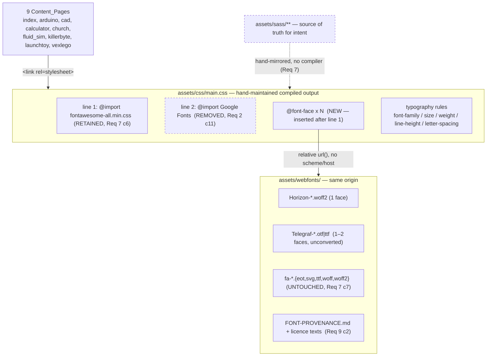

# Design Document

## Overview

This design implements the two outcomes of `requirements.md` against a static, build-tool-free HTML5 UP site:

1. **Footer email legibility** — the `mailto:` link moves from `#717981` (4.05:1, measured) to `#4a5158` (7.38:1, measured), via a *targeted* selector rather than a palette edit.
2. **Typeface replacement** — Horizon (WOFF2, one solid face) for `h1`–`h6`; Telegraf (vendor-supplied OTF/TTF, unconverted) for body text and all small interface text. Google Fonts is removed; both faces are self-hosted.

### What research established

All numbers below were measured against the repository during design, not assumed. Six findings materially shaped the design:

| # | Finding | Consequence |
|---|---|---|
| F1 | `#4a5158` measures **7.38:1** on `#f5f5f5` | Confirms Req 1 c12. Adopted as-is. |
| F2 | `#717981` occurs **15×** in `assets/css/main.css` — it is the shared `alt` palette `fg`/`fg-bold` driving footer headings, social icons, table `th`, and pagination | The colour change **cannot** be a palette edit; Req 1 c10/c11 force a targeted selector. See D3. |
| F3 | The footer link underline is `rgba(113,121,129,0.5)` → composites to `#b3b7bb` = **1.85:1** | Fails Req 1 c7 (≥3:1). The underline must become solid. See D4. |
| F4 | `#intro h1` is **5rem**, not 4rem, with a `3.25rem` override at `<=small` | Req 3 c6 caps intro `h1` at ≤4rem, so this is a reduction of two declarations, not one. See §3.3. |
| F5 | `#intro` horizontal padding is `4rem`/side (compiled: `padding: 8rem 4rem 6rem 4rem`); root font-size at 768px resolves to **11pt = 14.67px** | Gives a hard 650.7px content budget at 768px, which is the binding constraint on intro `h1`. See §3.3. |
| F6 | "Hallgrímskirkja" (15 chars, no break opportunity) **already overflows** at 320px in Source Sans Pro at 3.25rem (357.5px needed vs 266.7px available) | Req 3 c11 is unsatisfiable by size reduction alone. `overflow-wrap` is mandatory, not optional. See D6. |

F2, F3 and F6 are pre-existing defects that this refresh must fix in order to satisfy its own acceptance criteria. F6 in particular means the requirement cannot be met by tuning font sizes, which is how it would otherwise be read.

Requirement conflicts uncovered during measurement are collected in **Requirement Conflicts Requiring a Decision**. All six are now **settled**: the three accessibility conflicts (C2, C3, C4) have been ruled on explicitly by the site owner — *email link only, keep the change strictly scoped as Req 1 c10/c11 state* — and the remaining three (C1, C5, C6) adopt the defaults the design named. Implementation follows the section as written; nothing there is still open.

---

## Architecture

There is no application architecture. The only architecture is the *resolution chain* by which a page acquires a glyph, and the only structural decision is where each link in that chain lives.



Two properties of this chain drive the rest of the design:

- **The dotted SASS→CSS edge is not automated.** There is no `package.json`, no compiler, and `assets/css/main.css` is a shipped artifact that is edited by hand. The SASS files express intent; the CSS is what browsers execute. Requirement 7 exists because these can silently diverge, so the **Compiled Stylesheet Sync Procedure** defines a mechanical sync and **Correctness Property 2** makes divergence a detectable failure rather than a latent one.
- **`@font-face` must be inserted after the Font Awesome `@import`.** CSS requires all `@import` rules to precede other rules; placing `@font-face` above line 1 would invalidate the Font Awesome import and break every icon (Req 7 c6).

### Deployment topology and rollback

`.github/workflows/static.yml` triggers on push to `main` and uploads `path: '.'` — **the entire repository, with no build step and no staging environment**. Two consequences:

- Any file added to the repo is published, including `.kiro/` (already published today) and any new tooling. the **Testing Strategy** adds a prune step so verification tooling does not become part of the site.
- There is no pre-production environment, so "verify before it goes live" must mean *verify before push*. the **Pre-push verification gate** in the Testing Strategy defines that gate.

---

## Components and Interfaces

### 3.1 The `$font` map — `assets/sass/libs/_vars.scss`

The map is the single interface through which every typeface decision is expressed (Req 7 c4). Target state:

```scss
$font: (
    family:             ('Telegraf', 'Helvetica Neue', 'Segoe UI', Roboto, sans-serif),
    family-heading:     ('Horizon', 'Arial Black', Verdana, 'Trebuchet MS', sans-serif),
    family-fixed:       ('Courier New', monospace),   // UNCHANGED — Req 4 c8
    weight:             400,
    weight-bold:        700,   // Branch A; = 400 under Branch B, see §3.4
    weight-heading:     $HORIZON_WEIGHT,              // see note below
    letter-spacing-heading: 0.05em                    // NEW KEY — see note below
);
```

**Fallback stack for `family-heading` — widest-first, as Req 6 c1 requires.** Horizon is an extra-wide face, so its advance widths exceed every installed fallback. Ordering the stack widest-first minimises the layout shift when the webfont swaps in (Req 6 c8):

| Position | Family | Default-installed on | Why this position |
|---|---|---|---|
| 1 | `Arial Black` | Windows, macOS | Closest available match on *both* axes that matter — heavy weight and wide advances. Best single approximation of Horizon's metrics. |
| 2 | `Verdana` | Windows, macOS | Widest advances among ubiquitous text sans faces; wider than Arial/Helvetica by a clear margin. |
| 3 | `Trebuchet MS` | Windows, macOS | Moderately wide humanist sans; last resort before the generic. |
| 4 | `sans-serif` | generic | Terminator required by Req 6 c3; satisfies Req 6 c11. |

Android/iOS ship none of positions 1–3 and will land on `sans-serif` (Roboto / SF). This is acceptable: Req 6 c1 requires each *named* family to be installed on **at least one** of the four platforms, which positions 1–3 satisfy, and the generic terminator guarantees a rendering everywhere.

**Fallback stack for `family` — Req 6 c2** requires two or more named families, each default-installed somewhere, then the generic: `Helvetica Neue` (macOS/iOS), `Segoe UI` (Windows), `Roboto` (Android), `sans-serif`. Between them these cover all four named platforms with a neo-grotesque of similar proportion to Telegraf, keeping swap reflow small (Req 6 c9).

**`weight-heading` is resolved at implementation, not guessed.** Horizon ships exactly one solid face (decision 4), and Req 3 c4 requires `weight-heading` to *equal that face's weight* and requires the `@font-face` `font-weight` to match it, so that no browser-synthesized bold is ever applied. The value is read from the font's `OS/2.usWeightClass` once the file is in hand:

```bash
python3 -c "from fontTools.ttLib import TTFont; f=TTFont('assets/webfonts/Horizon.woff2'); \
print('usWeightClass =', f['OS/2'].usWeightClass, '| subfamily =', f['name'].getDebugName(2))"
```

Expected `400`. Whatever it reports is written *identically* into `weight-heading` and into the `@font-face` block. Because browsers default `h1`–`h6` to `bold`, an explicit `font-weight` is mandatory at every heading level — which the existing `_font(weight-heading)` reference already provides, **except** at the card `h2`, which hardcodes `font-weight: 700` and must be converted (§3.5).

**`letter-spacing-heading` is a new key that fixes a latent bug.** `assets/sass/components/_pagination.scss:31` already reads `_font(letter-spacing-heading)` — a key that does not exist in the map. Because the project has no compiler, this has never been evaluated; it would raise an error the moment anyone runs SASS. Adding the key both satisfies Req 5 c8 centrally and removes the trap. (The compiled CSS currently carries `letter-spacing: 0.075em` for pagination, from the preceding line.)

### 3.2 `@font-face` blocks — `assets/css/main.css`

Inserted immediately after the Font Awesome `@import` on line 1, before the reset. Filenames are placeholders confirmed against the actual downloads.

```css
/* Horizon — Alberto Fontense, free personal-use tier. WOFF2 (Req 2 c2). */
@font-face {
    font-family: 'Horizon';
    src: url('../webfonts/Horizon.woff2') format('woff2');
    font-weight: 400;          /* MUST equal $HORIZON_WEIGHT — Req 3 c4 */
    font-style: normal;
    font-display: swap;        /* Req 2 c8, Req 6 c6 */
    unicode-range: U+0000-00FF, U+0100-017F, U+2000-206F, U+2212;
}

/* Telegraf — Pangram Pangram Foundry, free personal-use tier.
   Vendor-supplied OTF, shipped unconverted (Req 2 c3, Req 9 c6).
   format() hint MUST match the actual file: opentype for .otf, truetype for .ttf. */
@font-face {
    font-family: 'Telegraf';
    src: url('../webfonts/Telegraf-Regular.otf') format('opentype');
    font-weight: 400;
    font-style: normal;
    font-display: swap;
    unicode-range: U+0000-00FF, U+0100-017F, U+2000-206F, U+2212;
}

/* Branch A only — omit entirely under Branch B (§3.4). */
@font-face {
    font-family: 'Telegraf';
    src: url('../webfonts/Telegraf-Bold.otf') format('opentype');
    font-weight: 700;
    font-style: normal;
    font-display: swap;
    unicode-range: U+0000-00FF, U+0100-017F, U+2000-206F, U+2212;
}
```

Interface contract per Req 2 c6 — one rule per file; `font-family` identical to the first family of the corresponding stack; `font-weight` equal to the referenced file's weight; `format()` matching the real format. Paths are relative to `main.css` (`../webfonts/…`), carrying no scheme and no host (Req 2 c7, c14).

**On `unicode-range` (Req 2 c9).** The criterion is scoped to rules referencing a *subset* font file. Req 9 c6 forbids subsetting, so **no rule here references a subset file and the criterion is vacuously satisfied**. The declaration is included anyway, for two reasons: it documents the coverage each face is relied upon for, and it is a correctness guard — an over-narrow range silently diverts characters to the fallback. The range must therefore be verified against real page content, not copied from a template. Measured content across all nine pages contains exactly three non-ASCII characters:

| Codepoint | Char | Where | In declared range? |
|---|---|---|---|
| U+00ED | í | `Hallgrímskirkja` — `h1` (church.html), `h2` (index.html) — **Heading_Text** | Yes (Latin-1) |
| U+00D7 | × | body text | Yes (Latin-1) |
| U+00B7 | · | body text | Yes (Latin-1) |

U+00ED lands in Heading_Text, so Horizon must actually carry it. Horizon's stated coverage is Basic Latin, Latin-1 and Latin Extended, so the declared range sits inside its coverage as Req 3 c15 requires — **to be confirmed by glyph audit** (**Testing Strategy, Check G**), because a missing glyph here silently substitutes a fallback family mid-word (Req 3 c16, Req 4 c14).

### 3.3 Heading type scale

Levels `h2`–`h6` are fixed by Req 3 c5 and are already correct in `_typography.scss`; they are re-declared unchanged. The base `h1` stays at `4rem`, satisfying the strictly-decreasing rule (4 → 1.75 → 1.25 → 1 → 0.9 → 0.8, every gap ≥ 0.1rem).

The *overrides* are where the work is. Req 3 c6 requires the intro `h1` to be "the largest value at or below 4rem" that keeps "Jeffery Ross" on one line at 768/1024/1440 — so the value must be **derived**, not chosen.

**Derivation method.** With `text-transform: uppercase` the string laid out is `JEFFERY ROSS` (12 characters). Required width is `chars × avg_advance_em × font_px`; available width is `viewport − 2 × padding`. Measured geometry:

| Viewport | Matching root step | Root px | `#intro` pad/side | Available |
|---|---|---|---|---|
| 320px | `<=xxsmall` 10pt | 13.33px | 2rem = 26.7px | **266.7px** |
| 768px | `<=large` 11pt | 14.67px | 4rem = 58.7px | **650.7px** |
| 1024px | `<=large` 11pt | 14.67px | 4rem = 58.7px | 906.7px |
| 1440px | `<=xlarge` 12pt | 16.00px | 4rem = 64.0px | 1312.0px |

Maximum intro `h1` that keeps `JEFFERY ROSS` on one line, as a function of Horizon's mean uppercase advance:

| Viewport | 0.80em | 0.90em | 1.00em | 1.10em |
|---|---|---|---|---|
| **768px** | 4.62rem | **4.11rem** | **3.70rem** | **3.36rem** |
| 1024px | 6.44rem | 5.72rem | 5.15rem | 4.68rem |
| 1440px | 8.54rem | 7.59rem | 6.83rem | 6.21rem |

**768px is the binding constraint** at every plausible advance width — 1024px and 1440px have slack to spare. Combined with the 4rem ceiling:

- **Intro `h1` (default): `3.5rem`** — down from 5rem. Survives a mean advance up to ~1.06em, which brackets the plausible range for an extra-wide geometric sans. Chosen over 4rem because 4rem only survives to ~0.92em and Horizon may well exceed that.
- **Intro `h1` (`<=small`): `2.75rem`** — down from 3.25rem. At 320px the widest unbreakable token is `JEFFERY` (7 chars); 2.75rem needs 256.7px of the 266.7px available at 1.00em advance. 3.25rem needs 303px and overflows. Req 3 c13 permits two lines here, which 2.75rem delivers.
- **Project-page `h1` (`body.project-page … header.major > h1`): `2.5rem`** — down from 3.25rem. These strings are far longer than the intro's (up to 38 chars: "KillerByte Full-Body Spinner BattleBot"); they wrap across multiple lines by design, so the constraint is the widest *word*, not the string.

**Verification, and the fallback if it does not fit.** The estimates above must be confirmed against Horizon's real metrics once the file is in hand. Exact per-string measurement, no browser needed:

```bash
python3 - <<'PY'
from fontTools.ttLib import TTFont
f = TTFont('assets/webfonts/Horizon.woff2')
upm = f['head'].unitsPerEm; cmap = f.getBestCmap(); hmtx = f['hmtx']
def width_em(s):
    return sum(hmtx[cmap[ord(c)]][0] for c in s if ord(c) in cmap) / upm
for s in ('JEFFERY ROSS', 'JEFFERY', 'HALLGRÍMSKIRKJA'):
    w = width_em(s)
    print(f'{s!r:20s} {w:6.3f}em  mean/char {w/len(s):.3f}em')
PY
```
Then, with `LS` the chosen letter-spacing in em and `AVAIL` the value from the geometry table: `max_rem = AVAIL / ((width_em + LS × len) × root_px)`. Take the **minimum** across 768/1024/1440, cap at 4rem, and round *down* to the nearest 0.25rem for margin.

If even a heavily reduced size will not hold `JEFFERY ROSS` on one line at 768px — i.e. the derived cap falls below ~2.5rem, where the intro would stop reading as a display heading — the escalation order is:

1. Apply the `-0.02em` end of the Req 3 c7 letter-spacing range (buys ~2% width).
2. Reduce the `<=medium` intro padding from `4rem` to `2rem`/side, adding ~117px of budget at 768px (~18%). This is a layout change outside the stated scope and needs owner sign-off.
3. Escalate to the owner: Req 3 c12 (one line at 768px) and Req 3 c6 (recognisable display size) are then in genuine conflict, and one must give.

Mid-word breaking is deliberately **not** on this list for the intro: it would split a person's name across lines.

**Heading letter-spacing: `-0.01em`** (Req 3 c7 range −0.02em…0.02em). Horizon's extra-wide letterforms already carry generous side bearings; the inherited `0.075em` would read as badly over-tracked. A slight negative value tightens word shapes without collision. This replaces `0.075em` at the `h1`–`h6` rule.

**Heading line-height** (Req 3 c8): intro `h1` `1.1` (range 1.05–1.20; replaces the current `1`, which is out of range); `h1`–`h6` base `1.3` (range 1.20–1.50; replaces `1.5`, tightened because a heavy extra-wide face at 1.5 leaves visually loose leading).

`text-transform: uppercase` and `fg-bold` colour resolution are preserved (Req 3 c9). Existing root-size steps are untouched, so rem values scale as Req 3 c10 requires.

### 3.4 Body text

| Property | Current | Target | Requirement |
|---|---|---|---|
| `font-family` | `_font(family)` → Merriweather | `_font(family)` → Telegraf | Req 4 c1, c2 |
| `line-height` | `2.375` | **`1.7`** | Req 4 c5 |
| `font-size` | `1rem` | `1rem` (unchanged) | Req 4 c6 |
| `text-align` | `justify` | `justify` (unchanged) | Req 4 c10 |

**`line-height: 1.7`** sits mid-range in the required 1.6–1.9. The existing 2.375 was tuned for Merriweather, a serif with a small x-height; Telegraf's larger x-height makes the same leading look disconnected. 1.7 keeps justified paragraphs cohesive while staying comfortable at 1rem.

Root steps (16pt/12pt/11pt/10pt) are preserved (Req 4 c6). The smallest resulting body size is 10pt = 13.33px at ≤360px, clearing the 13px floor of Req 4 c13 — with only 0.33px of margin, so the root steps must not be lowered.

**Italics (Req 4 c11).** If the licensed download has no true italic, `em`/`i` must stay in the Telegraf family with a synthesized oblique and must *not* fall back to another family. Browsers do this by default, but only if nothing disables synthesis — so `font-synthesis: none` must **not** be applied globally. Under Branch B it is applied to `strong`/`b` only, never to `em`/`i`.

**Bold — two branches, because Assumption 6 is still open.** The free Telegraf tier ships "selected styles", so a 700 face is not yet confirmed. Both branches are fully specified so implementation proceeds either way; the branch is selected by inspecting the download (**Testing Strategy, Check G**).

*Branch A — a bold face exists.* `weight: 400`, `weight-bold: 700`; both faces ship; `strong`/`b` resolve through `_font(weight-bold)` as they already do. Nothing further.

*Branch B — no bold face (Req 4 c4).* `weight-bold` is set **equal to** `weight` (400), only the regular face ships, and `strong`/`b` receive an alternative emphasis that does not rely on synthesized bold:

```scss
strong, b {
    font-weight: _font(weight-bold);   // == weight; no weight delta
    font-synthesis: none;              // suppress the synthetic bold browsers would apply
    letter-spacing: 0.02em;            // subtle tracking cue
    background-color: rgba(24, 191, 239, 0.12);   // accent-derived tint
    padding: 0 0.15em;
}
```
The tint reuses the existing accent `#18bfef` at low alpha, so emphasis stays legible without a second colour token, and the near-transparent wash leaves text contrast essentially unchanged — a claim that Property 1 verifies rather than assumes. Branch B also requires the limitation to be recorded in `README.md` (Req 4 c4) and reduces the bundle to a single Telegraf file, easing the §4.3 budget.

### 3.5 Chrome_Text migration — Heading font → body font

Chrome_Text currently inherits `family-heading` at sizes down to **0.55rem** (`body.home #main .button.skills`, `_main.scss:475`). Horizon's tight, closed apertures collapse long before that size, so all seven sites move to `_font(family)` (Req 5 c1). Every one is a `_font(family-heading)` → `_font(family)` swap plus a weight change from `weight-heading` to `weight` (Req 5 c2 — Chrome_Text must sit on a weight that actually ships).

| Source file | Selector | Size |
|---|---|---|
| `components/_button.scss:24` | buttons — skills + Read More | 0.8rem (0.7 small, 0.55 card) |
| `components/_form.scss:73` | `label` | inherits |
| `components/_pagination.scss:26` | pagination links | 0.8rem |
| `components/_table.scss:31` | `th` | 0.8rem |
| `layout/_navPanel.scss:22,84` | nav panel links | 0.9rem |
| `layout/_footer.scss:188` | `#copyright` | 0.8rem |

**Chrome_Text letter-spacing: `0.05em`**, down from `0.075em` (Req 5 c8 range 0.025–0.075em; both comply). Reduced deliberately: the longest skills label is exactly **20 characters** ("Waterjet fabrication"), precisely at the Req 5 c4 single-line boundary, and it must fit inside a card pill at 0.55rem. Dropping tracking by 0.025em buys ~0.5 characters of width at zero visual cost. Centralised as `letter-spacing-heading` in the `$font` map (§3.1) so all seven sites stay consistent (Req 8 c3).

**The card `h2` (Req 3 c3).** `layout/_main.scss:~361` hardcodes three values that must all change, not just the family:

```scss
// before                                  // after
font-family: Merriweather, Georgia, serif; → font-family: _font(family-heading);
font-weight: 700;                          → font-weight: _font(weight-heading);
letter-spacing: 0;                         → letter-spacing: _font(letter-spacing-heading);
```
The `font-weight: 700` is as important as the family: left in place with a single-weight Horizon it would trigger exactly the synthesized bold Req 3 c4 forbids. `font-size: 1.1rem` and `text-transform: none` are deliberate card-design choices and are retained — see conflict C5. This is the only literal typeface name outside the `$font` map and `@font-face` rules, and removing it satisfies Req 7 c4.

**Skills pills cannot wrap as currently built (Req 5 c7).** `body.home #main .button.skills` sets `white-space: nowrap`, a fixed `height: 1.7rem` and `line-height: 1.55rem`, and its container sets `flex-wrap: nowrap`. Req 5 c7 requires a label that exceeds the available width to *wrap inside the card* with every character visible — impossible under `nowrap`, and a wrapped label inside a fixed 1.7rem pill would be clipped even if it did wrap. The pill therefore becomes vertically elastic:

```scss
body.home #main .skills-box { flex-wrap: wrap; }
body.home #main .button.skills {
    white-space: normal;        // was nowrap  — permits the Req 5 c7 wrap
    height: auto;               // was 1.7rem  — fixed height would clip line 2
    min-height: 1.7rem;         // preserves the current pill silhouette
    line-height: 1.4;           // was 1.55rem — must be a ratio once multi-line
    padding: 0.15rem 0.4rem;    // restores vertical centring without a fixed height
}
```
Background, border, radius and uppercase treatment are untouched (Req 5 c5). White-on-`rgba(18,38,58,0.92)` measures 12.18:1 worst-case (over white) and 15.40:1 on the card, comfortably clearing Req 5 c6.

### 3.6 Footer email link

Selector: **`#footer a[href^="mailto:"]`**. Chosen over a class or a structural path because the nine pages carry two different footer nesting depths (index/arduino/cad/calculator/church/fluid_sim nest one level deeper than killerbyte/launchtoy/vexlego); an attribute selector matches all nine identically with no markup edits, satisfying Req 1 c3 and c9 while leaving every page's DOM untouched (Req 8 c5).

```css
#footer a[href^="mailto:"] {
    color: #4a5158;                    /* 7.38:1 measured — Req 1 c1, c2, c12 */
    border-bottom-color: #4a5158;      /* solid, 7.38:1 — Req 1 c7; was 1.85:1 */
}
#footer a[href^="mailto:"]:hover {
    color: #18bfef !important;         /* accent mandated by Req 1 c4 */
    border-bottom-color: #4a5158;      /* stays 7.38:1 — Req 1 c7 in hover state */
}
#footer a[href^="mailto:"]:focus-visible {
    outline: 2px solid #212931;        /* 13.51:1, ≥2px, spans the box — Req 1 c6 */
    outline-offset: 2px;
}
```

Four things this encodes:

- **Underline (Req 1 c7).** The inherited `rgba(113,121,129,0.5)` composites to `#b3b7bb` = 1.85:1 and fails. Even `rgba(74,81,88,0.5)` reaches only 2.33:1. Only a solid colour clears 3:1, so the underline is declared solid at the link colour.
- **Hover underline.** The generic `#footer a:hover` sets `border-bottom-color: transparent`. Req 1 c7 requires ≥3:1 in the hover state, and a transparent underline is at best an ambiguous pass; the rule above keeps it solid and measurable.
- **Focus (Req 1 c6).** `outline` is used rather than a border so the indicator spans the full text box and cannot alter layout. `:focus-visible` keeps the ring off mouse clicks; because `outline` and `color` are independent properties, the ring survives simultaneous hover as c6 demands.
- **Transitions (Req 1 c4, c5).** The inherited `a` transition is `0.2s` on `color` and `border-color`, inside the 200 ms bound. No new transition is needed.

Existing `0.8rem` sizing (`#footer form label, #footer h3, #footer p`) satisfies Req 1 c8 unchanged. No other footer colour is touched (Req 1 c10, c11).

---

## Data Models

The only persistent structures are the SASS maps, the font bundle, and the provenance record.

### 4.1 `$font` — typeface tokens

| Key | Type | Before | After | Constraint |
|---|---|---|---|---|
| `family` | font stack | `('Merriweather', Georgia, serif)` | `('Telegraf', 'Helvetica Neue', 'Segoe UI', Roboto, sans-serif)` | Req 4 c1; Req 6 c2, c3 |
| `family-heading` | font stack | `('Source Sans Pro', Helvetica, sans-serif)` | `('Horizon', 'Arial Black', Verdana, 'Trebuchet MS', sans-serif)` | Req 3 c1; Req 6 c1, c3 |
| `family-fixed` | font stack | `('Courier New', monospace)` | unchanged | Req 4 c8 |
| `weight` | 100–900 | `300` | `400` | Req 4 c3 |
| `weight-bold` | 100–900 | `600` | `700` (A) / `400` (B) | Req 4 c3, c4 |
| `weight-heading` | 100–900 | `900` | `$HORIZON_WEIGHT` (exp. 400) | Req 3 c4 |
| `letter-spacing-heading` | em length | *absent* | `0.05em` | Req 5 c8; fixes `_pagination.scss:31` |

`weight` moves 300 → 400 and `weight-heading` 900 → Horizon's single weight because Req 2 c5/c16 and Req 3 c4 require every declared weight to correspond to a face that actually ships. A declared 300 with only a 400 face on disk would invite synthesis.

### 4.2 `$palette` — one additive change

Every existing value is preserved (Req 8 c7). One key is **added** to the `alt` map:

| Map | Key | Value | Purpose |
|---|---|---|---|
| `alt` | `fg-link` | `#4a5158` | Footer email link default + underline (Req 1 c12) |

See conflict C1 under **Requirement Conflicts Requiring a Decision** for why this is additive rather than an edit to `alt.fg-bold`.

### 4.3 Webfont bundle manifest

Budget: **≤600 KB** for the two families combined, **≤400 KB** per Telegraf file (Req 2 c12, c13). The existing Font Awesome files (~2.9 MB across 15 files) are excluded from both bounds by name (Req 2 c12) and must remain byte-identical (Req 7 c7).

| File | Family | Weight | Format | `format()` | Typical | Bound |
|---|---|---|---|---|---|---|
| `Horizon.woff2` | Horizon | `$HORIZON_WEIGHT` | WOFF2 | `woff2` | 20–60 KB | — |
| `Telegraf-Regular.otf` | Telegraf | 400 | OTF (unconverted) | `opentype` | 60–200 KB | ≤400 KB |
| `Telegraf-Bold.otf` *(Branch A only)* | Telegraf | 700 | OTF (unconverted) | `opentype` | 60–200 KB | ≤400 KB |

Face count is the minimum Requirement 4 needs and no more (Req 2 c16) — one Horizon face (Req 2 c4), one Telegraf face per declared weight (Req 2 c5). If the download supplies `.ttf` rather than `.otf`, both the extension and the `format()` hint change to `truetype` together; a mismatched hint is a Req 2 c6 failure.

### 4.4 Provenance record — `assets/webfonts/FONT-PROVENANCE.md`

Requirement 9 c2 and c8 require source URL, download date, licence tier and format to be stored *in the repository*, alongside the licence texts, and updated whenever a file is added or replaced. One record per file:

| Field | Example |
|---|---|
| `file` | `Telegraf-Regular.otf` |
| `family` / `designer` | Telegraf / Pangram Pangram Foundry |
| `source_url` | `https://pangrampangram.com/products/telegraf/` (official channel only — Req 9 c1) |
| `download_date` | `2025-01-15` |
| `licence_tier` | Free personal / non-commercial |
| `licence_text_file` | `Telegraf-LICENSE.txt` |
| `format` / `converted` | OTF / **no** (Req 9 c6) |
| `sha256` | `…` — proves the shipped file is byte-identical to the download |
| `stored_bytes` | `142336` |
| `content_encoding` | `identity` (measured — Req 2 c17) |
| `transfer_bytes` | `142336` (measured — Req 2 c17, c18) |

`sha256` is not decorative: Req 9 c6 requires byte-for-byte fidelity to the vendor file, and a recorded hash is the only way a later reviewer can confirm nobody quietly re-saved or subsetted a face.

Licence texts are stored as `assets/webfonts/Horizon-LICENSE.txt` and `assets/webfonts/Telegraf-LICENSE.txt` (Req 9 c2). Neither Horizon nor Telegraf can be fetched by automation — both require a manual download from the designer's own channel behind an account or checkout flow (Req 9 c1 forbids aggregator mirrors, explicitly including the `fontdownloader.net` link that informed the requirements). Font acquisition is therefore a **manual prerequisite** that gates implementation; **Check G** in the Testing Strategy is the intake gate.

### 4.5 Transfer-size measurement procedure (Req 2 c17, c18)

Req 2 c17 requires the *measured* `Content-Encoding` and over-the-wire byte count for each Telegraf file from the deployed origin — because the OTF/TTF delivery path was chosen on a size trade-off that should be verified rather than assumed. Run **after** the first deploy that includes the fonts, and record both values in §4.4:

```bash
BASE=https://jefferyxr.github.io/personal-website/assets/webfonts
for f in Telegraf-Regular.otf Telegraf-Bold.otf Horizon.woff2; do
  [ -f "assets/webfonts/$f" ] || continue
  curl -sI --compressed "$BASE/$f" | grep -iE '^(HTTP/|content-encoding|content-length|content-type)'
  curl -s -o /dev/null --compressed \
       -w "$f  http=%{http_code}  transfer_bytes=%{size_download}  encoding=%{content_type}\n" \
       "$BASE/$f"
  echo "  stored_bytes=$(wc -c < "assets/webfonts/$f")"
done
```

`--compressed` advertises gzip/br so the response reflects what a real browser receives. GitHub Pages compresses some MIME types and not others, and `font/otf` is commonly **not** compressed — so `Content-Encoding: identity` with `transfer_bytes == stored_bytes` is the expected result, and `gzip` with a smaller count is a bonus.

**Either outcome changes nothing in the CSS.** The `@font-face` rules, `format()` hints and paths are identical regardless. What the measurement does affect is the budget: if `identity` is confirmed, the §4.3 stored-size bounds *are* the transfer cost, and the ≤400 KB per-file bound is the real defence against a slow first paint. Req 2 c18 (measured ≤ stored) holds in both cases, since compression can only reduce the count — but it is recorded as measured fact, not inferred. The same run doubles as the Req 2 c10 same-origin check (`http=200` for every file).

---

## Correctness Properties

*A property is a characteristic or behavior that should hold true across all valid executions of a system — essentially, a formal statement about what the system should do. Properties serve as the bridge between human-readable specifications and machine-verifiable correctness guarantees.*

This project is a good fit for property-based testing despite there being no application code, because the acceptance criteria quantify over an input space far too large to enumerate by hand: **9 pages × 4 viewports × 2 font states × ~40 in-scope elements per page**, plus every colour pair, every selector, and every font file. The oracles are all computable — the WCAG luminance formula, string equality of resolved declarations, bounding-box containment, `cmap` membership, SHA-256 equality. What PBT is *not* used for is recorded in the Testing Strategy: GitHub Pages' compression and same-origin behaviour, Font Awesome icon rendering, and the water-particle canvas are integration concerns whose behaviour does not vary with input.

Prework classified ~70 of the 106 criteria as property-shaped and then consolidated them: many criteria are the same universal quantification seen through different requirements. The 13 properties below are the result, and no two share both an oracle and a generator.

### Property 1: Every declared colour pair meets its contrast threshold

*For all* (foreground, background, element-role, interaction-state) tuples derived from the typography scope, **either** the tuple is a member of the accepted-exceptions set defined below and its measured WCAG 2.1 relative-luminance contrast ratio equals the ratio recorded for it there, **or** that measured ratio is greater than or equal to the threshold for its role — 7.0:1 for the footer email link in its default state, 3.0:1 for its underline in every state and for its focus indicator, and 4.5:1 for Heading_Text, Body_Text and Chrome_Text — and, in every case, the footer email link's default colour has a strictly lower relative luminance than `#717981`.

Generator: the `$palette` maps plus every `color`/`border-bottom-color`/`outline-color` declaration in the typography scope, crossed with `{default, hover, focus}`. Any `rgba()` value is alpha-composited over its resolved backdrop before measurement — the defect this catches is precisely a translucent underline that looks fine and measures 1.85:1.

**Accepted-exceptions set — exactly two entries, both fixed by the owner decision recorded in Requirement Conflicts Requiring a Decision:**

| Foreground | Element / role | State | Recorded ratio |
|---|---|---|---|
| `#717981` | `#footer h3` label — Heading_Text (conflict C2) | default | **4.05:1** |
| `rgba(255,255,255,0.25)` on `#1e252d` → `#565c62` | `#copyright` — Chrome_Text (conflict C3) | default | **2.27:1** (measured from the *unrounded* alpha composite; rounding to `#565c62` first yields 2.29:1 — do not "correct" it back) |

The exception set is what stops the accepted shortfalls from producing a red failure while keeping the check honest, and it is built to fail in three distinct ways rather than one:

- A tuple **outside** the set that misses its threshold fails loudly — so any *new* contrast regression is caught exactly as before. This is the clause that carries the property's value.
- A tuple **inside** the set whose measured ratio no longer equals the recorded value (compared at the recorded two-decimal precision) also fails, in either direction. An accepted exception is pinned to a measurement, not waved through: if `#footer h3` drifts to 3.4:1 the check breaks, and if someone fixes it to 7.38:1 the check breaks too and the entry must be retired.
- Every run **reports** both entries as *known-and-accepted*, with their ratios and their conflict IDs, so the shortfalls stay visible in output instead of disappearing.

**The set is a deliberate, reviewed exception list, and adding an entry to it requires an explicit owner decision.** Its two members exist solely because Req 1 c11 was ruled to win over Req 3 c14 and Req 5 c6; nothing else qualifies. Silently appending a third entry to make a failing check pass would turn this list into a place to hide real defects, which is precisely the failure mode it must not enable — so a change to the set is reviewed as a scope decision, not as a test fix. The hover accent of conflict C4 is deliberately **not** an entry: Req 1 c4 mandates that colour, so the property scopes the mandated transient hover state out of the ≥4.5:1 Body_Text clause instead of admitting it as an exception.

**Validates: Requirements 1.1, 1.2, 1.6, 1.7, 3.14, 4.7, 5.6**

### Property 2: Compiled CSS is value-identical to the resolved SASS source

*For all* selectors governing Heading_Text, Body_Text or Chrome_Text, and for all five properties `font-family`, `font-size`, `font-weight`, `line-height`, `letter-spacing`, the value declared in `assets/css/main.css` equals the value obtained by resolving that selector's declaration in the SASS source through the `$font` and `$palette` maps, with zero differing declarations.

Oracle detail: resolution must apply **last-declaration-wins** within a rule, because the compiled output already contains duplicate declarations for one property in one rule (`#footer` declares `color` twice, from the `color(alt)` mixin). A checker that reads the first match would report a false failure.

**Validates: Requirements 7.1, 7.2, 7.3, 7.8**

### Property 3: Typography is invariant across pages, per role

*For all* element roles in the typography scope, all viewport widths in {320, 768, 1024, 1440}, and all pairs of the nine Content_Pages on which that role appears, the computed font-family stack, font-weight, font-size, line-height and letter-spacing are equal — font-size within 0.01rem and line-height within 0.05 — and every computed size respects its floor: the footer email link at ≥0.8rem, Body_Text at ≥13px, and Chrome_Text at ≥0.7rem.

Two scoping rules, both forced by measurement: roles are compared **per role, not per tag** (conflict C5 — base `h2` 1.75rem, card `h2` 1.1rem and post `h2` 1.5rem legitimately differ), and a page on which a role does not appear is skipped rather than failed (`cad.html` has no `h1` and no `h2`).

**Validates: Requirements 1.3, 1.8, 4.13, 5.3, 8.1, 8.2, 8.3, 8.9**

### Property 4: Every element resolves to the token model

*For all* in-scope elements on all nine Content_Pages: Heading_Text resolves to a stack headed by Horizon and Chrome_Text and Body_Text to a stack headed by Telegraf, with no Chrome_Text element resolving to Horizon; every computed font-weight is a member of the shipped-face weight set, so no browser-synthesized weight is ever relied upon; every heading letter-spacing lies within −0.02em…0.02em and every Chrome_Text letter-spacing within 0.025em…0.075em; heading line-height lies in 1.05…1.20 for the intro `h1` and 1.20…1.50 for `h1`–`h6`, and Body_Text line-height in 1.6…1.9; consecutive heading levels differ by at least 0.1rem in strictly decreasing order; every computed pixel size equals the declared rem value times the expected root step for that viewport; `em`/`i` elements remain in the Telegraf family with an italic style; and every declaration naming either webfont terminates in `sans-serif`.

The weight clause is the high-value one: it fails on the card `h2`'s hardcoded `font-weight: 700` against a single-weight Horizon — the exact synthesized bold that Req 3 c4 forbids.

**Validates: Requirements 3.2, 3.3, 3.4, 3.5, 3.7, 3.8, 3.10, 4.2, 4.5, 4.6, 4.11, 4.12, 5.1, 5.2, 5.8, 6.3**

### Property 5: Nothing overflows, in either font state

*For all* (page, viewport ∈ {320, 768, 1024, 1440}, font-state ∈ {webfonts-loaded, webfonts-blocked}) combinations, the document produces no horizontal scrollbar (`scrollWidth ≤ clientWidth`), every heading, paragraph, card description and skills-button label is fully contained within its containing block with no clipped character, every in-scope element has non-empty text and a non-zero bounding box, the intro `h1` occupies exactly one line at 768/1024/1440 and at most two lines at 320, and every skills label of 20 characters or fewer occupies exactly one line inside its card while any longer label wraps inside the card bounds without page overflow.

Font-state is a generator dimension rather than a separate property, which is what makes the swap-reflow criteria (Req 6 c7–c9) fall out of the same run. Long-label wrapping requires **generated** labels longer than any current content — today's maximum is exactly 20 characters, so real content never exercises the wrap path. This is the property that fails today on `overflow-wrap` (finding F6, "Hallgrímskirkja" at 320px) and on the fixed-height `nowrap` skills pill.

**Validates: Requirements 3.11, 3.12, 3.13, 4.9, 5.4, 5.7, 6.7, 6.8, 6.9, 6.10**

### Property 6: No forbidden token, no off-origin font, no inline typography

*For all* (artifact, pattern) pairs over `assets/css/main.css`, the SASS sources and the nine Content_Pages: the family names `Merriweather` and `Source Sans Pro` occur zero times; every font `url()` and stylesheet `href` is relative, carries no scheme or host, and resolves to an existing local file; every `font-family` declaration in the SASS source is a `_font()` map lookup rather than a literal typeface name, except inside the `$font` map itself, the `@font-face` rules, and the Font Awesome icon families; and no inline `style` attribute and no embedded `<style>` block declares `font-family`, `font-size`, `font-weight`, `line-height` or `letter-spacing`.

Two oracle details. The literal-name clause is what catches the hardcoded `Merriweather, Georgia, serif` on the card `h2` — and, more usefully, prevents the next one. The inline-style oracle must target those five properties specifically rather than inline styles in general: `index.html` legitimately uses `style="--project-image: url(…)"` on every card, and a blanket ban would produce seven false failures on one page.

**Validates: Requirements 2.7, 2.11, 2.14, 7.4, 7.9, 7.10, 8.4**

### Property 7: Every character used is a character the font can render

*For all* characters appearing in Heading_Text or Body_Text across the nine Content_Pages, the codepoint lies inside the `unicode-range` declared for the applicable face and is present in that font's `cmap` table.

Measured content contains exactly three non-ASCII codepoints — U+00ED (í), U+00D7 (×), U+00B7 (·) — and U+00ED occurs in **heading** text ("Hallgrímskirkja" on `church.html` and `index.html`), so Horizon itself must carry it. This is the property that detects a silent per-character fallback, which reads as a subtly wrong letter rather than as an error.

**Validates: Requirements 2.9, 3.15, 3.16, 4.14**

### Property 8: Everything outside the intended delta is byte-identical to the baseline

*For all* declarations, markup structures and files outside an explicit allowlist of intended changes, the value equals its pre-change baseline in `git`: every `$palette` entry (the additive `alt.fg-link` key excepted), the footer `h3` / social-icon / `#copyright` colours, heading `text-transform` and colour resolution, the skills and Read More button background and uppercase treatment, every `mailto:` href and its visible text, every navigation and project `href` (each internal target resolving to a file present in the repository), the set, count, order and nesting of the intro, nav, card, footer-contact, social-icon and copyright element groups on every page, and the name, count and SHA-256 of all fifteen pre-existing Font Awesome webfont files.

The allowlist *is* the specification of scope. This property is what makes "restrict the change to the email link only" mean something enforceable, given that `#717981` appears 15 times in the compiled CSS and a palette edit would silently recolour five unrelated components.

**Validates: Requirements 1.9, 1.10, 1.11, 3.9, 5.5, 7.7, 8.5, 8.7, 8.8**

### Property 9: Bundle and declarations agree, within budget

*For all* font files in the Webfont_Bundle there is exactly one corresponding `@font-face` rule, and vice versa, in which the `font-family` equals the head of the corresponding family stack, the `font-weight` equals the weight recorded in the file's `OS/2.usWeightClass`, the `format()` hint matches the format determined from the file's actual sfnt signature (`woff2` for Horizon, `opentype` for an OTF and `truetype` for a TTF Telegraf file), and `font-display: swap` is declared; the set of weights declared for Body_Text equals the set of shipped Telegraf face weights exactly, in both directions, so that no declared weight lacks a file and no shipped file lacks a declared weight; and the summed stored size of all non-Font-Awesome font files is at most 600 KB with each Telegraf file at most 400 KB.

The format hint is determined from the file's real signature rather than its extension, because a renamed file with a plausible extension is exactly the failure mode a hand-maintained stylesheet invites, and a wrong hint is a silent load failure. The size clause must exclude Font Awesome by name — those fifteen files total ~2.9 MB and would swamp a 600 KB budget applied naively.

**Validates: Requirements 2.2, 2.3, 2.5, 2.6, 2.8, 2.12, 2.13, 2.16, 4.3**

### Property 10: Focus and hover states behave as declared

*For all* nine Content_Pages, the footer email link declares a transition of at most 200 ms on `color` and `border-color`; its hover rule sets the accent `#18bfef`; and while it holds keyboard focus it carries an indicator at least 2 CSS pixels thick spanning at least the full width of the link text, which is retained when the pointer simultaneously hovers the link.

Kept separate from Property 1 because the oracle is geometric and state-machine-like (thickness, extent, retention under a second simultaneous state) rather than colorimetric; the indicator's contrast is Property 1's business.

**Validates: Requirements 1.4, 1.5, 1.6**

### Property 11: Every font file is provably the vendor's, from the vendor

*For all* files in the Webfont_Bundle, a provenance record exists with every required field non-empty — source URL, download date, licence tier, format, `converted` flag and SHA-256 — the referenced licence text file is present under `assets/webfonts/`, the source URL's host is on the official-channel allowlist and is not on the aggregator denylist, the `converted` flag is `no`, and the SHA-256 of the shipped file equals the recorded hash of the vendor download.

The hash is the only mechanical proof of Req 9 c6, the load-bearing licence condition: the free Telegraf tier grants no converted format, so a re-saved or subsetted file would leave the site with no licensed delivery route at all. A denylist entry for `fontdownloader.net` is explicit, since that host informed the requirements but must never be a download source.

**Validates: Requirements 9.1, 9.2, 9.6, 9.8**

### Property 12: No page contains a commercial-use marker

*For all* nine Content_Pages and all markers in the commercial-use vocabulary — advertisement of paid services, statements of freelance or contract availability, rates or pricing, sponsorship, and affiliate content — the marker does not occur in the page's visible text.

Both licences are conditioned on non-commercial use, and that condition outlives this change. Running the check on every invocation converts a standing obligation into a detectable failure, so a future edit adding "available for freelance work" trips a check instead of quietly voiding both licences.

**Validates: Requirements 9.4**

### Property 13: Blocking the webfonts changes only the family

*For all* (page, viewport, in-scope element) triples, the computed `font-size`, `font-weight`, `line-height`, `letter-spacing`, `color` and `text-transform` observed with the webfont requests blocked are equal to those observed with the fonts loaded, and every element remains visible with non-empty text and a non-zero bounding box.

A differential property: it compares two renders of the same page rather than checking either against a fixed expectation, so it catches a fallback-only regression — such as a fallback stack that resolves to a family whose metrics silently alter computed line-height — that no single-state assertion would find. Containment in the fallback state is Property 5's `webfonts-blocked` arm; this property owns the *equality* half.

**Validates: Requirements 2.15, 6.4, 6.5**

---

## Error Handling

Nothing here executes logic, so "error handling" means **degradation paths**: what a visitor sees when a font, a rule, or a glyph is missing. The governing choice is `font-display: swap` on every face, which sets a 0 ms invisible-text block period and satisfies Req 6 c6 — text is painted in the fallback from first paint and never hidden.

| Failure | Detection | Behaviour | Requirement |
|---|---|---|---|
| Font file 404 / blocked / >3 s | Browser font loading | Fallback stack renders; all sizes, weights, line-heights and colours identical to the webfont case | Req 2 c15; Req 6 c4, c5 |
| Font still downloading | `font-display: swap` | Fallback painted immediately, 0 ms block period | Req 6 c6 |
| Horizon arrives after first paint | Browser swap | Reflow bounded by the widest-first stack (§3.1); must not overflow, truncate, or break the intro `h1` onto two lines ≥768px | Req 6 c8 |
| Telegraf arrives after first paint | Browser swap | Similar proportion to fallbacks; no card-description clipping | Req 6 c9 |
| Whole fallback stack unavailable | — | `sans-serif` generic renders at declared sizes/weights | Req 6 c11 |
| Glyph absent from Horizon (e.g. U+00ED) | Glyph audit, Check G | Browser substitutes **per character** from the next stack family; the string is not re-rendered wholesale | Req 3 c16; Req 4 c14 |
| No true italic in Telegraf | Download inspection | Synthesized oblique **within** the Telegraf family; no family substitution. Requires that `font-synthesis: none` is never applied to `em`/`i` | Req 4 c11 |
| No bold face in Telegraf | Download inspection | Branch B alternative emphasis (§3.4); no synthesized bold | Req 4 c4 |
| Font Awesome `@import` displaced | Icon rendering | Must not happen: `@font-face` is inserted *after* line 1, since a rule before an `@import` invalidates it | Req 7 c6 |

Two failures are silent and therefore the dangerous ones. A **missing glyph** looks like a slightly-off letter, not an error, so it is caught by the up-front glyph audit rather than by inspection. An **over-narrow `unicode-range`** diverts characters to the fallback with no console warning; §3.2 pins the range against measured page content for exactly this reason. Neither may surface an error message, empty run, or placeholder glyph to the visitor (Req 6 c10).

---

## Requirement Conflicts Requiring a Decision

Measurement surfaced six places where criteria cannot all hold as literally written. **All six are now settled and none is still open.** C2, C3 and C4 were accessibility outcomes that needed an explicit ruling; the site owner has given one:

> **Owner decision: email link only — keep the change strictly scoped as Requirement 1 c10/c11 state.**

C2, C3 and C4 are therefore marked **RESOLVED by owner decision** below, and C1, C5 and C6 **adopt** the defaults the design named. Implementation follows every entry in this section as written.

**C1 — "Palette change" vs. "email link only". ADOPTED.** Req 8 c7 describes the change as a palette value, but `#717981` is `alt.fg`/`alt.fg-bold`, used **15×** in the compiled CSS. Editing it would recolour the footer `h3`, social icons, table `th` and pagination links — violating Req 1 c10 and c11. *Adopted: add `alt.fg-link` (§4.2) and apply it through the targeted selector of §3.6. Every existing palette value is preserved, and the change reaches only the email link.* This is the same scoping rule the owner decision restates, so C1 and the C2/C3 rulings are one coherent position rather than three independent ones.

**C2 — Footer `h3` labels fail heading contrast. RESOLVED: leave unchanged.** `#footer h3` is `#717981` = **4.05:1** measured. Req 3 c14 requires ≥4.5:1 for Heading_Text, but Req 1 c11 requires this label's colour to stay identical. Both cannot hold, and **Req 1 c11 wins by explicit owner decision**: the colour is left exactly as it is. The 4.05:1 measurement is *reported, not fixed* — it is an accepted, recorded shortfall, and Correctness Property 1 carries it as an accepted exception rather than a failure. `#4a5158` (7.38:1) remains the ready remedy, reusing the token added for the email link, should the owner revisit this later; adopting it would be a new decision, not a follow-up to this one.

**C3 — `#copyright` fails chrome contrast. RESOLVED: leave unchanged.** `rgba(255,255,255,0.25)` on `#1e252d` composites to `#565c62` = **2.27:1** measured (the ratio comes from the *unrounded* alpha composite; rounding the composite to `#565c62` before computing gives 2.29:1, which is not the measured value). Req 5 c6 requires ≥4.5:1 for Chrome_Text; Req 1 c11 requires it unchanged. **Req 1 c11 wins by explicit owner decision**: the colour is left exactly as it is, and the 2.27:1 measurement is reported as an accepted shortfall carried in Correctness Property 1's exception list. The deferred fix is raising the alpha to ~0.65 (≈4.6:1); it is deferred, not rejected, and taking it would be a new owner decision.

**C4 — Hover accent fails body contrast. RESOLVED: keep the mandated accent.** Req 1 c4 mandates `#18bfef` on hover, which is **1.98:1** on `#f5f5f5`. The email link is Body_Text, so Req 4 c7 wants ≥4.5:1. **Resolved in favour of the explicit c4 mandate**, consistent with the default the design had already stated: the state is transient and pointer-driven, and the underline holds **7.38:1** throughout hover (§3.6), so the link never depends on text colour alone to be perceivable. The darker footer-scoped alternatives (`#0e7f9e`, 4.24:1; `#0b6a84`, ≥4.5:1) are recorded as *not* taken — Req 1 c4 is honoured as written. Because this state is a mandated value rather than an unmet threshold, Property 1 scopes the hover accent out of the ≥4.5:1 Body_Text clause; it is not an entry in the accepted-exceptions list.

**C5 — Cross-page `h2` identity vs. deliberate per-context sizes. ADOPTED.** Req 8 c1 requires an identical computed `h2` size on all nine pages, but three sizes coexist by design: base `1.75rem`, card `h2` `1.1rem` (index), post `h2` `1.5rem` (project pages). Also `cad.html` has **no** `h1` and **no** `h2` at all, so a literal all-pages comparison is undefined there. *Adopted: read Req 8 c1 per **role** — base heading, card heading, post heading — requiring identity within a role across every page where the role appears. Correctness Property 3 encodes this reading, and implementation follows it.* The alternative, collapsing all `h2`s to one size, would destroy the card design.

**C6 — Two elements are unclassified. ADOPTED.** `#nav .links a` (0.8rem, `family-heading`) meets the glossary's general Chrome_Text description but is not in its enumeration; `#header .logo` (2.25rem, `family-heading`) is neither Heading_Text, Body_Text, nor Chrome_Text. *Adopted: route `#nav .links a` to `_font(family)` with the other small chrome (consistent with Req 5's rationale — Horizon's apertures close up at 0.8rem), and keep `#header .logo` on `_font(family-heading)` as a display element.* Recorded here because neither classification follows from the requirements as written, but the routing above is what implementation does.

---

## Risks

**R1 — Horizon's extra width breaks existing layouts.** *(highest risk)* Every heading gets 60–100% wider at the same point size. Concretely: the intro `h1` (mitigated by §3.3 derivation), card `h2` in a fixed-aspect card, project-page `h1` up to 38 characters, `#nav` links in a flex row, and the 20-character skills pill. Mitigation: derive sizes from real metrics rather than assuming (§3.3); move all small chrome off Horizon entirely (§3.5); make pills elastic (§3.5); verify at four viewports in both font states (Property 5).

**R2 — "Hallgrímskirkja" cannot fit on one line at 320px at any usable size.** Measured: 15 unbreakable characters need 585px at 3.25rem/0.90em against 266.7px available. **It already overflows today** at 357.5px in Source Sans Pro — a pre-existing defect. No font-size reduction fixes this; even 1.5rem overflows. Mitigation: `overflow-wrap: break-word` on `h1`–`h6` (plus `hyphens: auto` where supported), which is *required* for Req 3 c11, not merely advisable. Applied to headings generally, not to the intro `h1` name.

**R3 — Uncompressed body font on first paint.** A 200 KB unconverted OTF, likely served as `identity`, is a real first-paint cost. Mitigation: `font-display: swap` (never blocks text), the ≤400 KB per-file bound, minimum face count (Branch B halves it), and §4.5 measurement to replace assumption with fact.

**R4 — SASS/CSS divergence.** Two artifacts, no compiler, and the CSS is what ships. A correct SASS edit with a forgotten CSS mirror is invisible until a visitor notices. Mitigation: the Compiled Stylesheet Sync Procedure and Correctness Property 2, which turns divergence into a check failure.

**R5 — Licence drift.** Both grants depend on the site staying non-commercial (Req 9 c4) — a standing obligation that outlives this change. Mitigation: Property 12 scans for commercial markers on every run, so a future edit adding rates or freelance availability trips a check rather than passing silently.

**R6 — Font acquisition blocks implementation.** Both faces need manual download from official channels (Req 9 c1); neither can be automated, and aggregator mirrors are forbidden. Every §3.3 number stays an *estimate* until the files exist. Mitigation: Check G is an explicit gate before CSS work; §3.3 supplies both a starting estimate and an escalation path.

---

## Compiled Stylesheet Sync Procedure

Requirement 7 c5 requires this documented in `README.md`; it is reproduced here as the design's interface between the two artifacts. Every typography change follows it in order:

1. **Edit the SASS source** — `_vars.scss` first (the `$font` map and the additive palette key), then the rule-level files (`base/_typography.scss`, `layout/_footer.scss`, `layout/_main.scss`, `layout/_intro.scss`, `layout/_navPanel.scss`, `components/_button.scss`, `_form.scss`, `_pagination.scss`, `_table.scss`).
2. **Resolve each map reference by hand.** `_font(family)` → the full comma-separated stack, with family names quoted exactly as the compiler would emit them (`"Telegraf", "Helvetica Neue", "Segoe UI", Roboto, sans-serif`).
3. **Apply the same change to `assets/css/main.css`** at every location. Map-driven values appear many times — `family-heading` resolves at **11** sites in the compiled CSS today — so change *all* occurrences, not the first.
4. **Remove the Google Fonts `@import` (line 2)** and insert the `@font-face` blocks directly after the Font Awesome `@import` on line 1 — never before it (Req 7 c6).
5. **Verify parity** by running the Testing Strategy checks. Property 2 is the authority: for every selector governing Heading_Text, Body_Text or Chrome_Text, the value resolved from SASS must equal the value declared in the CSS, with zero differing declarations.
6. **Confirm zero occurrences** of `Merriweather` and `Source Sans Pro` in both artifacts (Req 7 c9).

Note for step 3: the compiled CSS already contains duplicate declarations for the same property in one rule — `#footer` carries `color: #717981` followed by `color: #909498`, an artifact of the `color(alt)` mixin — so a parity checker must apply last-declaration-wins rather than reading the first match.

`README.md` additionally gains: the Credits entries required by Req 9 c3 (Horizon → Alberto Fontense, Telegraf → Pangram Pangram Foundry, each with its licence tier), and under Branch B the missing-bold limitation note required by Req 4 c4.


---

## Testing Strategy

### The starting position

There is no test suite, no `package.json`, and no build tooling. Tooling must therefore be *introduced*, and the deployment topology constrains where it can live: `static.yml` uploads `path: '.'`, so **anything added to the repository is published**. `.kiro/` is already being published today.

### Tooling and its placement

| Concern | Choice | Rationale |
|---|---|---|
| Location | `tools/typography-check/` | Self-contained; one directory to prune. Repository root stays as clean as it is today. |
| Runtime | Node 22 (present in the environment) | Already available; needed anyway for the browser driver. |
| Dependency manifest | `tools/typography-check/package.json` | Keeps `node_modules` and dev dependencies out of the repository root, so the site remains a plain static tree with no root-level manifest. |
| PBT library | **fast-check** | The established JS property-based testing library. Not hand-rolled (per the workflow's explicit instruction); supplies shrinking, which matters — a failure that shrinks to "`h2` on `cad.html` at 320px" is actionable, "some element somewhere overflows" is not. |
| Test runner | `node --test` | Built in; no extra dependency. |
| Browser | **Playwright**, headless, `--no-sandbox` | Properties 3, 5, 10 and 13 need *computed* styles and real bounding boxes, which no static parser can produce. The `playwright` Power is available in this environment. |
| Font introspection | `fontTools` (Python, already present) | Reads `OS/2.usWeightClass` and `cmap` for Properties 7 and 9. |

**Keeping tooling out of the deployed site.** `static.yml` gains one prune step before the upload — this is the minimal change that stops verification tooling (and the already-leaking `.kiro/` directory) from being published:

```yaml
      - name: Checkout
        uses: actions/checkout@v4
      - name: Prune non-site files
        run: rm -rf tools .kiro
      - name: Setup Pages
        uses: actions/configure-pages@v5
```

This runs against the ephemeral CI checkout, never the repository. Pruning `.kiro` is a small, in-scope correctness improvement: spec documents are not part of the site, and Property 12 (commercial-use markers) should not have to reason about text in spec files that visitors can currently reach.

### Property test configuration

Every property from the Correctness Properties section is implemented as **exactly one** property-based test, running a **minimum of 100 iterations**, tagged with a comment referencing its design property:

```js
// Feature: portfolio-typography-refresh, Property 5: Nothing overflows, in either font state
fc.assert(
  fc.property(
    fc.constantFrom(...NINE_PAGES),
    fc.constantFrom(320, 768, 1024, 1440),
    fc.constantFrom('loaded', 'blocked'),
    async (page, viewport, fontState) => { /* … */ }
  ),
  { numRuns: 100 }
);
```

Two notes on generators. Where a property's natural domain is smaller than 100 tuples (Property 9 ranges over 2–3 font files), the generator is widened with the dimensions that *do* vary — mutated declarations, permuted stacks — so the 100 iterations test the checker's discrimination rather than re-running one identical case. Where the domain is very large (Property 5 spans 9 × 4 × 2 × ~40), 100 runs sample it and fast-check's shrinking localises any failure. Property 5 caches one browser context per (page, viewport, font-state) triple, since a naive implementation would launch 100 browsers.

Webfont blocking for Properties 5 and 13 uses Playwright request interception, aborting `assets/webfonts/{Horizon,Telegraf}*`, which reproduces the Req 6 c4 failure mode without touching the CSS.

### Checks, in dependency order

| Check | What | Type | Gate |
|---|---|---|---|
| **A** | Files present at expected paths | Smoke | pre-push |
| **B** | Static properties: 2, 6, 8, 9, 11, 12 | Property (fast-check) | pre-push |
| **C** | Font-binary properties: 7, 9 (weights) | Property (fastTools + fast-check) | pre-push |
| **D** | Rendered properties: 1, 3, 4, 5, 10, 13 | Property (Playwright + fast-check) | pre-push |
| **E** | Font Awesome icons render; no missing-glyph substitution | Integration, 1 run | pre-push |
| **F** | Water canvas animates; card interactions respond; no console errors | Integration, 1 run | pre-push |
| **G** | **Font intake gate** — see below | Manual + smoke | **before any CSS work** |
| **H** | Same-origin 200s; `Content-Encoding`; transfer bytes | Integration, 1 run | **post-deploy** |

**Check G is a prerequisite, not a test.** Neither font can be fetched by automation — both require a manual download from the designer's own channel (Req 9 c1 forbids aggregator mirrors), so implementation cannot start until it passes. It establishes four facts that the rest of the work depends on:

1. **Horizon's weight** — `OS/2.usWeightClass` → fixes `weight-heading` and the `@font-face` `font-weight` (Req 3 c4).
2. **Which Telegraf styles the download contains** — resolves the open Assumption 6 and selects **Branch A or Branch B** (§3.4), including whether a true italic exists (Req 4 c11).
3. **Horizon's advance widths** — feeds the `h1` derivation in §3.3, converting its estimates into measured values.
4. **Glyph coverage for U+00ED, U+00D7, U+00B7** — Property 7's precondition; U+00ED appears in heading text, so a gap here changes the design rather than merely failing a test.

**Check H is post-deploy by necessity.** Req 2 c10, c17 and c18 are assertions about the deployed GitHub Pages origin — its compression behaviour and same-origin serving. These test *GitHub's* infrastructure, not this repository, and 100 requests would reveal nothing that 1 does; they are integration checks. The procedure is in §4.5, and its results are recorded in the provenance table.

### Unit and integration tests (the non-property half)

Deliberately few, because the properties carry the general cases. Reserved for single literal assertions where universal quantification would add nothing: the `$font` map heads (`Horizon`, `Telegraf`); `family-fixed` unchanged; `p { text-align: justify }` retained; the literal `#4a5158`; the intro `h1` declared value ≤ 4rem; exactly one Horizon face shipped, at the `weight-heading` value (Req 2 c4); `font-display: swap` present; fallback stacks having ≥2 named families each, checked against a curated platform-availability table (whether a family ships on Windows/macOS/iOS/Android is external knowledge, not a computable property — and "widest first" is a design judgement recorded in §3.1, since metrics for uninstalled fonts cannot be measured); README sections required by Req 7 c5, Req 9 c3 and, under Branch B, Req 4 c4.

### Where PBT is deliberately not used

- **GitHub Pages behaviour** (Req 2 c10, c17, c18) — external service; behaviour does not vary with input; each check costs a network round trip. Integration, 1 run.
- **Font Awesome icon rendering** (Req 7 c6) — third-party font behaviour, already tested by its authors. Integration, 1–2 examples. The one genuinely fragile part, that `@font-face` must not precede the `@import`, is a static assertion in Check B.
- **Water canvas and card interactions** (Req 8 c6) — unrelated to typography; a regression guard, not a property. Integration, 1 run.
- **Documentation obligations** (Req 7 c5, Req 9 c3, c5) — presence is checkable, adequacy is not. Smoke plus human review.
- **Future-conditional obligations** (Req 9 c5, c7) — antecedents are false today. Recorded as standing conditions; Property 11's `converted` flag makes c7 detectable if the delivery path ever changes.

### Pre-push verification gate

There is no staging environment: a push to `main` deploys straight to production. "Verify before it goes live" therefore has to mean *verify before push*.

```bash
cd tools/typography-check && npm ci && npm test    # Checks A–F
```

The full sequence:

1. **Check G** passes — fonts in hand, weights and styles known, branch selected.
2. SASS edited, then mirrored into `assets/css/main.css` by the procedure in the Compiled Stylesheet Sync Procedure section.
3. **Checks A–F** pass locally against the working tree via `file://`, or a local static server.
4. Visual review of `index.html` and one project page at 320 and 1440, in both font states — the properties bound overflow and containment, but not whether the result looks right.
5. Push to `main`; the workflow deploys.
6. **Check H** against the live origin; record `Content-Encoding` and transfer bytes in the provenance record.

**Rollback.** The change is confined to text artifacts plus added font binaries, so `git revert` of the single commit restores the previous typography completely and the next push redeploys it — no state, no migration, nothing to unwind. This argues for landing the work as **one revertible commit** rather than a series. If a defect is found after deploy, revert first and diagnose locally, rather than fixing forward against production.

One failure mode deserves pre-emptive naming, because it is expected on the first run and does not indicate a mistake in the design: Property 5 will fail until `overflow-wrap: break-word` is added to the headings (finding F6) and until the skills pill becomes vertically elastic (§3.5).

By contrast, Property 1 is **expected to pass**. The footer `h3` (4.05:1) and `#copyright` (2.27:1, measured from the unrounded alpha composite) shortfalls are now settled by owner decision — leave both unchanged — so they are carried in that property's accepted-exceptions set and surface in the run output as *known-and-accepted*, with their conflict IDs, rather than as failures. A red Property 1 therefore means one of three real things: a new contrast regression somewhere outside the set, or one of the two accepted ratios having drifted from its recorded value, or an entry having been added to the set without an owner decision. None of those is a first-run expectation.
